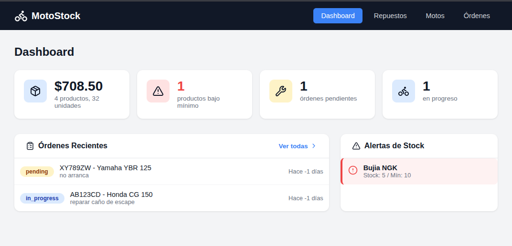

# AURA

## Un lenguaje de programación diseñado para agentes IA

> **Los lenguajes de programación fueron diseñados para humanos.**
> **AURA fue diseñado para máquinas que escriben código.**

---

## Tres Virtudes

### 1. 40x Menos Tokens

```
    Python   ████████████████████████████ 2000 tokens
    AURA     ██ 50 tokens
```

Un agente IA consume 40 veces menos tokens escribiendo AURA que Python.
Menos tokens = menos costo = más operaciones por dólar.

### 2. Self-healing: se repara solo

Un agente genera código que usa una variable no definida (error muy común):

```ruby
+http +json

goal "consultar usuarios de la API"

get_users = : r = http.get(api_url ++ "/users"); json.parse(r.body)
main = get_users()   # Error: api_url no está definida
```

```
$ aura heal api.aura

Error: variable no definida: api_url
Goal: "consultar usuarios de la API"

Fix propuesto:
  + api_url = "https://api.example.com"

Aplicando...
Resultado: [{id: 1, name: "Alice"}, ...]
```

El código se detecta, analiza y repara. El `goal` le dice al agente qué querías lograr, no solo qué falló.

**[Ver documentación completa](SELF-HEALING.md)**

### 3. Un Archivo = Todo

```
    Python/Flask  ████████████████████████████  10 archivos
    AURA          ██  1 archivo
```

No hay `requirements.txt`, `config.py`, `models.py`, `routes.py`...
Todo el contexto en un solo lugar.

---

## Probalo Ahora

```bash
git clone https://github.com/bluegin-ush/aura && cd aura
cargo build --release

./target/release/aura run examples/01_api_client.aura    # Ejecutar
./target/release/aura heal examples/broken.aura          # Self-healing
./target/release/aura serve api.aura --port 8080         # API REST
./target/release/aura repl                               # REPL
```

---

## Ejemplo: API REST en 10 líneas

```ruby
+db +json

goal "API REST para gestión de usuarios"

conn = db.connect("sqlite:./api.db")

get_health = {status: "ok"}
get_users = db.query(conn(), "SELECT * FROM users", [])
get_user(id) = first(db.query(conn(), "SELECT * FROM users WHERE id = ?", [id]))
post_user(req) = : db.execute(conn(), "INSERT INTO users (name) VALUES (?)", [req.body.name]); {created: true}
del_user(id) = : db.execute(conn(), "DELETE FROM users WHERE id = ?", [id]); {deleted: true}
```

```bash
$ aura serve api.aura --port 8080
Routes: GET /health, GET /users, GET /user/:id, POST /user, DELETE /user/:id
```

---

## Caso de Estudio: MotoStock

Sistema de inventario para taller de motos. **23 endpoints** en **68 líneas**.

```
    AURA vs Python/Flask
    ─────────────────────────────────
    Líneas de código    68  vs  450
    Archivos             1  vs   10
    Tokens consumidos   3K  vs  15K
    Tiempo             35m  vs   4h
```



**[→ Ver proyecto completo](projects/motostock/)**

---

## Documentación

| Documento | Contenido |
|-----------|-----------|
| **[SELF-HEALING.md](SELF-HEALING.md)** | Cómo funciona, flujo de trabajo, ejemplos |
| **[SYNTAX.md](SYNTAX.md)** | EBNF formal, quick reference, operadores |
| **[examples/](examples/)** | Ejemplos funcionando |

---

## Comandos

```bash
aura run file.aura       # Ejecutar
aura heal file.aura      # Self-healing
aura serve file.aura     # Servidor HTTP
aura repl                # REPL interactivo
aura check file.aura     # Verificar sintaxis
```

---

## Estado

```
✅ Intérprete completo        ✅ Goals (intención)
✅ REPL interactivo           ✅ Variables de entorno (+env)
✅ Servidor HTTP nativo       ✅ Modularización (+archivo)
✅ Self-healing               ✅ Invariants (constraints)
✅ Expect (verificación)      ✅ Memoria de healing
✅ @self_heal (anotación)     ✅ 226 tests
```

---

## Parte de Algo Más Grande

| Proyecto | Pregunta |
|----------|----------|
| [**Yo enseño {con IA}**](https://github.com/bluegin-ush/yo-ense-o-con-IA-) | ¿Qué debe saber un profesional en la era de la IA? |
| **AURA** | Si la IA escribe código, ¿con qué lenguaje? |
| [**IS-IA**](https://github.com/bluegin-ush/IS-IA) | ¿Cómo se construye software con IA? |

---

MIT License

<p align="center">
<strong>AURA: Porque el futuro del código lo escriben máquinas.</strong>
</p>
