# AURA: Incorporación de deliberación cognitiva en la semántica de lenguajes de programación

## Un reporte técnico sobre Agent-Unified Runtime Architecture

---

**Resumen.** Presentamos AURA (Agent-Unified Runtime Architecture), un lenguaje de programación que incorpora un ciclo de deliberación cognitiva---observar, razonar, ajustar, continuar---directamente en su semántica de ejecución. A diferencia de los enfoques existentes donde los modelos de lenguaje grande (LLMs) operan como herramientas externas de generación de código (GitHub Copilot, ChatRepair) o donde la auto-reparación opera a nivel de sistemas (MAPE-K, Rainbow), AURA introduce *primitivas cognitivas* (`goal`, `observe`, `expect`, `invariant`, `reason`) como construcciones sintácticas de primera clase que se parsean en nodos AST con reglas de evaluación definidas. Cuando un programa se ejecuta bajo el runtime cognitivo de AURA, la máquina virtual puede pausar en puntos arbitrarios de ejecución, reificar el contexto completo de ejecución (variables, goals, invariantes, historial de observaciones, checkpoints), despachar a un LLM para deliberación, y resumir con una de cinco intervenciones estructuralmente tipadas: continuar, inyección de valor, parcheo de código, backtracking basado en checkpoints con ajustes, o detención. Los goals e invariantes declarados por el desarrollador restringen todas las modificaciones generadas por el LLM, creando un espacio de adaptación formalmente acotado. Hasta donde sabemos, AURA es el primer lenguaje de programación donde (1) la deliberación cognitiva es parte de la semántica operacional, (2) un LLM participa como componente del runtime con acceso al estado de ejecución en vivo, y (3) los invariantes declarados por el desarrollador imponen restricciones de seguridad sobre las modificaciones de programa generadas por IA a nivel del lenguaje.

---

## 1. Introducción

### 1.1 La brecha paradigmática

Tres comunidades de investigación han desarrollado independientemente soluciones al problema de construir software que se adapte a condiciones inesperadas:

**Programación orientada a agentes** (Shoham 1993; Rao 1996; Bordini et al. 2007) introdujo actitudes mentales---creencias, deseos, intenciones---como primitivas de programación. Lenguajes como AgentSpeak/Jason, GOAL y 2APL implementan la arquitectura BDI (Belief-Desire-Intention) con razonamiento explícito sobre objetivos y manejo de fallos en planes. Sin embargo, estos lenguajes son anteriores a la era de los LLM: su "razonamiento" es búsqueda en biblioteca de planes, no deliberación abierta.

**Reparación automática de programas** (Le Goues et al. 2012; Xia & Zhang 2023; Long & Rinard 2016) desarrolló técnicas para corregir errores automáticamente, desde reparación basada en búsqueda (GenProg) hasta reparación conversacional con LLM (ChatRepair). Estos sistemas logran resultados impresionantes en benchmarks, pero todos operan *post-mortem*: el programa primero debe fallar, producir un fallo de test o mensaje de error, y luego una herramienta externa propone un parche. Ninguna herramienta APR tiene acceso al estado de ejecución en vivo.

**Sistemas auto-adaptativos** (Kephart & Chess 2003; Garlan et al. 2004; Weyns et al. 2012) formalizaron el ciclo MAPE-K (Monitorear-Analizar-Planificar-Ejecutar sobre Conocimiento compartido) para computación autónoma. Sistemas como Rainbow detectan violaciones de restricciones arquitectónicas y aplican estrategias de reparación predefinidas. Estos operan a nivel de infraestructura, no a nivel de lenguaje de programación.

A pesar de décadas de progreso en cada comunidad, persiste una brecha fundamental: **ningún lenguaje de programación existente integra deliberación cognitiva---la capacidad de pausar la ejecución, razonar sobre el estado actual contra intenciones declaradas, y elegir entre intervenciones estructuralmente diversas---en su semántica de ejecución.**

### 1.2 La síntesis

AURA cierra esta brecha sintetizando ideas de las tres tradiciones en un solo diseño de lenguaje:

| Origen | Concepto | Realización en AURA |
|--------|---------|------------------|
| Arquitecturas BDI | Goals como actitudes mentales de primera clase | `goal "descripción" check expr` --- goals con expresiones de verificación evaluadas en runtime |
| Verificación en runtime | Monitoreo continuo de propiedades | `observe variable` --- declara puntos de monitoreo en runtime |
| Diseño por contrato | Precondiciones e invariantes | `invariant expr` --- restricciones que acotan todas las adaptaciones |
| Ciclo MAPE-K | Ciclo Monitorear-Analizar-Planificar-Ejecutar | `observe` -> `deliberate()` -> `CognitiveDecision` -> aplicar |
| Checkpoint/rollback | Gestión transaccional de estado | `CheckpointManager` --- snapshots nombrados con restauración y ajustes |
| Frameworks de agentes LLM | Razonamiento potenciado por LLM | `reason "pregunta"` --- deliberación explícita con inyección de valores |

El resultado es un lenguaje donde el modelo de ejecución cambia fundamentalmente:

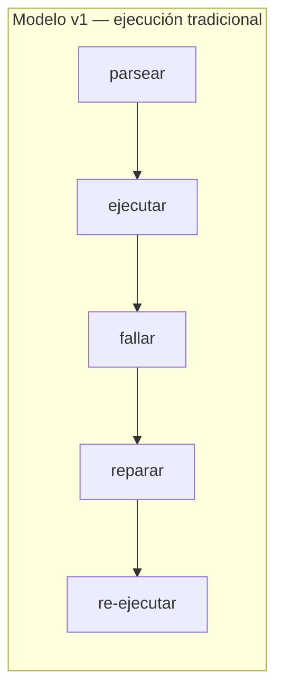

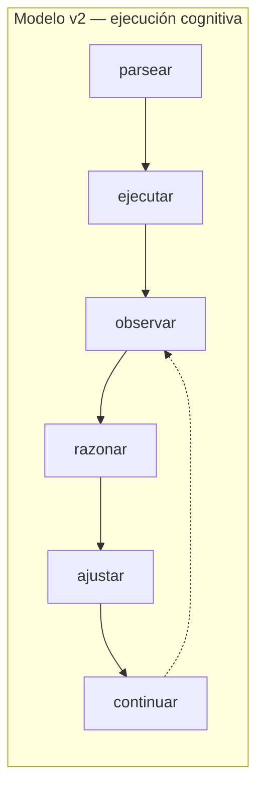

### 1.3 Contribuciones

Este reporte hace las siguientes afirmaciones, cada una respaldada por evidencia de implementación y posicionada contra la literatura relevada:

1. **Goals como expresiones de runtime evaluadas continuamente** (Sección 3.1). Ningún lenguaje BDI existente trata los goals como expresiones en el lenguaje anfitrión evaluadas durante la ejecución. El `GoalDef.check: Option<Expr>` de AURA permite monitoreo continuo de goals a granularidad arbitraria, distinto de los átomos simbólicos de AgentSpeak, las fórmulas lógicas de GOAL, y los maintain goals basados en callbacks de Jadex.

2. **Deliberación cognitiva como semántica del lenguaje** (Sección 3.2). Ningún lenguaje existente define la deliberación como una operación semántica que puede modificar el estado de ejecución, reescribir código, o hacer backtrack con ajustes. El trait `CognitiveRuntime` (`observe`, `deliberate`, `check_goals`, `is_active`) es invocado por la VM durante la evaluación de expresiones, no como una capa de monitoreo externa.

3. **Álgebra de intervención de cinco modos** (Sección 3.3). El enum `CognitiveDecision` define cinco intervenciones estructuralmente tipadas (`Continue`, `Override(Value)`, `Fix{new_code, explanation}`, `Backtrack{checkpoint, adjustments}`, `Halt(error)`), proporcionando un espacio de intervención más rico que cualquier sistema de auto-reparación existente.

4. **Adaptación acotada por invariantes** (Sección 3.4). Los invariantes y goals declarados por el desarrollador restringen todas las modificaciones generadas por el LLM. La función `validate_fix()` verifica que los fixes sean parseables, respeten límites de tamaño, preserven todos los goals declarados, y no introduzcan goals nuevos. Este es un patrón de diseño novedoso: restricciones declaradas por el desarrollador sobre la modificación automatizada de programas.

5. **Abstracción cognitiva de cero overhead** (Sección 3.5). Cuando `is_active()` retorna `false` (el `NullCognitiveRuntime`), todas las verificaciones cognitivas son no-ops. Los programas sin características cognitivas se ejecutan con rendimiento idéntico al de un runtime no cognitivo.

---

## 2. Trabajo relacionado

### 2.1 Lenguajes de programación orientados a agentes

**AgentSpeak(L)** (Rao 1996) introdujo el modelo de programación BDI dominante: los agentes tienen creencias (hechos tipo Prolog), eventos disparadores activan planes de una biblioteca de planes, y las intenciones son pilas de planes parcialmente ejecutados. **Jason** (Bordini et al. 2007) es la implementación más completa, añadiendo actos de habla, entornos y abstracciones organizacionales. Los goals en AgentSpeak son átomos simbólicos (`!achieve_goal`) que disparan selección de planes; el fallo causa abandono de intención o re-planificación dentro de la biblioteca de planes.

**GOAL** (Hindriks 2009) usa goals declarativos expresados como fórmulas lógicas. La base de goals de un agente se actualiza mediante un ciclo de deliberación que evalúa goals contra creencias. GOAL es el trabajo previo más cercano al modelo de goals activos de AURA, pero sus goals son fórmulas lógicas en un lenguaje de consulta de creencias separado, no expresiones en el lenguaje anfitrión.

**2APL** (Dastani 2008) introduce *reglas de razonamiento práctico* (PR-rules) que revisan planes cuando las condiciones cambian. Cuando un plan falla, las PR-rules hacen matching con el contexto de fallo y generan planes revisados. Este es el mecanismo de re-planificación más sofisticado en la literatura AOPL, pero opera sobre mapeos regla-plan predefinidos, no deliberación abierta con LLM.

**Jadex** (Pokahr et al. 2005) añade *maintain goals* al modelo BDI: condiciones que deben permanecer verdaderas, con re-activación automática de planes cuando se violan. Esto es estructuralmente similar al `goal ... check expr` de AURA, pero las condiciones maintain de Jadex son predicados Java registrados como callbacks, no expresiones en el lenguaje del agente mismo.

**SARL** (Rodriguez et al. 2014) introduce un modelo de capacidad/habilidad donde los agentes declaran capacidades requeridas y vinculan implementaciones en runtime. Esto es arquitectónicamente similar al sistema de capacidades de AURA (`+http`, `+json`, `+db`).

**La brecha.** Ningún lenguaje BDI existente trata los goals como expresiones evaluadas continuamente en el sistema de expresiones del lenguaje anfitrión. La Tabla 1 resume la distinción:

*Tabla 1: Representación de goals a través de lenguajes orientados a agentes*

| Lenguaje | Representación del goal | Momento de evaluación | Respuesta ante fallo |
|----------|-------------------|-------------------|-----------------|
| AgentSpeak | Átomo simbólico (`!g`) | Al dispararse | Abandonar intención |
| GOAL | Fórmula lógica | Por ciclo de deliberación | Re-seleccionar plan |
| Jadex | Predicado Java (callback) | Al callback | Re-activar plan |
| 2APL | Fórmula lógica | Por ciclo, PR-rules | Revisión basada en reglas |
| **AURA** | **Expresión del lenguaje anfitrión** | **Continua, por paso** | **Deliberación cognitiva + backtrack** |

### 2.2 Reparación automática de programas

**GenProg** (Le Goues et al. 2012) fue pionero en la reparación automatizada de programas basada en búsqueda usando programación genética para evolucionar parches. **SemFix** (Nguyen et al. 2013) y **Angelix** (Mechtaev et al. 2016) introdujeron reparación a nivel semántico usando ejecución simbólica y resolución de restricciones. **Prophet** (Long & Rinard 2016) aprendió modelos de corrección de código a partir de parches humanos para rankear candidatos.

La era de los LLM transformó el campo. **ChatRepair** (Xia & Zhang 2023) usa interacción conversacional con LLM para corregir 162/337 bugs de Defects4J a ~$0.42 por bug. **RepairLLaMA** (Silva et al. 2023) hace fine-tuning de LLMs open-source con adaptadores LoRA para reparación. **AlphaRepair** (Xia & Zhang 2022) demostró que modelos de código pre-entrenados pueden realizar reparación zero-shot tratando código con errores como un problema de modelo de lenguaje enmascarado.

**La limitación post-mortem.** Todas las herramientas APR---clásicas y basadas en LLM---comparten una arquitectura fundamental:

```
[Programa falla] → [Extraer código + error] → [Enviar a herramienta] → [Obtener parche] → [Aplicar] → [Re-ejecutar]
```

Ninguna tiene acceso al estado de ejecución en vivo. Ninguna puede inyectar valores a mitad de ejecución. Ninguna puede hacer backtrack a un checkpoint con ajustes. La herramienta de reparación nunca ve qué variables tenían qué valores en el momento del fallo, qué goals pretendía el desarrollador (más allá de aserciones de test), o el camino de ejecución que llevó al error.

### 2.3 Sistemas auto-adaptativos

**Computación autónoma** (Kephart & Chess 2003) propuso la arquitectura de referencia MAPE-K: Monitorear (recolectar datos vía sensores), Analizar (determinar si se necesita adaptación), Planificar (seleccionar estrategia), Ejecutar (aplicar vía efectores), sobre Conocimiento compartido. **Rainbow** (Garlan et al. 2004) implementa MAPE-K a nivel arquitectónico, monitoreando sistemas en ejecución contra restricciones y aplicando estrategias de reparación predefinidas.

**FORMS** (Weyns et al. 2012) proporciona un modelo de referencia formal para sistemas auto-adaptativos con semántica rigurosa para el sistema gestionado, entorno, goals de adaptación, y ciclo de retroalimentación.

**La limitación de capa externa.** Todas las implementaciones MAPE-K añaden monitoreo y adaptación como una capa arquitectónica externa. El sistema gestionado es una caja negra observada a través de sondas. Las estrategias de adaptación son configuraciones predefinidas, no modificaciones de código generadas en runtime. La lógica de adaptación está separada de la lógica del programa.

### 2.4 Arquitecturas cognitivas

**Soar** (Laird et al. 1987; Newell 1990) implementa un sistema de producción con sub-goalificación universal: cuando ninguna producción se dispara, un *impasse* activa la creación automática de sub-goals. El mecanismo de *chunking* de Soar aprende nuevas producciones a partir de la resolución de sub-goals, creando un ciclo de aprendizaje. **ACT-R** (Anderson & Lebiere 1998; Anderson et al. 2004) modela la cognición como la interacción de buffers modulares (visual, motor, memoria declarativa, buffer de goals) mediados por reglas de producción. **CLARION** (Sun 2016) modela explícitamente la interacción entre conocimiento implícito (subsimbólico) y explícito (simbólico). **LIDA** (Franklin et al. 2014) implementa la Teoría del Espacio de Trabajo Global con un mecanismo de difusión similar a la consciencia.

**La relevancia.** El runtime cognitivo de AURA implementa un ciclo que mapea directamente a componentes de arquitecturas cognitivas:

| Componente cognitivo | Implementación en AURA |
|---|---|
| Percepción | `observe()` --- detección de eventos durante la ejecución |
| Memoria de trabajo | Buffer de observaciones + contexto de ejecución actual |
| Deliberación | `deliberate()` --- invocación del LLM con contexto empaquetado |
| Decisión | Enum `CognitiveDecision` --- cinco tipos de intervención |
| Acción | Hot reload, inyección de valor, restauración de checkpoint |
| Aprendizaje | Traza de `ReasoningEpisode` + persistencia en `HealingMemory` |
| Metacognición | `CognitiveSafetyConfig` --- límites de seguridad sobre el comportamiento de razonamiento |

Esto convierte al runtime de AURA en una arquitectura cognitiva en sí misma, en lugar de un lenguaje usado para *implementar* una arquitectura cognitiva---una distinción sin precedentes en la literatura.

### 2.5 Arquitecturas reflectivas y de meta-nivel

**3-Lisp de Smith** (Smith 1984) introdujo la reflexión computacional: un programa que puede inspeccionar y modificar su propia ejecución. **CLOS MOP** (Kiczales et al. 1991) proporcionó un protocolo de meta-objetos que permite a los programas personalizar su propio sistema de clases. **Programación orientada a aspectos** (Kiczales et al. 1997) introdujo puntos de unión donde preocupaciones transversales pueden interceptar la ejecución.

**Efectos algebraicos** (Plotkin & Pretnar 2009; Bauer & Pretnar 2015) proporcionan el modelo formal más cercano: las computaciones pueden "ceder" efectos a handlers que los inspeccionan y reanudan. El puente cognitivo de AURA puede formalizarse como un handler de efectos algebraicos donde el efecto es "necesito asistencia cognitiva" y el handler es el LLM. La diferencia clave: los handlers de efectos algebraicos se definen estáticamente; el "handler" de AURA genera respuestas novedosas dinámicamente.

**El sistema de condiciones/restarts de Common Lisp** es el precedente clásico más cercano a la intervención a mitad de ejecución de AURA. Cuando un error señala una condición, los handlers pueden elegir entre restarts predefinidos (ej., `use-value`, `store-value`, `abort`). AURA generaliza esto: en lugar de restarts definidos por el programador, el LLM genera intervenciones novedosas informadas por el contexto de runtime, goals e invariantes.

### 2.6 Sistemas de programación integrados con LLM

**LMQL** (Beurer-Kellner et al. 2023) es la comparación más relevante como lenguaje de programación real (publicado en PLDI) que extiende Python con generación restringida de LLM. LMQL compila a máscaras a nivel de token para decodificación restringida. Sin embargo, se enfoca en restricciones en tiempo de generación, no en razonamiento de agentes---no tiene goals, observación, auto-reparación, ni runtime cognitivo.

**DSPy** (Khattab et al. 2023) introduce especificaciones declarativas de programas LLM con optimización automática de prompts. **SGLang** (Zheng et al. 2024) optimiza la ejecución de programas LLM estructurados con RadixAttention. Ambos están embebidos en Python y se enfocan en la eficiencia de llamadas al LLM, no en adaptación en runtime.

**ReAct** (Yao et al. 2023) y **Reflexion** (Shinn et al. 2023) implementan ciclos observar-razonar-actuar en agentes LLM, pero como patrones de prompt, no como semántica del lenguaje.

*Tabla 2: Sistemas de programación integrados con LLM*

| Sistema | ¿Es un lenguaje? | ¿LLM como primitiva? | ¿Goals? | ¿Auto-reparación? | ¿Ciclo en runtime? |
|--------|---------------|-------------------|--------|---------------|---------------|
| LMQL | **Sí** | Sí (generación restringida) | No | No | No |
| DSPy | Parcial (DSL en Python) | Sí (signatures) | No | Optimización de prompt | No |
| SGLang | Parcial (DSL en Python) | Sí (primitivas) | No | No | No |
| LangChain | No (biblioteca) | No (llamada a función) | No | No | No |
| ReAct | No (patrón de prompt) | Sí (en-prompt) | No | No | Sí (ad hoc) |
| **AURA** | **Sí** | **Sí** (`reason`) | **Sí** (`goal check`) | **Sí** (a nivel de lenguaje) | **Sí** (integrado en la VM) |

---

## 3. Diseño e implementación

La siguiente figura muestra la arquitectura general del runtime cognitivo de AURA, desde el código fuente hasta la intervención del LLM:

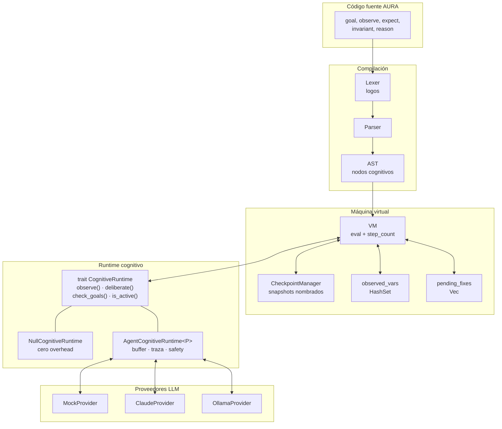

### 3.1 Primitivas cognitivas

AURA introduce seis construcciones que forman su vocabulario cognitivo. Estas se parsean en nodos AST---son parte de la gramática del lenguaje, no funciones de biblioteca.

#### 3.1.1 `goal`

```
goal "process user data correctly"
goal "all users must have valid names" check users != nil
```

Los goals son declaraciones de nivel superior (`Definition::Goal(GoalDef)`) con una expresión `check` opcional. La estructura `GoalDef`:

```rust
pub struct GoalDef {
    pub description: String,
    pub check: Option<Expr>,  // El elemento novedoso
    pub span: Span,
}
```

Cuando `check` está presente, el goal es *activo*: la VM evalúa la expresión check después de cambios en variables observadas, después de retornos de funciones, y en intervalos de pasos configurables. Si la verificación evalúa a falso, se eleva un `DeliberationTrigger::GoalMisalignment`, invocando el runtime cognitivo.

La palabra clave `check` se parsea como un *soft keyword* (`Ident("check")`), no como un token reservado---preservando compatibilidad hacia atrás con programas que usan "check" como identificador.

#### 3.1.2 `observe`

```
observe users
observe response.status
observe data where valid == true
```

`observe` declara un punto de monitoreo en runtime (`Expr::Observe`). Cuando una variable observada cambia de valor, la VM:
1. Crea un checkpoint implícito (vía `CheckpointManager`)
2. Notifica al runtime cognitivo vía `observe(ObservationEvent::ValueChanged{...})`
3. Dispara la evaluación de goals activos

Sin un runtime cognitivo, `observe` es un no-op que retorna nil.

#### 3.1.3 `expect`

```
expect len(users) > 0 "should have users"
```

`expect` es verificación de intención (`Expr::Expect`). A diferencia de las aserciones que crashean ante un fallo, los expects se registran como `ExpectationFailure` y, cuando un runtime cognitivo está activo, disparan `DeliberationTrigger::ExpectFailed`. El runtime puede entonces decidir continuar, sobreescribir el resultado, generar un fix, o hacer backtrack.

#### 3.1.4 `invariant`

```
invariant len(users) > 0
```

Los invariantes (`Definition::Invariant(Expr)`) declaran restricciones que ninguna adaptación puede violar. Sirven como la frontera de seguridad del desarrollador: la función `validate_fix()` verifica que los fixes propuestos por el LLM no rompan invariantes antes de ser aplicados.

#### 3.1.5 `reason`

```
strategy = reason "we have {len(users)} users, should we process all or filter?"
```

`reason` es un punto de deliberación explícito (`Expr::Reason`). La ejecución pausa, la pregunta y las observaciones recientes se envían al runtime cognitivo, y la decisión del LLM se convierte en el valor de la expresión. Esto permite *inyección de valores*: el LLM puede retornar un valor que se vincula a una variable y se usa en la computación subsiguiente.

Sin un runtime cognitivo, `reason` retorna nil.

#### 3.1.6 `@self_heal`

```
@self_heal(max_attempts: 5, mode: "semantic")
process_data(data) = { ... }
```

Anotación a nivel de función (`SelfHealConfig`) que marca funciones individuales para reparación automática. Configurable con `max_attempts` y `mode` (technical, semantic, auto).

### 3.2 El trait CognitiveRuntime

El trait `CognitiveRuntime` define la interfaz entre la VM y el agente cognitivo:

```rust
pub trait CognitiveRuntime: Send {
    fn observe(&mut self, event: ObservationEvent);
    fn deliberate(&mut self, trigger: DeliberationTrigger) -> CognitiveDecision;
    fn check_goals(&mut self) -> Vec<CognitiveDecision>;
    fn is_active(&self) -> bool;
    fn set_available_checkpoints(&mut self, checkpoints: Vec<String>) {}
}
```

**Eventos de observación** (`ObservationEvent`) incluyen `ValueChanged`, `ExpectEvaluated`, `FunctionReturned`, y `CheckpointCreated`. Estos proporcionan al LLM contexto de runtime rico que ninguna herramienta de reparación post-mortem puede acceder.

**Disparadores de deliberación** (`DeliberationTrigger`) clasifican qué provocó la deliberación: `ExpectFailed`, `ExplicitReason`, `TechnicalError`, o `GoalMisalignment`. Esta clasificación ayuda al LLM a entender la naturaleza del problema.

El `NullCognitiveRuntime` implementa todas las operaciones como no-ops con `is_active() = false`, proporcionando cero overhead para ejecución no cognitiva.

El siguiente diagrama muestra cómo la VM interactúa con el trait durante la evaluación de expresiones:

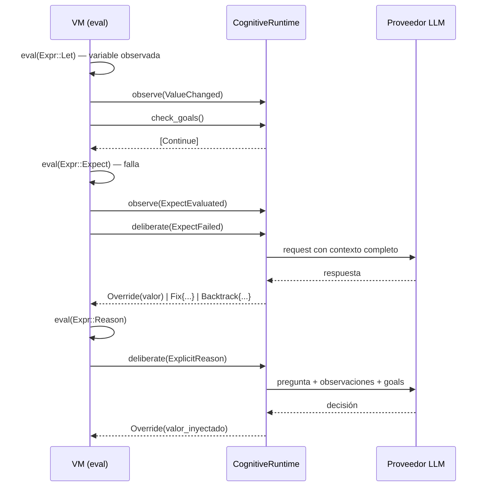

### 3.3 El álgebra de intervención de cinco modos

`CognitiveDecision` define cinco intervenciones estructuralmente tipadas:

```rust
pub enum CognitiveDecision {
    Continue,
    Override(Value),
    Fix { new_code: String, explanation: String },
    Backtrack { checkpoint: String, adjustments: Vec<(String, Value)> },
    Halt(RuntimeError),
}
```

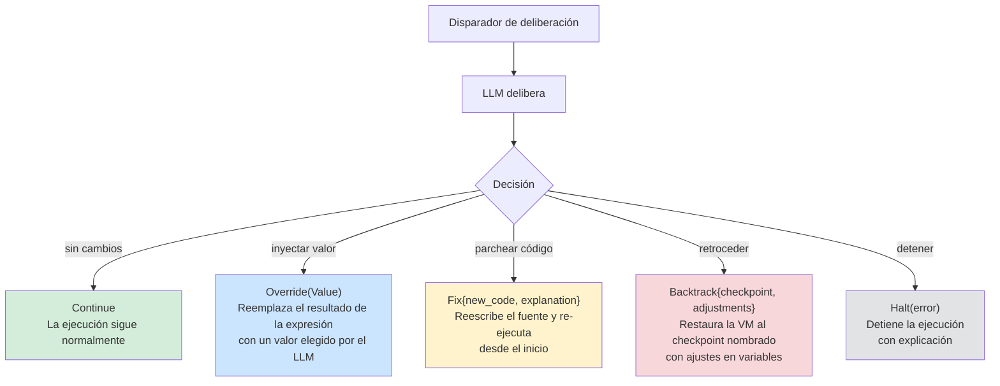

Comparación con modelos de intervención existentes:

| Intervención | Semántica | Precedente |
|---|---|---|
| `Continue` | Proceder normalmente | Común (todos los sistemas) |
| `Override(Value)` | Inyectar un valor de reemplazo en el flujo de ejecución | Restart `use-value` de Common Lisp, pero elegido por LLM |
| `Fix{new_code, explanation}` | Reescribir código fuente; re-ejecutar desde el inicio | Herramientas APR (GenProg, ChatRepair), pero con contexto de runtime |
| `Backtrack{checkpoint, adjustments}` | Restaurar la VM al checkpoint nombrado, aplicar ajustes a variables, continuar desde ese punto | **Sin precedente** en APR o frameworks LLM |
| `Halt(error)` | Detener ejecución con explicación | Común (todos los sistemas) |

La intervención `Backtrack` es particularmente novedosa. A diferencia de las herramientas APR que deben re-ejecutar desde cero, y a diferencia de la supervisión de Erlang que reinicia desde el estado inicial, AURA puede restaurar a cualquier checkpoint nombrado *con ajustes*---el LLM especifica qué variables modificar antes de reanudar. Esto permite re-ejecución parcial con correcciones informadas, una capacidad sin precedentes en la literatura.

### 3.4 Seguridad: adaptación acotada por invariantes

La función `validate_fix()` impone restricciones de seguridad antes de que cualquier modificación propuesta por el LLM sea aplicada:

1. **Restricción de tamaño**: los fixes que exceden `max_fix_lines` (por defecto: 50) son rechazados, previniendo reescrituras completas del programa.
2. **Validez sintáctica**: cada fix propuesto debe tokenizarse y parsearse como AURA válido.
3. **Inmutabilidad de goals**: el fix debe preservar todos los goals declarados---sin adiciones, sin eliminaciones, sin modificaciones. Los goals son dominio exclusivo del desarrollador.
4. **Profundidad de backtrack**: `max_backtrack_depth` (por defecto: 5) previene ciclos infinitos de backtrack.
5. **Seguimiento de progreso**: `max_deliberations_without_progress` (por defecto: 3) detiene el razonamiento descontrolado.

```rust
pub struct CognitiveSafetyConfig {
    pub max_fix_lines: usize,
    pub max_backtrack_depth: usize,
    pub max_deliberations_without_progress: usize,
}
```

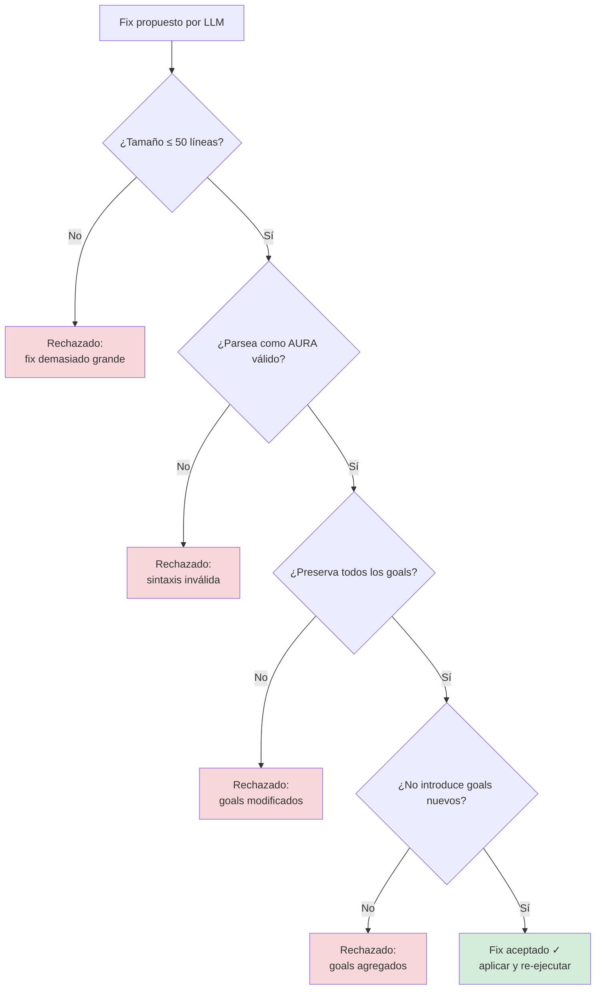

Esto establece un espacio de adaptación formalmente acotado: el LLM puede modificar el programa, pero solo dentro de las restricciones que el desarrollador ha declarado. Este es un patrón de diseño novedoso---**restricciones declaradas por el desarrollador sobre la modificación automatizada de programas**---que no tiene precedente directo en la literatura de APR o sistemas auto-adaptativos.

### 3.5 Sistema de checkpoints

El `CheckpointManager` mantiene snapshots nombrados del estado de la VM:

```rust
pub struct VMCheckpoint {
    pub name: String,
    pub variables: HashMap<String, Value>,
    pub step_count: u64,
    pub timestamp: Instant,
}
```

Los checkpoints se crean implícitamente (ante disparadores de `observe`, antes de llamadas a funciones) y pueden restaurarse con ajustes:

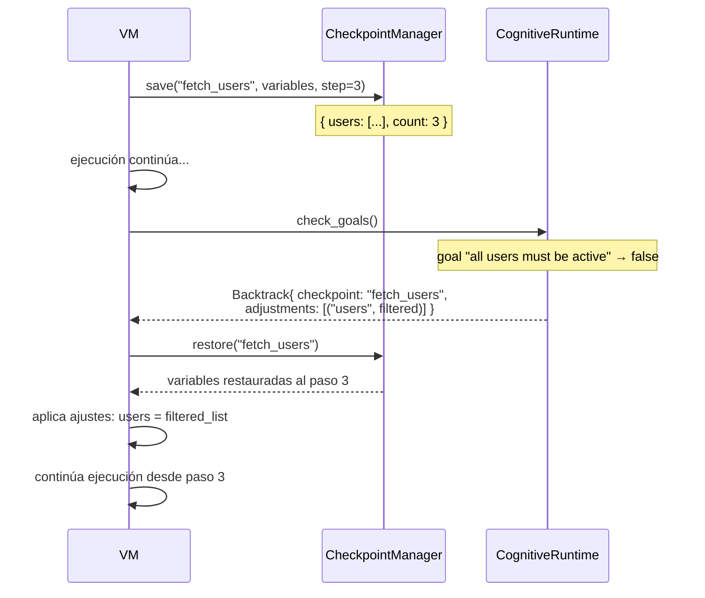

Esto combina ideas de memoria transaccional de software (Shavit & Touitou 1995; Harris et al. 2005), backtracking cronológico de Prolog, y manejo de fallos de planes BDI, pero la síntesis---backtracking con ajustes sugeridos por LLM en un ciclo de ejecución cognitiva---es nueva.

### 3.6 El AgentCognitiveRuntime

La implementación real conecta el trait `CognitiveRuntime` a un `AgentProvider` (soportando múltiples backends de LLM):

```rust
pub struct AgentCognitiveRuntime<P: AgentProvider> {
    provider: P,
    tokio_handle: Handle,        // puente async-sync
    goals: Vec<GoalDef>,
    invariants: Vec<String>,
    source_code: String,
    observation_buffer: Vec<ObservationEvent>,
    reasoning_trace: Vec<ReasoningEpisode>,
    available_checkpoints: Vec<String>,
    max_deliberations: usize,
    deliberation_count: usize,
    safety_config: CognitiveSafetyConfig,
    consecutive_backtracks: usize,
    deliberations_without_progress: usize,
}
```

Decisiones de diseño clave:

- **Puente async-sync**: la VM es síncrona; el `AgentProvider` es async. `tokio_handle.block_on()` tiende el puente, manteniendo simple la implementación de la VM.
- **Agrupación de observaciones**: los eventos se acumulan en `observation_buffer` y se drenan después de cada deliberación, proporcionando al LLM contexto acumulativo.
- **Memoria episódica**: `reasoning_trace: Vec<ReasoningEpisode>` registra cada episodio de deliberación, incluido en solicitudes subsiguientes para que el LLM pueda aprender de la historia reciente.
- **Fail-open**: si el provider falla (error de red, timeout), el runtime retorna `Continue` en lugar de crashear. La capa cognitiva nunca hace al programa *menos* confiable.

### 3.7 El runner de ejecución cognitiva

La función `run_cognitive()` orquesta el ciclo de reintentos:

```rust
pub fn run_cognitive(
    source: &str,
    cognitive: Box<dyn CognitiveRuntime>,
    max_retries: usize,
) -> Result<CognitiveRunResult, RuntimeError>
```

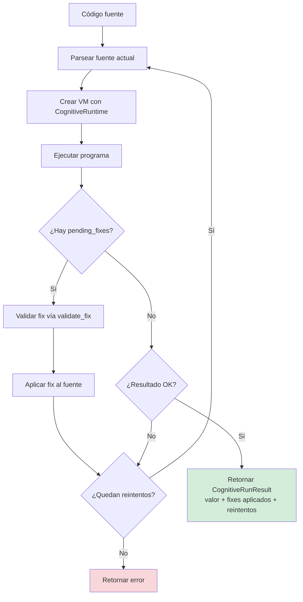

Para cada intento:
1. Parsear el código fuente actual
2. Crear la VM con runtime cognitivo (primer intento) o `NullCognitiveRuntime` (reintentos)
3. Cargar y ejecutar el programa
4. Si existen `pending_fixes`, validar cada fix vía `validate_fix()`, aplicar el válido, y reintentar
5. Si la ejecución tiene éxito sin fixes pendientes, retornar el resultado
6. Si se agotaron los reintentos, retornar el error

Crucialmente, las decisiones `Backtrack` se manejan *dentro* de una sola ejecución (son restauraciones de estado en línea), mientras que las decisiones `Fix` requieren re-parseo y re-ejecución. Esta adaptación de doble nivel---backtrack en línea para correcciones rápidas, re-ejecución completa para cambios estructurales---proporciona una flexibilidad sin igual en sistemas de estrategia única.

---

## 4. Posicionamiento frente al estado del arte

### 4.1 Comparación integral

*Tabla 3: AURA posicionado contra sistemas representativos de cada línea de investigación*

| Dimensión | GenProg | ChatRepair | LangChain | Rainbow | Jason | AURA v2.0 |
|---|---|---|---|---|---|---|
| **Naturaleza** | Herramienta APR | Herramienta de reparación LLM | Orquestación LLM | Framework auto-adaptativo | Lenguaje BDI | **Lenguaje cognitivo** |
| **Cuándo ocurre la reparación** | Post-mortem | Post-mortem | N/A | Runtime (externo) | Fallo de plan | **A mitad de ejecución (en la VM)** |
| **Acceso al estado de runtime** | Ninguno | Ninguno | Ninguno | Métricas arquitectónicas | Base de creencias | **Completo: variables, goals, checkpoints** |
| **Oráculo de reparación** | Suite de tests | Suite de tests + LLM | N/A | Estrategias predefinidas | Biblioteca de planes | **Goals + expects + invariantes + LLM** |
| **Inyección de valores** | No | No | No | No | Actualización de creencias | **Sí (`Override`)** |
| **Backtracking** | No | No | No | No | Pila de intenciones | **Sí (checkpoint + ajustes)** |
| **Parcheo de código** | Sí (fuente) | Sí (fuente) | N/A | Sí (config) | No | **Sí (fuente validado)** |
| **Restricciones de seguridad** | Solo suite de tests | Ninguna | N/A | Por construcción | Ninguna | **Invariantes + inmutabilidad de goals** |
| **Intención del desarrollador** | Casos de test | Casos de test | Código Python | Restricciones arq. | Goals BDI | **`goal`, `expect`, `invariant`** |
| **Integración LLM** | Ninguna | API externa | API externa | Ninguna | Ninguna | **Trait de runtime de primera clase** |

### 4.2 La brecha tripartita

AURA cierra una brecha en la intersección de tres preocupaciones previamente separadas:

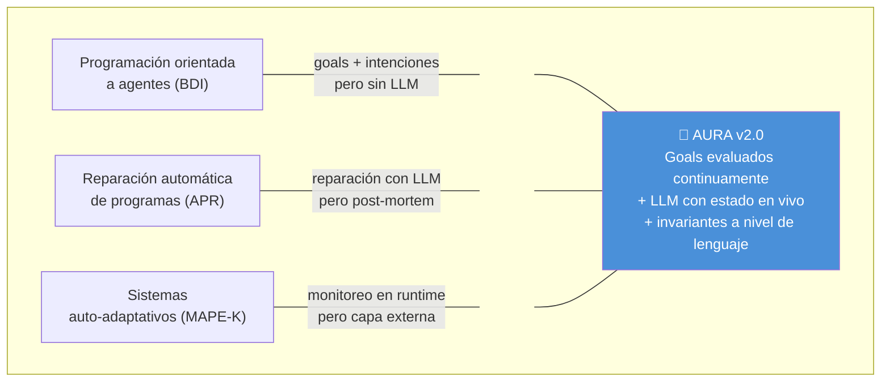

1. **Ningún lenguaje actual** proporciona construcciones integradas para expresar la intención del desarrollador (`goal`), expectativas de runtime (`expect`), monitoreo de variables (`observe`), puntos seguros de rollback (checkpoints), y solicitudes explícitas de razonamiento (`reason`) como sintaxis de primera clase.

2. **Ningún sistema actual** da a un LLM acceso al estado de ejecución en vivo (valores de variables, camino de ejecución, resultados de evaluación de goals) durante la ejecución del programa, permitiendo decisiones a mitad de ejecución (inyección de valores, parcheo de código, backtracking basado en checkpoints).

3. **Ningún sistema actual** impone invariantes de seguridad sobre las adaptaciones generadas por LLM a nivel del lenguaje---donde los invariantes se declaran en la sintaxis del programa, se validan por el parser, y se aplican antes de que cualquier fix propuesto por el LLM sea aplicado.

### 4.3 Afirmación formal de novedad

> AURA incorpora un ciclo cognitivo (observar-razonar-ajustar-continuar) como un mecanismo de runtime de primera clase dentro de la semántica de ejecución del lenguaje, donde (1) la fase "razonar" invoca un modelo de lenguaje grande externo con contexto de ejecución reificado, (2) la fase "ajustar" aplica modificaciones verificadas en tipo al código en ejecución, y (3) el ciclo opera a granularidad arbitraria---desde expresiones individuales hasta cuerpos de funciones completos---en lugar de solo en fronteras de proceso (Erlang), fronteras de transacción (STM), o puntos de unión predefinidos (AOP).

### 4.4 Lo que no es novedoso

La honestidad académica requiere identificar sobre qué construye AURA en lugar de inventar:

- La arquitectura BDI (Rao & Georgeff 1991, 1995; Bratman 1987)
- Ciclos auto-adaptativos MAPE-K (Kephart & Chess 2003)
- Mecanismos de checkpoint/rollback (Shavit & Touitou 1995)
- Reparación de código basada en LLM (Xia & Zhang 2023; Le Goues et al. 2012)
- Hot code reloading (Armstrong 2003)
- Sistemas de módulos basados en capacidades (cf. modelo de capacidades de SARL)
- Sistemas de condiciones/restarts (Common Lisp)
- Verificación en runtime (Leucker & Schallhart 2009)

La contribución de AURA es la *síntesis*: integrar todo lo anterior en un mecanismo de runtime unificado diseñado desde cero para esta interacción.

---

## 5. Ejemplo desarrollado

El siguiente programa AURA demuestra la ejecución cognitiva. Los comentarios anotan lo que el runtime cognitivo hace en cada punto.

```aura
# Demo del runtime cognitivo
# Ejecutar con: aura run --cognitive --provider mock examples/cognitive_demo.aura

+http +json

# El desarrollador declara su intención
goal "process user data correctly"
goal "all users must have valid names" check users != nil

# Definición de tipo con anotaciones de validación
@User {
    id :i
    name :s
    email :s
}

# Función de fuente de datos
fetch_users() = [{id: 1, name: "Alice", email: "alice@example.com"}, {id: 2, name: "Bob", email: "bob@example.com"}, {id: 3, name: "Charlie", email: "charlie@example.com"}]

# Función de formateo
format_user(user) = "User {user.id}: {user.name} <{user.email}>"

main = : users = fetch_users(); observe users; expect len(users) > 0 "should have users"; strategy = reason "we have users, should we process all or filter?"; first_user = first(users); format_user(first_user)
```

### 5.1 Traza de ejecución bajo runtime cognitivo

Al ejecutarse con `aura run --cognitive --provider claude examples/cognitive_demo.aura`:

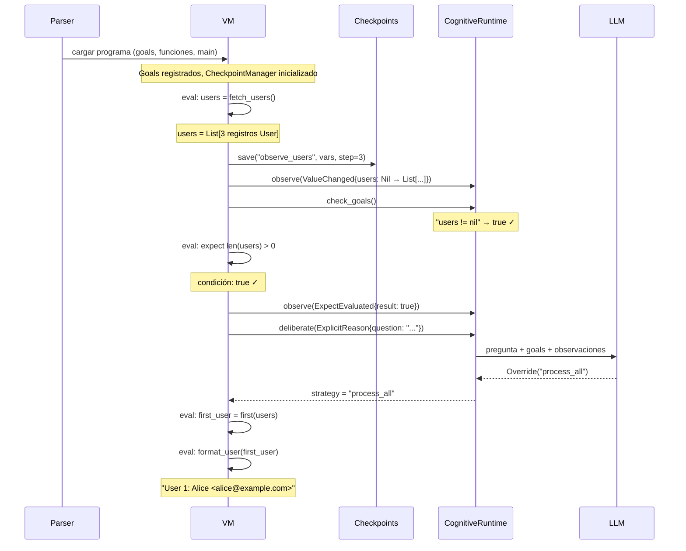

### 5.2 Contrafactual: escenario de desalineación de goal

Supongamos que `fetch_users()` retornó una lista incluyendo un usuario con `name: nil`. El goal `check users != nil` aún pasaría (la lista misma no es nil), pero imaginemos un goal más preciso:

```aura
goal "all names must be non-empty" check for(u in users) : u.name != nil
```

Cuando la verificación del goal falla:

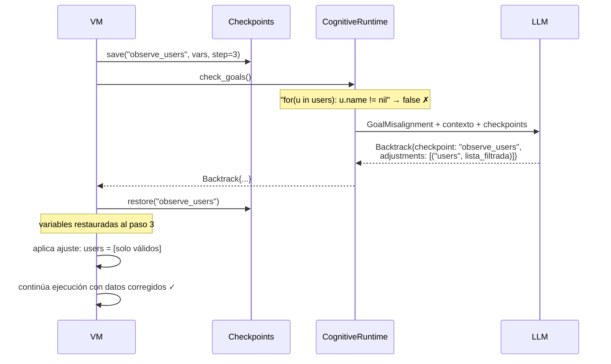

Este es el poder del backtracking basado en checkpoints con ajustes informados por LLM: el programa no crashea, no reinicia desde cero, y no aplica una estrategia predefinida frágil. El LLM entiende el goal ("all names must be non-empty"), examina los datos, y propone una corrección dirigida.

---

## 6. Discusión

### 6.1 Enmarcamiento teórico

El runtime cognitivo de AURA puede formalizarse a través de múltiples lentes teóricos:

**Como un handler de efectos algebraicos** (Plotkin & Pretnar 2009): las primitivas cognitivas (`observe`, `reason`, `expect` ante fallo) son efectos cedidos por la computación. El `CognitiveRuntime` es el handler que interpreta estos efectos. La novedad clave: el handler no es una función definida estáticamente sino un LLM que razona dinámicamente.

**Como una instancia MAPE-K** (Kephart & Chess 2003): `observe` = Monitorear, clasificación de `DeliberationTrigger` = Analizar, deliberación del LLM = Planificar, aplicación de `CognitiveDecision` = Ejecutar, traza de `ReasoningEpisode` = Conocimiento. La novedad: todas las fases están embebidas en el runtime del lenguaje, no superpuestas externamente.

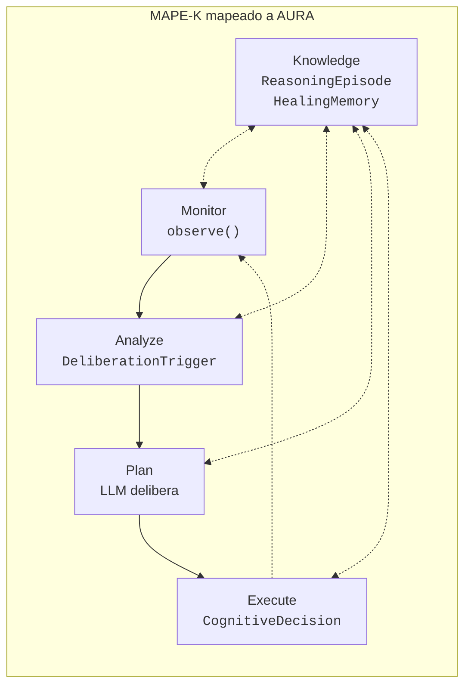

**Como un sistema generalizado de condiciones/restarts**: las condiciones de Common Lisp señalan errores; los restarts proporcionan opciones de recuperación. AURA generaliza ambos: cualquier evento de ejecución (no solo errores) puede disparar deliberación, y las opciones de recuperación son generadas dinámicamente por un LLM en lugar de ser predefinidas por el programador.

### 6.2 El runtime como arquitectura cognitiva

Al mapearse a la teoría de arquitecturas cognitivas, el runtime de AURA implementa los componentes esenciales identificados por Newell (1990) y arquitecturas subsiguientes:

- **Percepción**: detección de eventos vía `observe()`
- **Memoria de trabajo**: buffer de observaciones + contexto de ejecución
- **Memoria a largo plazo**: `HealingMemory` con persistencia de `ReasoningEpisode`
- **Deliberación**: invocación del LLM con contexto estructurado
- **Selección de acción**: enum `CognitiveDecision`
- **Aprendizaje**: el historial de episodios informa deliberaciones subsiguientes
- **Metacognición**: límites de `CognitiveSafetyConfig` sobre el comportamiento de razonamiento

Esto convierte a AURA, hasta donde sabemos, en **el primer runtime de lenguaje de programación que es en sí mismo una arquitectura cognitiva**---en lugar de un lenguaje usado para implementar una.

### 6.3 Limitaciones

**Latencia.** La deliberación con LLM añade segundos de latencia por invocación. AURA mitiga esto a través del `NullCognitiveRuntime` (cero overhead cuando las características cognitivas están inactivas) y observaciones agrupadas, pero las aplicaciones en tiempo real pueden necesitar límites de latencia más estrictos.

**Determinismo.** Las respuestas del LLM son no determinísticas. Dos ejecuciones del mismo programa pueden seguir caminos diferentes. AURA registra la traza de `ReasoningEpisode` para análisis de reproducibilidad, pero las garantías formales requieren trabajo futuro.

**Corrección de fixes generados por LLM.** La función `validate_fix()` verifica sintaxis, preservación de goals, y tamaño---pero no corrección semántica. Un fix que parsea correctamente y preserva goals aún puede introducir errores. La suite de tests proporciona validación adicional, pero la verificación formal de parches generados por LLM sigue siendo un problema de investigación abierto.

**Costo.** Cada deliberación incurre en costos de API del LLM. Los límites `max_deliberations` y `max_deliberations_without_progress` acotan esto, pero las estrategias de deliberación conscientes del costo son trabajo futuro.

### 6.4 Direcciones futuras

- **Semántica formal**: definir el ciclo cognitivo de AURA en un framework de semántica operacional, construyendo sobre la literatura de efectos algebraicos.
- **Runtime cognitivo multi-agente**: múltiples LLMs con diferentes especializaciones (ej., uno para reparación de código, otro para razonamiento arquitectónico).
- **Adaptación verificada**: usar métodos formales para demostrar que las adaptaciones dentro del espacio acotado por invariantes preservan propiedades especificadas.
- **Deliberación consciente del costo**: estrategias que balanceen el costo de llamadas al LLM contra el beneficio esperado.
- **Cognición colaborativa**: modos humano-en-el-ciclo donde el runtime presenta opciones en lugar de actuar autónomamente.

---

## 7. Conclusión

AURA demuestra que la deliberación cognitiva puede incorporarse en la semántica de lenguajes de programación, creando una nueva categoría de diseño de lenguajes. Al sintetizar conceptos de programación orientada a agentes (goals BDI), sistemas auto-adaptativos (monitoreo MAPE-K), y reparación de programas basada en LLM (corrección conversacional) en construcciones de primera clase del lenguaje con reglas de evaluación definidas, AURA abre un espacio de diseño que, hasta donde sabemos, no ha sido explorado en la literatura publicada.

La idea clave es arquitectónica: el LLM no es una herramienta externa que procesa archivos fuente, sino un componente del runtime que participa en la ejecución---observando cambios en variables, evaluando goals, y tomando decisiones que se aplican inmediatamente dentro del flujo de ejecución. Los invariantes y goals declarados por el desarrollador restringen el espacio de adaptación, creando un contrato formalmente acotado entre la intención humana y el razonamiento de la máquina.

Los 244 tests de AURA, la implementación completa en Rust, y el modo de ejecución cognitiva funcional demuestran que este diseño no es meramente teórico sino prácticamente realizable. El `NullCognitiveRuntime` asegura cero overhead para programas no cognitivos, haciendo que las capacidades cognitivas sean puramente aditivas.

Si este paradigma escala a sistemas de producción, cómo pueden establecerse garantías formales de corrección para adaptaciones generadas por LLM, y qué patrones de experiencia de desarrollador emergen cuando los programas pueden razonar sobre su propia ejecución---estas son preguntas que la existencia de AURA hace concretas y tratables.

---

## Referencias

### Lenguajes de programación orientados a agentes

[1] Shoham, Y. (1993). "Agent-Oriented Programming." *Artificial Intelligence*, 60(1):51-92.

[2] Rao, A.S. (1996). "AgentSpeak(L): BDI Agents Speak Out in a Logical Computable Language." *MAAMAW'96*, LNCS 1038, Springer, 42-55.

[3] Bordini, R.H., Hubner, J.F., & Wooldridge, M. (2007). *Programming Multi-Agent Systems in AgentSpeak using Jason*. Wiley.

[4] Hindriks, K.V. (2009). "Programming Rational Agents in GOAL." In *Multi-Agent Programming*, Springer, 119-157.

[5] Dastani, M. (2008). "2APL: A Practical Agent Programming Language." *Autonomous Agents and Multi-Agent Systems*, 16(3):214-248.

[6] Rodriguez, S., Gaud, N., & Galland, S. (2014). "SARL: A General-Purpose Agent-Oriented Programming Language." *WI-IAT 2014*, IEEE/WIC/ACM.

[7] Pokahr, A., Braubach, L., & Lamersdorf, W. (2005). "Jadex: A BDI Reasoning Engine." In *Multi-Agent Programming*, Springer, 149-174.

### Teoría BDI

[8] Bratman, M.E. (1987). *Intention, Plans, and Practical Reason*. Harvard University Press.

[9] Rao, A.S. & Georgeff, M.P. (1991). "Modeling Rational Agents within a BDI-Architecture." *KR'91*, Morgan Kaufmann, 473-484.

[10] Rao, A.S. & Georgeff, M.P. (1995). "BDI Agents: From Theory to Practice." *ICMAS'95*, AAAI Press, 312-319.

[11] Sardina, S. & Padgham, L. (2011). "A BDI Agent Programming Language with Failure Handling, Declarative Goals, and Planning." *Autonomous Agents and Multi-Agent Systems*, 23(1):18-70.

[12] Cohen, P.R. & Levesque, H.J. (1990). "Intention is Choice with Commitment." *Artificial Intelligence*, 42(2-3):213-261.

### Reparación automática de programas

[13] Le Goues, C., Nguyen, T.V., Forrest, S., & Weimer, W. (2012). "GenProg: A Generic Method for Automatic Software Repair." *IEEE TSE*, 38(1):54-72.

[14] Nguyen, H.D.T., Qi, D., Roychoudhury, A., & Chandra, S. (2013). "SemFix: Program Repair via Semantic Analysis." *ICSE 2013*, 772-781.

[15] Mechtaev, S., Yi, J., & Roychoudhury, A. (2016). "Angelix: Scalable Multiline Program Patch Synthesis via Symbolic Analysis." *ICSE 2016*, 1071-1082.

[16] Long, F. & Rinard, M. (2016). "Automatic Patch Generation by Learning Correct Code." *POPL 2016*, 298-312.

[17] Xia, C.S. & Zhang, L. (2022). "Less Training, More Repairing Please: Revisiting Automated Program Repair via Zero-Shot Learning." *ESEC/FSE 2022*, 959-971.

[18] Xia, C.S. & Zhang, L. (2023). "Keep the Conversation Going: Fixing 162 out of 337 bugs for $0.42 each using ChatGPT." *ISSTA 2024*. arXiv:2304.00385.

[19] Monperrus, M. (2018). "Automatic Software Repair: A Bibliography." *ACM Computing Surveys*, 51(1):1-24.

### Sistemas auto-adaptativos

[20] Kephart, J.O. & Chess, D.M. (2003). "The Vision of Autonomic Computing." *IEEE Computer*, 36(1):41-50.

[21] Garlan, D., Cheng, S.-W., Huang, A.-C., Schmerl, B., & Steenkiste, P. (2004). "Rainbow: Architecture-Based Self-Adaptation with Reusable Infrastructure." *IEEE Computer*, 37(10):46-54.

[22] Weyns, D., Malek, S., & Andersson, J. (2012). "FORMS: Unifying Reference Model for Formal Specification of Distributed Self-Adaptive Systems." *ACM TAAS*, 7(1).

[23] Weyns, D. (2020). *An Introduction to Self-Adaptive Systems: A Contemporary Software Engineering Perspective*. Wiley/IEEE Press.

### Arquitecturas cognitivas

[24] Laird, J.E., Newell, A., & Rosenbloom, P.S. (1987). "SOAR: An Architecture for General Intelligence." *Artificial Intelligence*, 33(1):1-64.

[25] Newell, A. (1990). *Unified Theories of Cognition*. Harvard University Press.

[26] Anderson, J.R. & Lebiere, C. (1998). *The Atomic Components of Thought*. Lawrence Erlbaum Associates.

[27] Anderson, J.R. et al. (2004). "An Integrated Theory of the Mind." *Psychological Review*, 111(4):1036-1060.

[28] Sun, R. (2016). *Anatomy of the Mind: Exploring Psychological Mechanisms and Processes with the Clarion Cognitive Architecture*. Oxford University Press.

[29] Franklin, S. et al. (2014). "LIDA: A Systems-level Architecture for Cognition, Emotion, and Learning." *IEEE Trans. on Autonomous Mental Development*, 6(1):19-41.

### Reflexión, efectos y meta-programación

[30] Smith, B.C. (1984). "Reflection and Semantics in Lisp." *POPL '84*, ACM, 23-35.

[31] Kiczales, G., des Rivieres, J., & Bobrow, D.G. (1991). *The Art of the Metaobject Protocol*. MIT Press.

[32] Kiczales, G. et al. (1997). "Aspect-Oriented Programming." *ECOOP '97*, LNCS 1241, Springer, 220-242.

[33] Plotkin, G.D. & Pretnar, M. (2009). "Handlers of Algebraic Effects." *ESOP 2009*, LNCS 5502, Springer, 80-94.

[34] Bauer, A. & Pretnar, M. (2015). "Programming with Algebraic Effects and Handlers." *Journal of Logical and Algebraic Methods in Programming*, 84(1):108-123.

### Checkpoint, rollback y tolerancia a fallos

[35] Shavit, N. & Touitou, D. (1995). "Software Transactional Memory." *PODC '95*, ACM, 204-213.

[36] Harris, T., Marlow, S., Peyton Jones, S., & Herlihy, M. (2005). "Composable Memory Transactions." *PPoPP '05*, ACM, 48-60.

[37] Armstrong, J. (2003). *Making Reliable Distributed Systems in the Presence of Software Errors*. PhD Thesis, Royal Institute of Technology, Stockholm.

[38] Rinard, M. et al. (2004). "Enhancing Server Availability and Security Through Failure-Oblivious Computing." *OSDI 2004*, USENIX, 303-316.

[39] Perkins, J.H. et al. (2009). "Automatically Patching Errors in Deployed Software." *SOSP 2009*, ACM, 87-102.

### Programación integrada con LLM

[40] Beurer-Kellner, L., Fischer, M., & Vechev, M. (2023). "Prompting Is Programming: A Query Language for Large Language Models." *PLDI 2023*, ACM, 1507-1532.

[41] Khattab, O. et al. (2023). "DSPy: Compiling Declarative Language Model Calls into Self-Improving Pipelines." arXiv:2310.03714. *ICLR 2024*.

[42] Zheng, L. et al. (2024). "SGLang: Efficient Execution of Structured Language Model Programs." arXiv:2312.07104.

[43] Yao, S. et al. (2023). "ReAct: Synergizing Reasoning and Acting in Language Models." *ICLR 2023*.

[44] Shinn, N. et al. (2023). "Reflexion: Language Agents with Verbal Reinforcement Learning." *NeurIPS 2023*.

### Programación orientada a objetivos y planificación

[45] Fikes, R.E. & Nilsson, N.J. (1971). "STRIPS: A New Approach to the Application of Theorem Proving to Problem Solving." *Artificial Intelligence*, 2(3-4):189-208.

[46] Nilsson, N.J. (1994). "Teleo-Reactive Programs for Agent Control." *JAIR*, 1:139-158.

[47] Nau, D. et al. (2003). "SHOP2: An HTN Planning System." *JAIR*, 20:379-404.

### Verificación en runtime y diseño por contrato

[48] Meyer, B. (1992). "Applying 'Design by Contract'." *IEEE Computer*, 25(10):40-51.

[49] Leucker, M. & Schallhart, C. (2009). "A Brief Account of Runtime Verification." *Journal of Logic and Algebraic Programming*, 78(5):293-303.

[50] Ernst, M.D. et al. (2007). "The Daikon System for Dynamic Detection of Likely Invariants." *Science of Computer Programming*, 69(1-3):35-45.

### Surveys y trabajo fundacional

[51] Wooldridge, M. & Jennings, N.R. (1995). "Intelligent Agents: Theory and Practice." *Knowledge Engineering Review*, 10(2):115-152.

[52] Wang, L. et al. (2024). "A Survey on Large Language Model Based Autonomous Agents." *Frontiers of Computer Science*.

[53] Schmidhuber, J. (2003). "Goedel Machines: Self-Referential Universal Problem Solvers Making Provably Optimal Self-Improvements." Technical Report IDSIA-19-03.

[54] Hicks, M. & Nettles, S. (2005). "Dynamic Software Updating." *ACM TOPLAS*, 27(6):1049-1096.

[55] Gat, E. (1998). "On Three-Layer Architectures." In *Artificial Intelligence and Mobile Robots*, MIT Press, 195-210.

---

*AURA está implementado en Rust con 244 tests. Código fuente disponible en el repositorio del proyecto.*
