# AURA: Incorporación de deliberación cognitiva en la semántica de lenguajes de programación

## Un reporte técnico sobre Agent-Unified Runtime Architecture

---

**Resumen.** Presentamos AURA (Agent-Unified Runtime Architecture), un lenguaje de programación cuya máquina virtual redefine qué significa ejecutar un programa: en AURA, un programa no es una función que mapea entradas a salidas, sino la especificación de un *espacio de trayectorias de ejecución válidas*, restringido por goals e invariantes declarados por el desarrollador, donde un agente cognitivo (respaldado por un LLM) actúa como oráculo que selecciona trayectorias viables cuando la ejecución determinista no puede continuar. A diferencia de los enfoques existentes donde los LLMs operan como herramientas externas de generación de código (GitHub Copilot, ChatRepair), como orquestadores de agentes (LangChain, DSPy), o donde la auto-reparación opera a nivel de sistemas (MAPE-K, Rainbow), AURA incorpora la deliberación cognitiva directamente en su semántica operacional: la VM puede suspender la evaluación en puntos arbitrarios, reificar el contexto completo de ejecución (variables, goals, invariantes, historial de observaciones, checkpoints), despachar a un LLM para deliberación, y resumir con una de cinco intervenciones estructuralmente tipadas---continuar, inyección de valor, parcheo de código, backtracking basado en checkpoints con ajustes, o detención. El backtracking con ajustes es la intervención central: convierte al programa en un *grafo navegable de estados* donde la ejecución puede retroceder y explorar trayectorias alternativas, acercando AURA a la semántica de búsqueda de Prolog, los handlers de efectos algebraicos, y el sistema de condiciones/restarts de Common Lisp---pero con un oráculo generativo en lugar de handlers estáticos. Hasta donde sabemos, AURA es el primer lenguaje de programación donde (1) la deliberación cognitiva es parte de la semántica operacional, no una capa externa, (2) la ejecución se modela como selección de trayectoria en un espacio restringido por intenciones declaradas, y (3) un LLM participa como componente del runtime que selecciona entre continuaciones semánticamente válidas, no como herramienta heurística arbitraria.

---

### Abreviaturas

| Abreviatura | Significado |
|---|---|
| 2APL | 2nd Agent Programming Language |
| ACT-R | Adaptive Control of Thought—Rational |
| AOPL | Agent-Oriented Programming Language |
| APR | Automatic Program Repair |
| AST | Abstract Syntax Tree |
| AURA | Agent-Unified Runtime Architecture |
| BDI | Belief-Desire-Intention |
| CLOS MOP | Common Lisp Object System Meta-Object Protocol |
| CTL | Computation Tree Logic |
| DSL | Domain-Specific Language |
| FORMS | Formal Reference Model for Self-adaptation |
| HTN | Hierarchical Task Network |
| IoT | Internet of Things |
| LIDA | Learning Intelligent Distribution Agent |
| LLM | Large Language Model |
| LMQL | Language Model Query Language |
| LTL | Linear Temporal Logic |
| MAPE-K | Monitor-Analyze-Plan-Execute over Knowledge |
| RSS | Resident Set Size |
| SARL | SARL Agent-Oriented Programming Language |
| Soar | State, Operator, And Result |
| STM | Software Transactional Memory |
| VM | Virtual Machine |

---

## 1. Introducción

### 1.1 La brecha paradigmática

Tres comunidades de investigación han desarrollado independientemente soluciones al problema de construir software que se adapte a condiciones inesperadas:

**Programación orientada a agentes** (Shoham 1993; Rao 1996; Bordini et al. 2007) introdujo actitudes mentales---creencias, deseos, intenciones---como primitivas de programación. Lenguajes como AgentSpeak/Jason, GOAL y 2APL implementan la arquitectura BDI (Belief-Desire-Intention) con razonamiento explícito sobre objetivos y manejo de fallos en planes. Sin embargo, estos lenguajes son anteriores a la era de los LLM: su "razonamiento" es búsqueda en biblioteca de planes, no deliberación abierta.

**Reparación automática de programas** (Le Goues et al. 2012; Xia & Zhang 2023; Long & Rinard 2016) desarrolló técnicas para corregir errores automáticamente, desde reparación basada en búsqueda (GenProg) hasta reparación conversacional con LLM (ChatRepair). Estos sistemas logran resultados impresionantes en benchmarks, pero todos operan *post-mortem*: el programa primero debe fallar, producir un fallo de test o mensaje de error, y luego una herramienta externa propone un parche. Ninguna herramienta APR tiene acceso al estado de ejecución en vivo.

**Sistemas auto-adaptativos** (Kephart & Chess 2003; Garlan et al. 2004; Weyns et al. 2012) formalizaron el ciclo MAPE-K (Monitorear-Analizar-Planificar-Ejecutar sobre Conocimiento compartido) para computación autónoma. Sistemas como Rainbow detectan violaciones de restricciones arquitectónicas y aplican estrategias de reparación predefinidas. Estos operan a nivel de infraestructura, no a nivel de lenguaje de programación.

A pesar de décadas de progreso en cada comunidad, persiste una brecha fundamental: **ningún lenguaje de programación existente integra deliberación cognitiva---la capacidad de pausar la ejecución, razonar sobre el estado actual contra intenciones declaradas, y elegir entre intervenciones estructuralmente diversas---en su semántica de ejecución.**

### 1.2 La síntesis

AURA cierra esta brecha sintetizando ideas de las tres tradiciones en un solo diseño de lenguaje:

| Origen | Concepto | Realización en AURA |
|--------|---------|------------------|
| Arquitecturas BDI | Goals como actitudes mentales de primera clase | `goal "descripción" check expr` --- goals con expresiones de verificación evaluadas en runtime |
| Verificación en runtime | Monitoreo continuo de propiedades | `observe variable` --- declara puntos de monitoreo en runtime |
| Diseño por contrato | Precondiciones e invariantes | `invariant expr` --- restricciones que acotan todas las adaptaciones |
| Ciclo MAPE-K | Ciclo Monitorear-Analizar-Planificar-Ejecutar | `observe` -> `deliberate()` -> `CognitiveDecision` -> aplicar |
| Checkpoint/rollback | Gestión transaccional de estado | `CheckpointManager` --- snapshots nombrados con restauración y ajustes |
| Frameworks de agentes LLM | Razonamiento potenciado por LLM | `reason "pregunta"` --- deliberación explícita con inyección de valores |

El resultado es un lenguaje donde el modelo de ejecución difiere sustancialmente del modelo convencional:

**Modelo v1 — ejecución tradicional:**

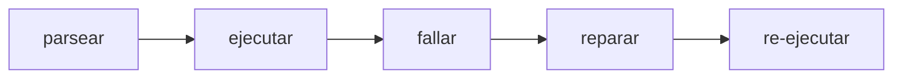

**Modelo v2 — ejecución cognitiva:**

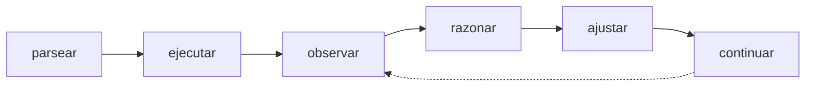

### 1.3 El salto conceptual

Sin embargo, describir AURA como "un lenguaje con primitivas de agentes" sería reduccionista. Lo que AURA implementa es algo cualitativamente distinto:

> **AURA no es un lenguaje que permite deliberación. AURA es una máquina abstracta donde la continuidad del programa es negociada.**

En un lenguaje convencional, un programa define *el* comportamiento: dada una entrada, la semántica del lenguaje determina una única traza de ejecución (o falla). En AURA, un programa define el *espacio permitido* de comportamientos. Los goals y los invariantes restringen ese espacio. La ejecución es entonces **búsqueda guiada en un espacio de trayectorias válidas**, donde el agente cognitivo actúa como oráculo de selección.

Esto cambia de manera fundamental el estatus del programa:

| Aspecto | Lenguaje convencional | AURA |
|---------|----------------------|------|
| El programa define | El comportamiento | El espacio de comportamientos permitidos |
| La ejecución es | Evaluación determinista | Búsqueda de trayectoria válida |
| Un error es | Un crash | Un punto de bifurcación |
| El estado es | Una secuencia | Un grafo navegable |
| La continuación es | Determinada por la semántica | Negociada con un oráculo |

Este reencuadre tiene consecuencias teóricas importantes. Conecta a AURA no con los agent frameworks (LangChain, DSPy), sino con:

- **Efectos algebraicos** (Plotkin & Pretnar 2009): la deliberación es un efecto cedido a un handler, pero el handler es generativo (LLM) en lugar de estático.
- **Condiciones/restarts de Common Lisp**: el programa señala una condición; el oráculo elige un restart---pero los restarts no están predefinidos sino generados dinámicamente.
- **Arquitecturas cognitivas tipo Soar** (Laird et al. 1987): un impasse activa sub-goalificación automática. En AURA, un error o expect fallido activa deliberación cognitiva.
- **Búsqueda con backtracking de Prolog**: la ejecución explora alternativas cuando un camino falla, pero las alternativas son propuestas por un oráculo en lugar de enumeradas estáticamente.

Este posicionamiento teórico se desarrolla formalmente en la Sección 4.

### 1.4 Contribuciones

Este reporte hace las siguientes afirmaciones, cada una respaldada por evidencia de implementación y posicionada contra la literatura relevada:

1. **Ejecución como selección de trayectoria restringida** (Sección 4). Proponemos un modelo operacional donde ejecutar un programa no es evaluar una función, sino buscar una trayectoria válida en un espacio de estados restringido por goals e invariantes. El LLM actúa como oráculo de selección, no como herramienta heurística. Esta formalización eleva a AURA de "sistema interesante" a "modelo de programación", conectándolo con semánticas operacionales no deterministas, planificación, y model checking.

2. **Deliberación cognitiva como semántica del lenguaje** (Sección 3.2). Ningún lenguaje existente define la deliberación como una operación semántica que puede modificar el estado de ejecución, reescribir código, o hacer backtrack con ajustes. El trait `CognitiveRuntime` (`observe`, `deliberate`, `check_goals`, `is_active`) es invocado por la VM durante la evaluación de expresiones, no como una capa de monitoreo externa.

3. **Backtracking con ajustes como primitiva semántica** (Sección 3.3). La intervención `Backtrack{checkpoint, adjustments}` convierte al programa en un grafo navegable de estados donde la ejecución puede retroceder y explorar trayectorias alternativas. Esto no es una feature---es la semántica. Combina backtracking cronológico (Prolog), memoria transaccional (STM), y re-planificación BDI, pero con un oráculo generativo que propone ajustes.

4. **Goals como expresiones de runtime evaluadas continuamente** (Sección 3.1). Ningún lenguaje BDI existente trata los goals como expresiones en el lenguaje anfitrión evaluadas durante la ejecución. El `GoalDef.check: Option<Expr>` de AURA permite monitoreo continuo de goals a granularidad arbitraria, distinto de los átomos simbólicos de AgentSpeak, las fórmulas lógicas de GOAL, y los maintain goals basados en callbacks de Jadex.

5. **Álgebra de intervención de cinco modos** (Sección 3.3). El enum `CognitiveDecision` define cinco intervenciones estructuralmente tipadas (`Continue`, `Override(Value)`, `Fix{new_code, explanation}`, `Backtrack{checkpoint, adjustments}`, `Halt(error)`), proporcionando un espacio de intervención más rico que cualquier sistema de auto-reparación existente.

6. **Adaptación acotada por invariantes** (Sección 3.4). Los invariantes y goals declarados por el desarrollador restringen todas las modificaciones generadas por el LLM. La función `validate_fix()` verifica que los fixes sean parseables, respeten límites de tamaño, preserven todos los goals declarados, y no introduzcan goals nuevos.

7. **Abstracción cognitiva de cero overhead** (Sección 3.5). Cuando `is_active()` retorna `false` (el `NullCognitiveRuntime`), todas las verificaciones cognitivas son no-ops. Los programas sin características cognitivas se ejecutan con rendimiento idéntico al de un runtime no cognitivo.

---

## 2. Trabajo relacionado

### 2.1 Lenguajes de programación orientados a agentes

**AgentSpeak(L)** (Rao 1996) introdujo el modelo de programación BDI dominante: los agentes tienen creencias (hechos tipo Prolog), eventos disparadores activan planes de una biblioteca de planes, y las intenciones son pilas de planes parcialmente ejecutados. **Jason** (Bordini et al. 2007) es la implementación más completa, añadiendo actos de habla, entornos y abstracciones organizacionales. Los goals en AgentSpeak son átomos simbólicos (`!achieve_goal`) que disparan selección de planes; el fallo causa abandono de intención o re-planificación dentro de la biblioteca de planes.

**GOAL** (Hindriks 2009) usa goals declarativos expresados como fórmulas lógicas. La base de goals de un agente se actualiza mediante un ciclo de deliberación que evalúa goals contra creencias. GOAL es el trabajo previo más cercano al modelo de goals activos de AURA, pero sus goals son fórmulas lógicas en un lenguaje de consulta de creencias separado, no expresiones en el lenguaje anfitrión.

**2APL** (Dastani 2008) introduce *reglas de razonamiento práctico* (PR-rules) que revisan planes cuando las condiciones cambian. Cuando un plan falla, las PR-rules hacen matching con el contexto de fallo y generan planes revisados. Este es el mecanismo de re-planificación más sofisticado en la literatura AOPL, pero opera sobre mapeos regla-plan predefinidos, no deliberación abierta con LLM.

**Jadex** (Pokahr et al. 2005) añade *maintain goals* al modelo BDI: condiciones que deben permanecer verdaderas, con re-activación automática de planes cuando se violan. Esto es estructuralmente similar al `goal ... check expr` de AURA, pero las condiciones maintain de Jadex son predicados Java registrados como callbacks, no expresiones en el lenguaje del agente mismo.

**SARL** (Rodriguez et al. 2014) introduce un modelo de capacidad/habilidad donde los agentes declaran capacidades requeridas y vinculan implementaciones en runtime. Esto es arquitectónicamente similar al sistema de capacidades de AURA (`+http`, `+json`, `+db`).

**La brecha.** Ningún lenguaje BDI existente trata los goals como expresiones evaluadas continuamente en el sistema de expresiones del lenguaje anfitrión. La Tabla 1 resume la distinción:

*Tabla 1: Representación de goals a través de lenguajes orientados a agentes*

| Lenguaje | Representación del goal | Momento de evaluación | Respuesta ante fallo |
|----------|-------------------|-------------------|-----------------|
| AgentSpeak | Átomo simbólico (`!g`) | Al dispararse | Abandonar intención |
| GOAL | Fórmula lógica | Por ciclo de deliberación | Re-seleccionar plan |
| Jadex | Predicado Java (callback) | Al callback | Re-activar plan |
| 2APL | Fórmula lógica | Por ciclo, PR-rules | Revisión basada en reglas |
| **AURA** | **Expresión del lenguaje anfitrión** | **Continua, por paso** | **Deliberación cognitiva + backtrack** |

### 2.2 Reparación automática de programas

**GenProg** (Le Goues et al. 2012) fue pionero en la reparación automatizada de programas basada en búsqueda usando programación genética para evolucionar parches. **SemFix** (Nguyen et al. 2013) y **Angelix** (Mechtaev et al. 2016) introdujeron reparación a nivel semántico usando ejecución simbólica y resolución de restricciones. **Prophet** (Long & Rinard 2016) aprendió modelos de corrección de código a partir de parches humanos para rankear candidatos.

La era de los LLM transformó el campo. **ChatRepair** (Xia & Zhang 2023) usa interacción conversacional con LLM para corregir 162/337 bugs de Defects4J a ~$0.42 por bug. **RepairLLaMA** (Silva et al. 2023) hace fine-tuning de LLMs open-source con adaptadores LoRA para reparación. **AlphaRepair** (Xia & Zhang 2022) demostró que modelos de código pre-entrenados pueden realizar reparación zero-shot tratando código con errores como un problema de modelo de lenguaje enmascarado.

**La limitación post-mortem.** Todas las herramientas APR---clásicas y basadas en LLM---comparten una arquitectura fundamental:

```
[Programa falla] → [Extraer código + error] → [Enviar a herramienta] → [Obtener parche] → [Aplicar] → [Re-ejecutar]
```

Ninguna tiene acceso al estado de ejecución en vivo. Ninguna puede inyectar valores a mitad de ejecución. Ninguna puede hacer backtrack a un checkpoint con ajustes. La herramienta de reparación nunca ve qué variables tenían qué valores en el momento del fallo, qué goals pretendía el desarrollador (más allá de aserciones de test), o el camino de ejecución que llevó al error.

### 2.3 Sistemas auto-adaptativos

**Computación autónoma** (Kephart & Chess 2003) propuso la arquitectura de referencia MAPE-K: Monitorear (recolectar datos vía sensores), Analizar (determinar si se necesita adaptación), Planificar (seleccionar estrategia), Ejecutar (aplicar vía efectores), sobre Conocimiento compartido. **Rainbow** (Garlan et al. 2004) implementa MAPE-K a nivel arquitectónico, monitoreando sistemas en ejecución contra restricciones y aplicando estrategias de reparación predefinidas.

**FORMS** (Weyns et al. 2012) proporciona un modelo de referencia formal para sistemas auto-adaptativos con semántica rigurosa para el sistema gestionado, entorno, goals de adaptación, y ciclo de retroalimentación.

**La limitación de capa externa.** Todas las implementaciones MAPE-K añaden monitoreo y adaptación como una capa arquitectónica externa. El sistema gestionado es una caja negra observada a través de sondas. Las estrategias de adaptación son configuraciones predefinidas, no modificaciones de código generadas en runtime. La lógica de adaptación está separada de la lógica del programa.

### 2.4 Arquitecturas cognitivas

**Soar** (Laird et al. 1987; Newell 1990) implementa un sistema de producción con sub-goalificación universal: cuando ninguna producción se dispara, un *impasse* activa la creación automática de sub-goals. El mecanismo de *chunking* de Soar aprende nuevas producciones a partir de la resolución de sub-goals, creando un ciclo de aprendizaje. **ACT-R** (Anderson & Lebiere 1998; Anderson et al. 2004) modela la cognición como la interacción de buffers modulares (visual, motor, memoria declarativa, buffer de goals) mediados por reglas de producción. **CLARION** (Sun 2016) modela explícitamente la interacción entre conocimiento implícito (subsimbólico) y explícito (simbólico). **LIDA** (Franklin et al. 2014) implementa la Teoría del Espacio de Trabajo Global con un mecanismo de difusión similar a la consciencia.

**La relevancia.** El runtime cognitivo de AURA implementa un ciclo que mapea directamente a componentes de arquitecturas cognitivas:

| Componente cognitivo | Implementación en AURA |
|---|---|
| Percepción | `observe()` --- detección de eventos durante la ejecución |
| Memoria de trabajo | Buffer de observaciones + contexto de ejecución actual |
| Deliberación | `deliberate()` --- invocación del LLM con contexto empaquetado |
| Decisión | Enum `CognitiveDecision` --- cinco tipos de intervención |
| Acción | Hot reload, inyección de valor, restauración de checkpoint |
| Aprendizaje | Traza de `ReasoningEpisode` + persistencia en `HealingMemory` |
| Metacognición | `CognitiveSafetyConfig` --- límites de seguridad sobre el comportamiento de razonamiento |

Argumentamos que esto convierte al runtime de AURA en una arquitectura cognitiva en sí misma, en lugar de un lenguaje usado para *implementar* una arquitectura cognitiva---una distinción que, hasta donde sabemos, no tiene precedente directo en la literatura.

### 2.5 Arquitecturas reflectivas y de meta-nivel

**3-Lisp de Smith** (Smith 1984) introdujo la reflexión computacional: un programa que puede inspeccionar y modificar su propia ejecución. **CLOS MOP** (Kiczales et al. 1991) proporcionó un protocolo de meta-objetos que permite a los programas personalizar su propio sistema de clases. **Programación orientada a aspectos** (Kiczales et al. 1997) introdujo puntos de unión donde preocupaciones transversales pueden interceptar la ejecución.

**Efectos algebraicos** (Plotkin & Pretnar 2009; Bauer & Pretnar 2015) proporcionan el modelo formal más cercano: las computaciones pueden "ceder" efectos a handlers que los inspeccionan y reanudan. El puente cognitivo de AURA puede formalizarse como un handler de efectos algebraicos donde el efecto es "necesito asistencia cognitiva" y el handler es el LLM. La diferencia clave: los handlers de efectos algebraicos se definen estáticamente; el "handler" de AURA genera respuestas novedosas dinámicamente.

**El sistema de condiciones/restarts de Common Lisp** es el precedente clásico más cercano a la intervención a mitad de ejecución de AURA. Cuando un error señala una condición, los handlers pueden elegir entre restarts predefinidos (ej., `use-value`, `store-value`, `abort`). AURA generaliza esto: en lugar de restarts definidos por el programador, el LLM genera intervenciones novedosas informadas por el contexto de runtime, goals e invariantes.

### 2.6 Sistemas de programación integrados con LLM

**LMQL** (Beurer-Kellner et al. 2023) es la comparación más relevante como lenguaje de programación real (publicado en PLDI) que extiende Python con generación restringida de LLM. LMQL compila a máscaras a nivel de token para decodificación restringida. Sin embargo, se enfoca en restricciones en tiempo de generación, no en razonamiento de agentes---no tiene goals, observación, auto-reparación, ni runtime cognitivo.

**DSPy** (Khattab et al. 2023) introduce especificaciones declarativas de programas LLM con optimización automática de prompts. **SGLang** (Zheng et al. 2024) optimiza la ejecución de programas LLM estructurados con RadixAttention. Ambos están embebidos en Python y se enfocan en la eficiencia de llamadas al LLM, no en adaptación en runtime.

**ReAct** (Yao et al. 2023) y **Reflexion** (Shinn et al. 2023) implementan ciclos observar-razonar-actuar en agentes LLM, pero como patrones de prompt, no como semántica del lenguaje.

*Tabla 2: Sistemas de programación integrados con LLM*

| Sistema | ¿Es un lenguaje? | ¿LLM como primitiva? | ¿Goals? | ¿Auto-reparación? | ¿Ciclo en runtime? |
|--------|---------------|-------------------|--------|---------------|---------------|
| LMQL | **Sí** | Sí (generación restringida) | No | No | No |
| DSPy | Parcial (DSL en Python) | Sí (signatures) | No | Optimización de prompt | No |
| SGLang | Parcial (DSL en Python) | Sí (primitivas) | No | No | No |
| LangChain | No (biblioteca) | No (llamada a función) | No | No | No |
| ReAct | No (patrón de prompt) | Sí (en-prompt) | No | No | Sí (ad hoc) |
| **AURA** | **Sí** | **Sí** (`reason`) | **Sí** (`goal check`) | **Sí** (a nivel de lenguaje) | **Sí** (integrado en la VM) |

---

## 3. Diseño e implementación

La siguiente figura muestra la arquitectura general del runtime cognitivo de AURA, desde el código fuente hasta la intervención del LLM:

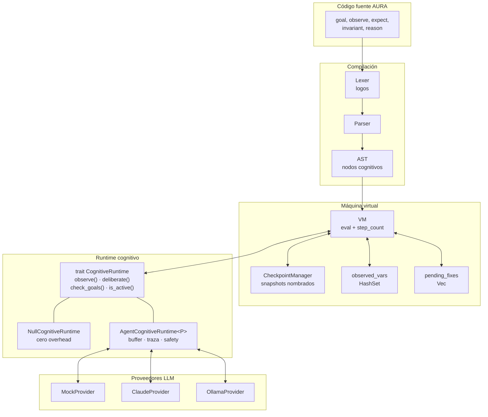

### 3.1 Primitivas cognitivas

AURA introduce seis construcciones que forman su vocabulario cognitivo. Estas se parsean en nodos AST---son parte de la gramática del lenguaje, no funciones de biblioteca. En la Sección 4.10 demostramos que estas primitivas no son features independientes sino **consecuencias necesarias** del modelo de ejecución: cada una corresponde a un componente formal sin el cual el modelo degenera a algo que ya existe.

#### 3.1.1 `goal`

```
goal "procesar datos de usuario correctamente"
goal "todos los usuarios deben tener nombres válidos" check usuarios != nil
```

Los goals son declaraciones de nivel superior (`Definition::Goal(GoalDef)`) con una expresión `check` opcional. La estructura `GoalDef`:

```rust
pub struct GoalDef {
    pub description: String,
    pub check: Option<Expr>,  // El elemento novedoso
    pub span: Span,
}
```

Cuando `check` está presente, el goal es *activo*: la VM evalúa la expresión check después de cambios en variables observadas, después de retornos de funciones, y en intervalos de pasos configurables. Si la verificación evalúa a falso, se eleva un `DeliberationTrigger::GoalMisalignment`, invocando el runtime cognitivo.

La palabra clave `check` se parsea como un *soft keyword* (`Ident("check")`), no como un token reservado---preservando compatibilidad hacia atrás con programas que usan "check" como identificador.

#### 3.1.2 `observe`

```
observe usuarios
observe respuesta.estado
observe datos where valido == true
```

`observe` declara un punto de monitoreo en runtime (`Expr::Observe`). Cuando una variable observada cambia de valor, la VM:
1. Crea un checkpoint implícito (vía `CheckpointManager`)
2. Notifica al runtime cognitivo vía `observe(ObservationEvent::ValueChanged{...})`
3. Dispara la evaluación de goals activos

Sin un runtime cognitivo, `observe` es un no-op que retorna nil.

#### 3.1.3 `expect`

```
expect len(usuarios) > 0 "debería haber usuarios"
```

`expect` es verificación de intención (`Expr::Expect`). A diferencia de las aserciones que crashean ante un fallo, los expects se registran como `ExpectationFailure` y, cuando un runtime cognitivo está activo, disparan `DeliberationTrigger::ExpectFailed`. El runtime puede entonces decidir continuar, sobreescribir el resultado, generar un fix, o hacer backtrack.

#### 3.1.4 `invariant`

```
invariant len(usuarios) > 0
```

Los invariantes (`Definition::Invariant(Expr)`) declaran restricciones que ninguna adaptación puede violar. Sirven como la frontera de seguridad del desarrollador: la función `validate_fix()` verifica que los fixes propuestos por el LLM no rompan invariantes antes de ser aplicados.

#### 3.1.5 `reason`

```
estrategia = reason "tenemos {len(usuarios)} usuarios, procesamos todos o filtramos?"
```

`reason` es un punto de deliberación explícito (`Expr::Reason`). La ejecución pausa, la pregunta y las observaciones recientes se envían al runtime cognitivo, y la decisión del LLM se convierte en el valor de la expresión. Esto permite *inyección de valores*: el LLM puede retornar un valor que se vincula a una variable y se usa en la computación subsiguiente.

Sin un runtime cognitivo, `reason` retorna nil.

#### 3.1.6 `@self_heal`

```
@self_heal(max_attempts: 5, mode: "semantic")
procesar_datos(datos) = { ... }
```

Anotación a nivel de función (`SelfHealConfig`) que marca funciones individuales para reparación automática. Configurable con `max_attempts` y `mode` (technical, semantic, auto).

### 3.2 El trait CognitiveRuntime

El trait `CognitiveRuntime` define la interfaz entre la VM y el agente cognitivo:

```rust
pub trait CognitiveRuntime: Send {
    fn observe(&mut self, event: ObservationEvent);
    fn deliberate(&mut self, trigger: DeliberationTrigger) -> CognitiveDecision;
    fn check_goals(&mut self) -> Vec<CognitiveDecision>;
    fn is_active(&self) -> bool;
    fn set_available_checkpoints(&mut self, checkpoints: Vec<String>) {}
}
```

**Eventos de observación** (`ObservationEvent`) incluyen `ValueChanged`, `ExpectEvaluated`, `FunctionReturned`, y `CheckpointCreated`. Estos proporcionan al LLM contexto de runtime rico que ninguna herramienta de reparación post-mortem puede acceder.

**Disparadores de deliberación** (`DeliberationTrigger`) clasifican qué provocó la deliberación: `ExpectFailed`, `ExplicitReason`, `TechnicalError`, o `GoalMisalignment`. Esta clasificación ayuda al LLM a entender la naturaleza del problema.

El `NullCognitiveRuntime` implementa todas las operaciones como no-ops con `is_active() = false`, proporcionando cero overhead para ejecución no cognitiva.

El siguiente diagrama muestra cómo la VM interactúa con el trait durante la evaluación de expresiones:

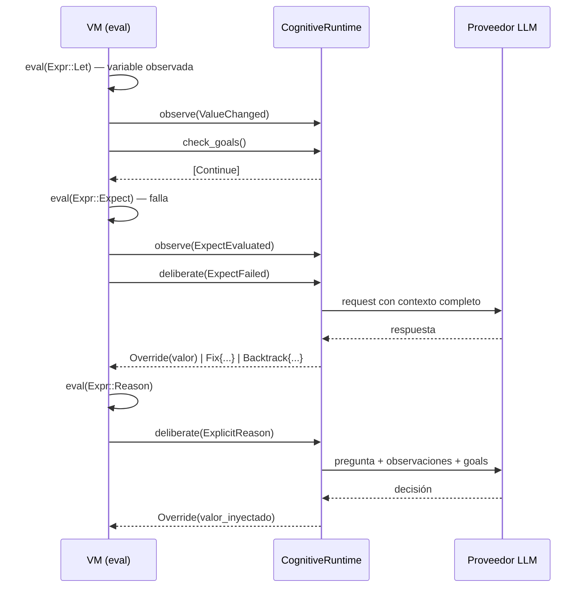

### 3.3 El álgebra de intervención de cinco modos

`CognitiveDecision` define cinco intervenciones estructuralmente tipadas:

```rust
pub enum CognitiveDecision {
    Continue,
    Override(Value),
    Fix { new_code: String, explanation: String },
    Backtrack { checkpoint: String, adjustments: Vec<(String, Value)> },
    Halt(RuntimeError),
}
```

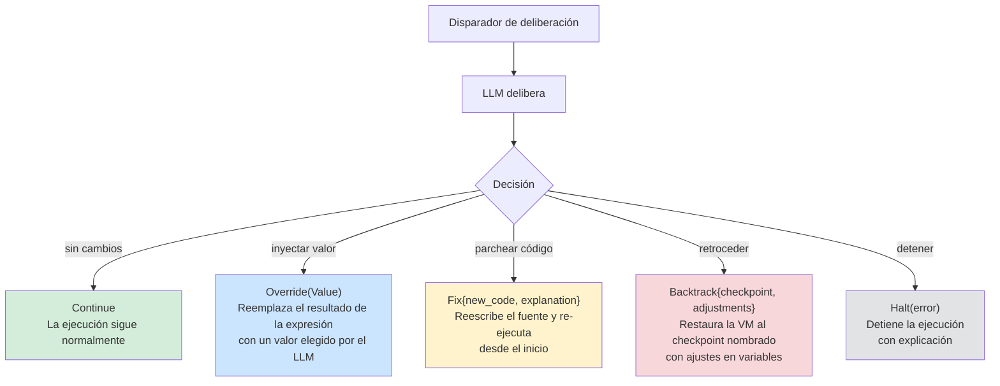

Comparación con modelos de intervención existentes:

| Intervención | Semántica | Precedente |
|---|---|---|
| `Continue` | Proceder normalmente | Común (todos los sistemas) |
| `Override(Value)` | Inyectar un valor de reemplazo en el flujo de ejecución | Restart `use-value` de Common Lisp, pero elegido por LLM |
| `Fix{new_code, explanation}` | Reescribir código fuente; re-ejecutar desde el inicio | Herramientas APR (GenProg, ChatRepair), pero con contexto de runtime |
| `Backtrack{checkpoint, adjustments}` | Restaurar la VM al checkpoint nombrado, aplicar ajustes a variables, continuar desde ese punto | **Sin precedente directo**, hasta donde sabemos, en APR o frameworks LLM |
| `Halt(error)` | Detener ejecución con explicación | Común (todos los sistemas) |

#### Backtrack como primitiva semántica central

La intervención `Backtrack` no es una feature auxiliar---es la pieza que transforma la semántica de AURA. Con backtracking con ajustes, **el programa deja de ser una secuencia y se convierte en un grafo navegable en runtime:**

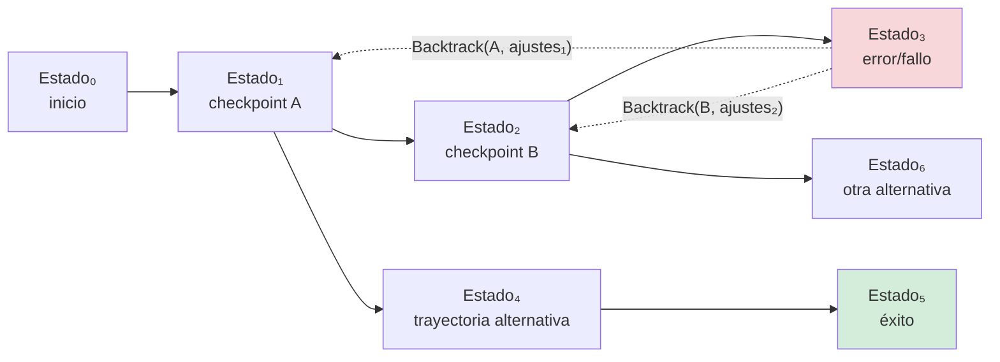

A diferencia de las herramientas APR que deben re-ejecutar desde cero, y a diferencia de la supervisión de Erlang que reinicia desde el estado inicial, AURA puede restaurar a cualquier checkpoint nombrado *con ajustes*---el LLM especifica qué variables modificar antes de reanudar. Esto permite re-ejecución parcial con correcciones informadas.

La consecuencia semántica central es que la ejecución ya no avanza monótonamente. El programa puede:
- **Retroceder** a un estado anterior (como Prolog)
- **Ajustar variables** antes de reanudar (a diferencia de Prolog, que solo hace backtracking puro)
- **Elegir a qué checkpoint retroceder** (navegación en el grafo, no solo backtracking cronológico)

Esto es más cercano a *reversible computing* parcial y a planificación online que a los modelos de ejecución tradicionales. La implicación teórica se desarrolla en la Sección 4.

### 3.4 Seguridad: adaptación acotada por invariantes

La función `validate_fix()` impone restricciones de seguridad antes de que cualquier modificación propuesta por el LLM sea aplicada:

1. **Restricción de tamaño**: los fixes que exceden `max_fix_lines` (por defecto: 50) son rechazados, previniendo reescrituras completas del programa.
2. **Validez sintáctica**: cada fix propuesto debe tokenizarse y parsearse como AURA válido.
3. **Inmutabilidad de goals**: el fix debe preservar todos los goals declarados---sin adiciones, sin eliminaciones, sin modificaciones. Los goals son dominio exclusivo del desarrollador.
4. **Profundidad de backtrack**: `max_backtrack_depth` (por defecto: 5) previene ciclos infinitos de backtrack.
5. **Seguimiento de progreso**: `max_deliberations_without_progress` (por defecto: 3) detiene el razonamiento descontrolado.

```rust
pub struct CognitiveSafetyConfig {
    pub max_fix_lines: usize,
    pub max_backtrack_depth: usize,
    pub max_deliberations_without_progress: usize,
}
```

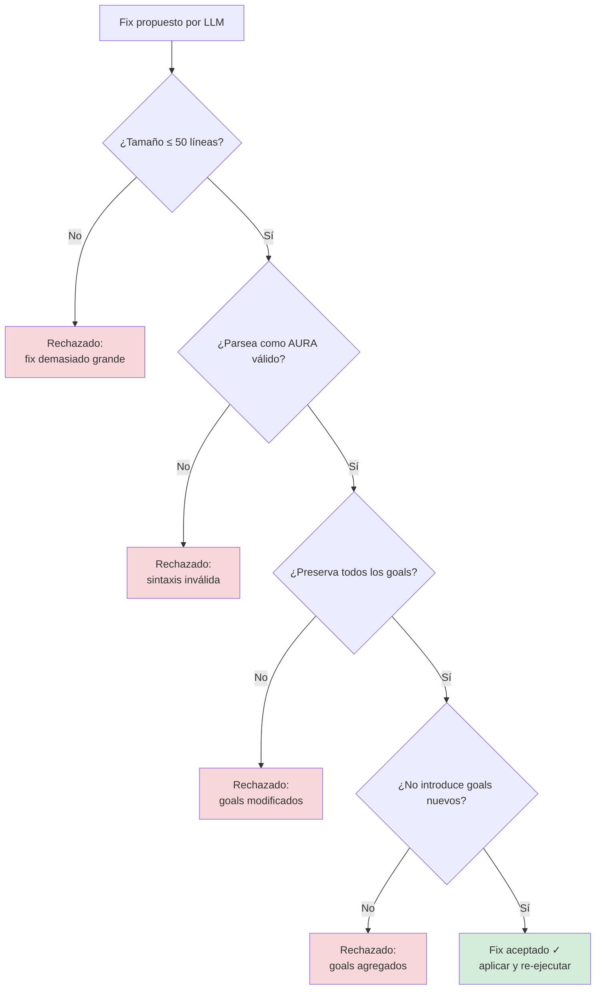

Esto establece un espacio de adaptación formalmente acotado: el LLM puede modificar el programa, pero solo dentro de las restricciones que el desarrollador ha declarado. Este es un patrón de diseño novedoso---**restricciones declaradas por el desarrollador sobre la modificación automatizada de programas**---que no tiene precedente directo en la literatura de APR o sistemas auto-adaptativos.

### 3.5 Sistema de checkpoints

El `CheckpointManager` mantiene snapshots nombrados del estado de la VM:

```rust
pub struct VMCheckpoint {
    pub name: String,
    pub variables: HashMap<String, Value>,
    pub step_count: u64,
    pub timestamp: Instant,
}
```

Los checkpoints se crean implícitamente (ante disparadores de `observe`, antes de llamadas a funciones) y pueden restaurarse con ajustes:

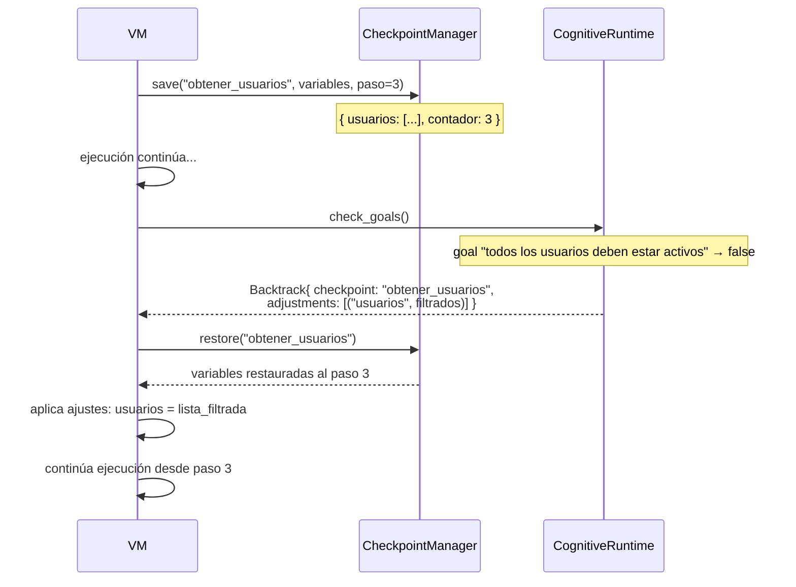

Esto combina ideas de memoria transaccional de software (Shavit & Touitou 1995; Harris et al. 2005), backtracking cronológico de Prolog, y manejo de fallos de planes BDI, pero la síntesis---backtracking con ajustes sugeridos por LLM en un ciclo de ejecución cognitiva---es nueva.

### 3.6 El AgentCognitiveRuntime

La implementación real conecta el trait `CognitiveRuntime` a un `AgentProvider` (soportando múltiples backends de LLM):

```rust
pub struct AgentCognitiveRuntime<P: AgentProvider> {
    provider: P,
    tokio_handle: Handle,        // puente async-sync
    goals: Vec<GoalDef>,
    invariants: Vec<String>,
    source_code: String,
    observation_buffer: Vec<ObservationEvent>,
    reasoning_trace: Vec<ReasoningEpisode>,
    available_checkpoints: Vec<String>,
    max_deliberations: usize,
    deliberation_count: usize,
    safety_config: CognitiveSafetyConfig,
    consecutive_backtracks: usize,
    deliberations_without_progress: usize,
}
```

Decisiones de diseño clave:

- **Puente async-sync**: la VM es síncrona; el `AgentProvider` es async. `tokio_handle.block_on()` tiende el puente, manteniendo simple la implementación de la VM.
- **Agrupación de observaciones**: los eventos se acumulan en `observation_buffer` y se drenan después de cada deliberación, proporcionando al LLM contexto acumulativo.
- **Memoria episódica**: `reasoning_trace: Vec<ReasoningEpisode>` registra cada episodio de deliberación, incluido en solicitudes subsiguientes para que el LLM pueda aprender de la historia reciente.
- **Fail-open**: si el provider falla (error de red, timeout), el runtime retorna `Continue` en lugar de crashear. La capa cognitiva nunca hace al programa *menos* confiable.

### 3.7 El runner de ejecución cognitiva

La función `run_cognitive()` orquesta el ciclo de reintentos:

```rust
pub fn run_cognitive(
    source: &str,
    cognitive: Box<dyn CognitiveRuntime>,
    max_retries: usize,
) -> Result<CognitiveRunResult, RuntimeError>
```

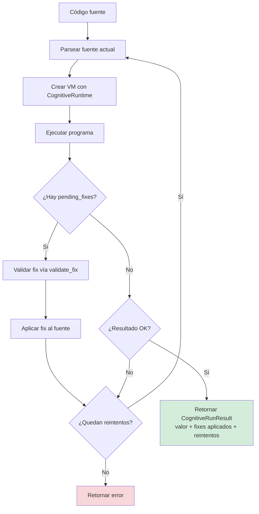

Para cada intento:
1. Parsear el código fuente actual
2. Crear la VM con runtime cognitivo (primer intento) o `NullCognitiveRuntime` (reintentos)
3. Cargar y ejecutar el programa
4. Si existen `pending_fixes`, validar cada fix vía `validate_fix()`, aplicar el válido, y reintentar
5. Si la ejecución tiene éxito sin fixes pendientes, retornar el resultado
6. Si se agotaron los reintentos, retornar el error

Crucialmente, las decisiones `Backtrack` se manejan *dentro* de una sola ejecución (son restauraciones de estado en línea), mientras que las decisiones `Fix` requieren re-parseo y re-ejecución. Esta adaptación de doble nivel---backtrack en línea para correcciones rápidas, re-ejecución completa para cambios estructurales---proporciona una flexibilidad mayor que la de sistemas de estrategia única.

---

## 4. Modelo formal: Ejecución como selección de trayectoria restringida

Esta sección presenta el centro teórico de AURA. No describimos una arquitectura de software---definimos un *modelo de computación*. El argumento procede de lo constitutivo a lo relacional: primero establecemos qué *es* ejecutar un programa AURA (Secciones 4.2-4.5), luego qué *significa* que una ejecución sea correcta (Secciones 4.6-4.7), luego qué *propiedades* tiene el modelo (Secciones 4.8-4.10), y finalmente cómo se *relaciona* con modelos existentes (Secciones 4.11-4.14).

La tesis formal que esta sección demuestra:

> Un programa AURA no define una función de entradas a salidas, sino un espacio de historias válidas restringido por semántica declarativa, donde la ejecución es la selección progresiva de una trayectoria consistente bajo incertidumbre.

### 4.1 Seis preguntas fundacionales

Para afirmar que AURA propone un *modelo de computación*---y no simplemente una arquitectura interesante---debemos responder seis preguntas con precisión formal. Cada pregunta distingue a AURA de los modelos existentes; juntas, cierran ontológicamente qué es ejecutar en AURA.

1. **¿Qué es un programa?** No es código. Es una tripleta de implementación, intenciones y restricciones. → Definición 1 (Sección 4.2).

2. **¿Qué es un estado?** No es un par (entorno, expresión). Es una 7-tupla que incluye historia, checkpoints, goals activos e invariantes activos. → Definición 2 (Sección 4.2).

3. **¿Qué es un paso?** Es una transición determinista o una transición mediada por oráculo, cada una con reglas de inferencia explícitas. → Definiciones 5, 13 (Secciones 4.3, 4.4).

4. **¿Qué significa terminar?** No es alcanzar un valor. Es alcanzar una configuración donde el valor producido es consistente con todos los goals activos, o donde el oráculo ha decidido detenerse. → Definiciones 16-17 (Sección 4.5).

5. **¿Qué significa ser correcto?** La validez estructural (la ejecución respeta transiciones legales e invariantes) no implica corrección semántica (la intención del desarrollador fue satisfecha). Hay una jerarquía de tres niveles. → Definiciones 21-23, Teorema 3 (Sección 4.7).

6. **¿Qué no puede expresar un modelo clásico?** Un programa AURA con oráculo activo tiene múltiples ejecuciones válidas; el modelo clásico de Turing asigna exactamente una. La denotación de un programa AURA es un *conjunto de trayectorias*, no un valor. → Teorema 2, Teoremas 6-8 (Secciones 4.6, 4.12).

Las seis respuestas convergen en la tesis: ejecutar un programa AURA es seleccionar una trayectoria en un espacio restringido, no evaluar una función.

### 4.2 Programa, estado cognitivo y espacio de configuraciones

**Definición 1 (Programa AURA).** Un programa AURA es una tripleta *P = (C, G, I)* donde:

- *C* es el código: el AST que define las transiciones deterministas (funciones, expresiones, let-bindings). En la implementación, *C* es el resultado de `Parser::parse()` sobre el código fuente.
- *G = {g₁, ..., gₘ}* es el conjunto de goals, cada uno con descripción y expresión check opcional: *gⱼ = (descⱼ, checkⱼ?)*. Implementación: `Vec<GoalDef>` donde `GoalDef = {description: String, check: Option<Expr>}`.
- *I = {i₁, ..., iₖ}* es el conjunto de invariantes: expresiones que definen restricciones duras. Implementación: `Vec<Expr>` almacenado en `VM.invariants`.

Nota fundamental: **el programa no es el código**. El programa es la tripleta. El código *C* es la implementación; los goals *G* e invariantes *I* son la especificación. Esta separación es la que permite que el oráculo modifique *C* sin "cambiar el programa"---siempre que *G* e *I* se preserven.

**Definición 2 (Estado cognitivo).** El estado cognitivo de la VM es una 7-tupla:

```
Σ = (H, Γ, κ, G_act, I_act, Ω, U)
```

donde:

- *H*: Var → Val es el heap---el mapeo de variables a valores. Implementación: `Environment.variables: HashMap<String, Value>`.
- *Γ*: Name → FuncDef es el entorno de funciones. Implementación: `Environment.functions: HashMap<String, FuncDef>`.
- *κ*: List(Frame) es la pila de continuaciones (stack de llamadas). Implementación: el patrón de save/restore en `VM::call_function()`, donde cada llamada crea un nuevo `Environment` con `parent: Option<Box<Environment>>`.
- *G_act ⊆ G* son los goals activos---el subconjunto de goals del programa con expresiones check que se evalúan periódicamente. Implementación: `VM.goals: Vec<GoalDef>`.
- *I_act ⊆ I* son los invariantes activos. Implementación: `VM.invariants: Vec<Expr>`.
- *Ω*: Seq(ObservationEvent) es la historia de observaciones---la secuencia ordenada de eventos cognitivos observados durante la ejecución. Implementación: `AgentCognitiveRuntime.observation_buffer: Vec<ObservationEvent>`.
- *U*: Name ⇀ Σ' es el mapa parcial de checkpoints---snapshots nombrados de estados anteriores. Implementación: `CheckpointManager.checkpoints: HashMap<String, VMCheckpoint>` donde `VMCheckpoint = {name, variables, step_count, timestamp}`.

Cada componente de Σ tiene un mapeo directo a un campo del struct `VM` o del struct `AgentCognitiveRuntime`. Esto no es una coincidencia: la formalización *describe* la implementación, no la idealiza.

**Definición 3 (Configuración).** Una configuración de ejecución es una 4-tupla:

```
𝒞 = (P, Σ, e, n)
```

donde *P = (C, G, I)* es el programa, *Σ* es el estado cognitivo (Definición 2), *e* es la expresión actualmente bajo evaluación, y *n ∈ ℕ* es el contador de pasos (implementación: `VM.step_count: u64`).

**Definición 4 (Espacio de configuraciones).** Para un programa *P*, el espacio de configuraciones es:

```
Conf(P) = { 𝒞 | 𝒞₀ →* 𝒞 }
```

donde *𝒞₀ = (P, Σ₀, e₀, 0)* es la configuración inicial (estado vacío, expresión raíz del programa, paso cero) y *→** es la clausura reflexivo-transitiva de la relación de transición (Definiciones 5 y 13). *Conf(P)* contiene todas las configuraciones alcanzables desde el inicio.

### 4.3 Semántica operacional: transiciones deterministas

**Definición 5 (Transición determinista).** La relación →_d ⊂ Conf × Conf define las transiciones que no requieren oráculo. Cada regla corresponde a un brazo del `match expr` en `VM::eval()`:

```
                              x ∈ dom(H)
    ————————————————————————————————————————————— [VAR]
    (P, Σ, x, n) →_d (P, Σ, H(x), n+1)


    (P, Σ, e₁, n) →_d (P, Σ₁, v₁, n₁)    Σ₂ = Σ₁[H ↦ H₁[x ↦ v₁]]
    ———————————————————————————————————————————————————————————————————— [LET]
    (P, Σ, let x = e₁, n) →_d (P, Σ₂, v₁, n₁)


    Γ(f) = (params, body)    |args| = |params|
    (P, Σ[κ ↦ κ·Frame(H)], body[params ↦ args], n) →_d* (P, Σ', v, n')
    —————————————————————————————————————————————————————————————————————— [CALL]
    (P, Σ, f(args), n) →_d (P, Σ'[κ ↦ κ], v, n')


    (P, Σ, e_cond, n) →_d (P, Σ₁, v_cond, n₁)    v_cond ≠ false, nil
    (P, Σ₁, e_then, n₁) →_d (P, Σ₂, v, n₂)
    ——————————————————————————————————————————————————————————————————— [IF-TRUE]
    (P, Σ, if e_cond then e_then else e_else, n) →_d (P, Σ₂, v, n₂)


    v₁, v₂ ∈ Val    v = v₁ ⊕ v₂    (⊕ determinado por el operador)
    ———————————————————————————————————————————————————————————————— [BINOP]
    (P, Σ, v₁ ⊕ v₂, n) →_d (P, Σ, v, n+1)
```

Estas reglas son representativas, no exhaustivas. AURA incluye reglas adicionales para records, listas, `print`, pattern matching, y otras construcciones. Lo relevante es que el fragmento determinista es un lenguaje funcional estándar con semántica convencional.

**Proposición 1 (Determinismo del fragmento puro).** *Si 𝒞 →_d 𝒞₁ y 𝒞 →_d 𝒞₂, entonces 𝒞₁ = 𝒞₂.*

*Demostración.* Cada regla de →_d tiene premisas mutuamente excluyentes (determinadas por la forma sintáctica de *e*): [VAR] requiere que *e* sea un identificador, [LET] que sea un let-binding, [CALL] que sea una aplicación, etc. Para una configuración dada, a lo sumo una regla aplica. El resultado de cada regla es una función determinista de sus premisas: la aritmética es determinista, la búsqueda en *H* es determinista, la selección de rama en [IF-TRUE]/[IF-FALSE] es determinista. Por tanto →_d es una función parcial sobre Conf. ∎

**Definición 6 (Función de evaluación determinista).** La función de evaluación determinista es:

```
eval_d : Expr × Σ → (Val × Σ) ∪ {⊥}
eval_d(e, Σ) = (v, Σ')  si (P, Σ, e, n) →_d* (P, Σ', v, n')
             = ⊥         si e se queda stuck
```

`eval_d` está bien definida por Proposición 1: dado que →_d es una función parcial, la secuencia de reducciones es única, y el resultado (si existe) es único. Implementación: la rama determinista de `VM::eval()` que no invoca al runtime cognitivo.

**Definición 7 (Evaluación con oráculo --- set-valued).** La evaluación con oráculo es una función de conjuntos:

```
Eval : Expr × Σ × O × S → 𝒫(Val × Σ)
Eval(e, Σ, O, S) = { (v, Σ') | ∃τ ∈ P_S : τ pasa por (_, Σ, e, _)
                     y la siguiente configuración-valor es (_, Σ', v, _) }
```

Mientras `eval_d` retorna a lo sumo un resultado, `Eval` retorna un *conjunto* de resultados posibles: distintos oráculos pueden producir distintos valores para la misma expresión stuck.

**Observación (Composicionalidad).** `eval_d` es composicional: `eval_d(let x = e₁ in e₂, Σ) = eval_d(e₂, Σ'[x ↦ v])` donde `(v, Σ') = eval_d(e₁, Σ)`. Esto se sigue directamente de la regla [LET] y del determinismo de →_d. En cambio, `Eval` **no es composicional**: el oráculo puede intervenir entre sub-expresiones, alterando el estado de formas no predecibles desde la semántica de las sub-expresiones solas. Formalmente, `Eval(let x = e₁ in e₂, Σ, O, S) ⊉ ⋃_{(v,Σ') ∈ Eval(e₁,Σ,O,S)} Eval(e₂, Σ'[x ↦ v], O, S)` en general, ya que el oráculo acumula historia (Ω) y puede tomar decisiones diferentes según el contexto de evaluación. Esta ruptura de composicionalidad es una **consecuencia fundamental** del modelo, no un defecto: es lo que distingue a AURA de un lenguaje funcional con efectos.

### 4.4 El oráculo y las transiciones no deterministas

**Definición 8 (Disparador de deliberación).** Un disparador de deliberación clasifica la causa que activa al oráculo. Es un elemento del tipo suma:

```
Trigger = ExpectFailed(failure)
        | ExplicitReason(observations, question)
        | TechnicalError(error)
        | GoalMisalignment(goal_desc, check_result)
```

Implementación directa: el enum `DeliberationTrigger` en `vm/cognitive.rs` con exactamente estas cuatro variantes.

**Definición 9 (Álgebra de intervención).** El álgebra de intervención es el conjunto:

```
Δ = { Continue,
      Override(v)           donde v ∈ Val,
      Fix(C', expl)         donde C' es un AST y expl es una explicación,
      Backtrack(cp, adj)    donde cp es un nombre de checkpoint y adj ⊆ Var × Val,
      Halt(err)             donde err es un error }
```

Implementación directa: el enum `CognitiveDecision` en `vm/cognitive.rs`. Δ es finito en estructura (cinco formas) pero infinito en contenido (los valores *v*, el código *C'*, y los ajustes *adj* son arbitrarios). Esto captura la intuición de que el oráculo está *estructuralmente restringido* pero *generativamente libre*.

**Definición 10 (Oráculo).** Un oráculo es una función:

```
O : Conf × Trigger → Δ
```

No se requiere que *O* sea determinista, total, ni computable. Un LLM es una realización de *O* (no determinista, parcial en la práctica, no computable en el sentido clásico). El `NullCognitiveRuntime` es otra realización: *O_null(𝒞, t) = Continue* para todo *𝒞* y *t*.

La separación entre el oráculo como interfaz formal y sus realizaciones concretas es deliberada. El modelo define qué ejecuciones son *válidas* independientemente de *cómo* el oráculo elige; la calidad de la elección es un problema de ingeniería, no de semántica. Esto es análogo a la semántica no determinista en lenguajes concurrentes: la semántica define qué interleavings son válidos sin especificar qué scheduler los produce.

**Definición 11 (Configuración stuck).** Una configuración *𝒞 = (P, Σ, e, n)* está stuck si la expresión activa no es un valor y ninguna regla determinista aplica:

```
stuck(𝒞) ⟺ ¬is_value(e) ∧ ¬∃𝒞'. 𝒞 →_d 𝒞'
```

La primera condición excluye la terminación normal (Definición 16): si *e* es un valor, la evaluación terminó exitosamente. La segunda exige que ninguna regla de →_d (Definición 5) sea aplicable. Implementación: en `VM::eval()`, una configuración stuck corresponde a un brazo del match que retorna `Err(RuntimeError)`, o a la evaluación de `reason`/`expect` que no puede resolverse determinísticamente.

**Definición 12 (Clasificación de trigger).** La función de clasificación de trigger asigna a cada configuración stuck su causa:

```
trigger : {𝒞 | stuck(𝒞)} → Trigger

trigger(𝒞) = ExpectFailed(f)           si e = expect(cond, desc) ∧ eval_d(cond, Σ) = (false, _)
           | GoalMisalignment(g, r)    si ∃g ∈ G_act: g.check ≠ ⊥ ∧ eval_d(g.check, Σ) = (false, _)
           | ExplicitReason(Ω, q)      si e = reason(q)
           | TechnicalError(err)       en otro caso
```

Las tres primeras variantes se verifican en el orden mostrado; `TechnicalError` es el caso residual. Implementación directa: los brazos de `VM::eval()` que construyen un `DeliberationTrigger` e invocan `deliberate()`. La clasificación determina el contexto que el oráculo recibe y, por tanto, influye en la calidad de la intervención.

**Definición 13 (Transiciones guiadas por oráculo).** La relación →_o ⊂ Conf × Conf define las transiciones mediadas por el oráculo. La premisa común es que *𝒞* está stuck (Definición 11) y el trigger está clasificado (Definición 12):

```
    stuck(𝒞)    O(𝒞, trigger(𝒞)) = Continue
    ———————————————————————————————————————————— [STEP-CONTINUE]
    𝒞 →_o 𝒞       (la configuración no cambia; la ejecución sigue con la siguiente expresión)


    stuck(𝒞)    O(𝒞, trigger(𝒞)) = Override(v')
    ————————————————————————————————————————————— [STEP-OVERRIDE]
    (P, Σ, e, n) →_o (P, Σ, v', n+1)


    stuck(𝒞)    O(𝒞, trigger(𝒞)) = Backtrack(cp, adj)    cp ∈ dom(U)
    ———————————————————————————————————————————————————————————————————— [STEP-BACKTRACK]
    (P, Σ, e, n) →_o (P, Σ[H ↦ U(cp).variables ⊕ adj, n ↦ U(cp).step_count], e_resume, n')


    stuck(𝒞)    O(𝒞, trigger(𝒞)) = Fix(C', expl)    validate(C', G, S) = OK
    —————————————————————————————————————————————————————————————————————————— [STEP-FIX]
    (P, Σ, e, n) →_o ((C', G, I), Σ₀, e₀', 0)


    stuck(𝒞)    O(𝒞, trigger(𝒞)) = Halt(err)
    ———————————————————————————————————————————— [STEP-HALT]
    (P, Σ, e, n) →_o (P, Σ[halted ↦ err], ⊥, n)
```

Observaciones cruciales:

- **STEP-FIX preserva la especificación**: el programa resultante es *(C', G, I)*---mismo *G*, mismo *I*, diferente *C*. La validación `validate(C', G, S)` (implementación: `validate_fix()`) garantiza que *C'* sea parseable, que todos los goals en *G* aparezcan en *C'*, que no se agreguen goals nuevos, y que el tamaño no exceda los límites de *S*.
- **STEP-BACKTRACK restaura con ajustes**: el estado se restaura al checkpoint *cp* pero las variables en *adj* se sobreescriben. Esto no es backtracking puro (Prolog) sino backtracking con hipótesis (el oráculo propone: "si esta variable hubiera tenido este valor...").
- **STEP-CONTINUE no es trivial**: el oráculo puede decidir explícitamente que la ejecución debe continuar pese al stuck---por ejemplo, cuando un `expect` falla pero el oráculo juzga que no requiere intervención.

**Definición 14 (Admisibilidad).** Una decisión *δ ∈ Δ* es admisible en el contexto de una configuración *𝒞* y restricciones *S* si satisface las condiciones de seguridad correspondientes a su variante:

```
admissible(Continue, 𝒞, S)          = true
admissible(Override(v), 𝒞, S)       = ∀iₖ ∈ I_act: eval_d(iₖ, Σ[result(e) ↦ v]) ∉ {false}
admissible(Fix(C', expl), 𝒞, S)    = validate(C', G, S) = OK
admissible(Backtrack(cp, adj), 𝒞, S) = cp ∈ dom(U)
                                       ∧ consecutive_backtracks < max_backtrack_depth
                                       ∧ ∀iₖ ∈ I_act: eval_d(iₖ, U(cp).Σ ⊕ adj) ∉ {false}
admissible(Halt(err), 𝒞, S)        = true
```

Continue y Halt son siempre admisibles: el primero no modifica nada, el segundo detiene la ejecución. Override es admisible si el valor inyectado no viola invariantes activos. Fix es admisible si pasa la validación completa (`validate_fix()`). Backtrack es admisible si el checkpoint existe, no se excede la profundidad máxima de backtracks consecutivos, y el estado restaurado con ajustes no viola invariantes.

**Proposición 2 (Exhaustividad del álgebra).** *Toda transición →_o es instancia de exactamente una de las cinco reglas.*

*Demostración.* Las cinco reglas tienen premisas mutuamente excluyentes determinadas por la forma de *δ = O(𝒞, trigger(𝒞))*: δ es exactamente una variante del tipo suma Δ (Definición 9). Toda variante de Δ tiene una regla correspondiente. Por tanto la partición es exhaustiva y disjunta. ∎

**Proposición 3 (Soundness de admisibilidad).** *Si `admissible(δ, 𝒞, S)` y 𝒞 →_o 𝒞' vía δ, entonces ∀iₖ ∈ I_act: eval_d(iₖ, H') ∉ {false}, donde H' es el heap de la configuración resultante 𝒞'.*

*Demostración (por análisis de casos).* Para *δ = Continue*: la configuración no cambia, por lo que *H' = H* y los invariantes que se satisfacían antes siguen satisfaciéndose. Para *δ = Override(v)*: la definición de admisibilidad verifica explícitamente los invariantes sobre el nuevo valor. Para *δ = Backtrack(cp, adj)*: la admisibilidad verifica invariantes sobre el estado restaurado con ajustes aplicados. Para *δ = Fix(C', expl)*: la ejecución reinicia con Σ₀ (estado inicial vacío); los invariantes se verificarán desde cero durante la nueva ejecución. Para *δ = Halt(err)*: la ejecución se detiene; no hay *H'* sobre el que verificar invariantes (la trayectoria ha terminado). ∎

### 4.5 Ejecución, trayectoria y terminación

Esta subsección responde la cuarta pregunta fundacional: *¿qué significa terminar?*

**Definición 15 (Trayectoria).** Una trayectoria de un programa *P* es una secuencia (posiblemente infinita) de configuraciones:

```
τ = 𝒞₀, 𝒞₁, 𝒞₂, ...
```

donde *𝒞₀* es la configuración inicial y cada par consecutivo está conectado por una transición: *𝒞ᵢ →_d 𝒞ᵢ₊₁* o *𝒞ᵢ →_o 𝒞ᵢ₊₁*. Sea *Traj(P)* el conjunto de todas las trayectorias de *P*.

**Definición 16 (Configuración terminal).** Una configuración *𝒞 = (P, Σ, e, n)* es terminal si:

```
terminal(𝒞) ⟺ (is_value(e) ∧ ∀g ∈ G_act : checkⱼ ≠ ⊥ ⟹ eval(checkⱼ, H) ≠ false)
              ∨ halted(𝒞)
```

La primera disyunción dice: *e* es un valor (la evaluación produjo un resultado) y todos los goals activos con expresión check están satisfechos. La segunda dice: el oráculo emitió Halt. Implementación: la VM retorna `Ok(value)` cuando la evaluación termina sin errores pendientes, o `Err(RuntimeError)` cuando se emite Halt.

Nótese que `eval(checkⱼ, H) ≠ false` no exige `= true`: si la evaluación del check produce ⊥ (variable del check aún no definida), la condición se satisface vacuamente. Esto refleja la implementación, donde `eval(check)` puede fallar si las variables del check aún no existen en *H*.

**Definición 17 (Terminación).** Una trayectoria *τ* termina si es finita y su última configuración es terminal:

```
terminates(τ) ⟺ |τ| < ∞ ∧ terminal(last(τ))
```

**Definición 18 (Restricciones de seguridad).** Las restricciones de seguridad son una 5-tupla:

```
S = (max_retries, max_deliberations, max_backtrack_depth, max_fix_lines, max_no_progress)
```

Implementación directa: `max_retries` es el parámetro de `run_cognitive()`, y los restantes son campos de `CognitiveSafetyConfig`:

| Componente de *S* | Campo en la implementación | Default |
|---|---|---|
| max_retries | Parámetro de `run_cognitive()` | 3 |
| max_deliberations | `AgentCognitiveRuntime.max_deliberations` | 10 |
| max_backtrack_depth | `CognitiveSafetyConfig.max_backtrack_depth` | 5 |
| max_fix_lines | `CognitiveSafetyConfig.max_fix_lines` | 50 |
| max_no_progress | `CognitiveSafetyConfig.max_deliberations_without_progress` | 3 |

**Teorema 1 (Terminación acotada).** *Bajo las restricciones de seguridad S, toda trayectoria de un programa P termina. En particular:*

*(a) El número total de pasos deterministas es a lo sumo (max_retries + 1) · N_steps, donde N_steps es el número máximo de pasos de una ejecución determinista de C.*

*(b) El número total de invocaciones al oráculo es a lo sumo max_retries · max_deliberations.*

*(c) El número de backtracks consecutivos es a lo sumo max_backtrack_depth.*

*Demostración.* El runner `run_cognitive()` itera `for attempt in 0..=max_retries`---a lo sumo *max_retries + 1* iteraciones (incluyendo el intento inicial). Cada iteración ejecuta el programa completo (a lo sumo *N_steps* pasos deterministas) y puede producir a lo sumo un Fix (que causa re-intento) o cero Fix (que termina la iteración).

Dentro de cada iteración, el `AgentCognitiveRuntime` incrementa `deliberation_count` en cada llamada a `deliberate()` y retorna `Continue` cuando alcanza `max_deliberations`. El `NullCognitiveRuntime` (usado en reintentos posteriores al primero, por el patrón `.take()` en el runner) no delibera en absoluto. Por tanto el total de deliberaciones está acotado por *max_deliberations* (solo el primer intento delibera).

El campo `consecutive_backtracks` se incrementa en cada `Backtrack` consecutivo y causa `Halt` cuando alcanza `max_backtrack_depth`. El campo `deliberations_without_progress` causa `Halt` cuando alcanza `max_no_progress`.

Combinando: toda rama del ciclo de ejecución está acotada por un decremento léxico sobre la tupla *(reintentos restantes, deliberaciones restantes, backtracks restantes)*. Esta tupla decrece estrictamente en cada iteración del ciclo. Por tanto el ciclo termina. ∎

### 4.6 Ejecución válida y espacio de trayectorias

Esta subsección y la siguiente contienen la tesis central del modelo.

**Definición 19 (Trayectoria válida).** Una trayectoria *τ = 𝒞₀, 𝒞₁, ...* es válida respecto a restricciones *S* si cumple tres condiciones:

1. **Legalidad de transiciones**: cada par consecutivo *𝒞ᵢ, 𝒞ᵢ₊₁* está conectado por una transición →_d (Definición 5) o →_o (Definición 13).

2. **Admisibilidad del oráculo**: toda decisión *δ* emitida por el oráculo satisface `admissible(δ, 𝒞, S)` (Definición 14). Esto subsume tanto la seguridad de invariantes (verificada por caso en la definición de admisibilidad) como la disciplina de restricciones (profundidad de backtrack, validación de fixes).

3. **Preservación de especificación**: toda transición STEP-FIX preserva *G* e *I*. Si el programa antes de la transición es *(C, G, I)* y después es *(C', G', I')*, entonces *G' = G* e *I' = I*.

**Definición 20 (Denotación de un programa).** La denotación de un programa *P* bajo restricciones *S* es:

```
P_S = { τ ∈ Traj(P) | valid(τ, S) ∧ terminates(τ) }
```

Es decir: el conjunto de todas las trayectorias válidas y terminantes de *P*. **La denotación de un programa AURA no es un valor---es un conjunto de trayectorias.**

**Teorema 2 (Denotación como conjunto de trayectorias --- tesis central).** *P_S ⊆ 𝒫(Traj(P)). Si el oráculo es activo (O ≠ O_null) y existe al menos un punto stuck en la ejecución, entonces es posible que |P_S| > 1: el programa admite múltiples ejecuciones válidas. El oráculo selecciona entre ellas.*

*Demostración.* La primera parte es directa de la Definición 20: P_S es un subconjunto de Traj(P) y por tanto un elemento de 𝒫(Traj(P)).

Para la segunda parte, construimos un ejemplo explícito. Sea *P* un programa con un expect que falla, y sean *O₁, O₂* dos oráculos tales que *O₁(𝒞, ExpectFailed(...)) = Override(v₁)* y *O₂(𝒞, ExpectFailed(...)) = Override(v₂)* con *v₁ ≠ v₂*. Ambas trayectorias resultantes satisfacen las tres condiciones de validez (Definición 19): las transiciones son legales (STEP-OVERRIDE), la decisión Override es admisible (Definición 14: no viola invariantes), y la especificación se preserva (Override no modifica *P*). Por tanto *τ₁, τ₂ ∈ P_S* y *τ₁ ≠ τ₂*. ∎

Este teorema es el resultado central: la denotación de un programa AURA es genuinamente no determinista cuando el oráculo está activo. Esto distingue formalmente a AURA de los lenguajes funcionales (denotación es un valor), de los lenguajes concurrentes (el no determinismo proviene del scheduling, no de un oráculo semántico), y de los lenguajes lógicos (el no determinismo proviene de la unificación, no de un oráculo generativo).

**Proposición 4 (Monotonicidad).** *Sea S una restricción de seguridad y S' una relajación de S (mayores límites). Entonces P_S ⊆ P_S'. Análogamente, sea I' ⊂ I un subconjunto estricto de invariantes; entonces (C,G,I)_S ⊆ (C,G,I')_S.*

*Demostración.* Relajar restricciones solo puede hacer que más trayectorias satisfagan las condiciones de validez: la condición 1 (seguridad de invariantes) se debilita con menos invariantes, la condición 3 (disciplina del oráculo) se debilita con límites mayores. Toda trayectoria válida bajo restricciones más fuertes sigue siendo válida bajo restricciones más débiles. ∎

**Proposición 5 (Conexión con power domains).** *P_S se interpreta naturalmente en el sentido del power domain de Hoare (Plotkin 1976): P "puede producir" una trayectoria válida si existe al menos un oráculo O tal que la trayectoria resultante pertenece a P_S.*

*Observación.* El power domain de Smyth (P "debe producir" para todo oráculo) no se satisface en general: oráculos patológicos (ej., siempre Halt) producen trayectorias degeneradas. El power domain de Plotkin (may + must) requeriría restricciones adicionales sobre el oráculo que el modelo actual no impone. La semántica de Hoare---existencial sobre oráculos---es la interpretación correcta para AURA: un programa es "ejecutable" si *existe* un oráculo que produce una trayectoria válida.

### 4.7 Corrección como pertenencia a trayectoria

Esta subsección responde la quinta pregunta fundacional: *¿qué significa ser correcto?*

**Definición 21 (Corrección estructural).** Una trayectoria *τ* es estructuralmente correcta si pertenece a la denotación del programa:

```
correct_struct(τ) ⟺ τ ∈ P_S
```

Es decir: la trayectoria es válida (Definición 19) y termina (Definición 17). Corrección estructural es el nivel mínimo: la ejecución respetó las reglas del modelo.

**Definición 22 (Corrección semántica --- intención satisfecha).** Una trayectoria *τ* satisface la intención declarada si, además de ser estructuralmente correcta, todos los goals con check evalúan a true en la configuración final:

```
correct_sat(τ) ⟺ terminal(last(τ)) ∧ ∀g ∈ G : (g.check ≠ ⊥ ⟹ eval(g.check, H_final) = true)
```

La diferencia con corrección estructural es que aquí exigimos que todos los checks evalúen a *true*, no solo que no evalúen a *false*. Un goal cuyo check produce ⊥ en la configuración final no satisface esta definición.

**Definición 23 (Corrección semántica --- intención preservada).** Una trayectoria *τ* preserva la intención si, además de satisfacerla, toda intervención del oráculo es coherente con la semántica intencional de los goals:

```
correct_pres(τ) ⟺ correct_sat(τ) ∧ ∀δᵢ ∈ interventions(τ) : intent_coherent(δᵢ, G)
```

**Problema abierto.** La función `intent_coherent` no está definida formalmente en este trabajo. Su definición requiere un lenguaje de especificación de intenciones más rico que expresiones booleanas. Candidatos:

- *Lógica de intenciones de Cohen-Levesque* (Cohen & Levesque 1990): formalizaría goals como actitudes mentales con axiomas de persistencia y compromiso.
- *HyperLTL*: formalizaría propiedades sobre *conjuntos* de trayectorias (ej., "toda trayectoria que satisface el goal lo hace por la misma razón").
- *Lógica deóntica*: distinguiría entre lo que el oráculo *puede* hacer (permitido por Δ) y lo que *debe* hacer (coherente con la intención).

Ejemplo concreto de la brecha: dado `goal "mantener usuarios activos" check usuarios != nil`, un oráculo que elimina todos los usuarios satisface el check (lista vacía ≠ nil en AURA) pero no preserva la intención. La Definición 22 no detecta esto; la Definición 23 lo detectaría con un `intent_coherent` adecuado.

Sin definir `intent_coherent`, establecemos **condiciones necesarias** que cualquier formalización futura debe cumplir:

**Desiderata para `intent_coherent`.**

```
(D1) Consistencia:     intent_coherent(δ, G) ⟹ admissible(δ, 𝒞, S)
(D2) No-trivialidad:   ∃δ: admissible(δ, 𝒞, S) ∧ ¬intent_coherent(δ, G)
(D3) Monotonía en G:   G' ⊆ G ∧ intent_coherent(δ, G) ⟹ intent_coherent(δ, G')
(D4) Frame:            si δ no modifica variables mencionadas en g.check
                       para ningún g ∈ G, entonces intent_coherent(δ, G)
```

(D1) dice que coherencia implica admisibilidad---es estrictamente más fuerte. (D2) dice que la relación no es trivial: existen intervenciones admisibles que no son coherentes (el ejemplo de "eliminar usuarios" es admisible pero no coherente). (D3) dice que quitar goals no puede hacer incoherente algo coherente: si una intervención es coherente con un conjunto grande de goals, lo es con cualquier subconjunto. (D4) da una condición suficiente parcial: si la intervención no toca las variables mencionadas en los checks de los goals, es coherente---un principio de *frame* que acota el problema.

Estas desiderata son verificables contra el ejemplo: la intervención "eliminar usuarios" viola (D2) (es admisible pero incoherente) y no satisface (D4) (modifica la variable `usuarios` mencionada en el check).

**Teorema 3 (Jerarquía de corrección).** *correct_pres(τ) ⟹ correct_sat(τ) ⟹ correct_struct(τ). Los conversos son falsos.*

*Demostración.* La primera implicación es directa: correct_pres incluye correct_sat como conjunción. La segunda es directa: correct_sat implica terminal(last(τ)) (y por tanto terminates(τ)) y el cumplimiento de goals fortalece la condición de terminación de correct_struct.

Para los conversos, construimos contraejemplos:

- *correct_struct ⇏ correct_sat*: una trayectoria que termina con `halted(𝒞)` (el oráculo emitió Halt) es estructuralmente correcta (terminal por la segunda disyunción de Definición 16) pero no satisface correct_sat si algún goal check evalúa a ⊥ o false.

- *correct_sat ⇏ correct_pres*: el ejemplo de "mantener usuarios activos" arriba---la trayectoria satisface todos los checks pero la intervención del oráculo (eliminar usuarios) no es coherente con la intención. ∎

### 4.8 Continuación negociada y equivalencia observacional

**Definición 24 (Continuación negociada).** Cuando una configuración *𝒞* está stuck (la expresión *e* no puede reducir vía →_d), la continuación se determina por la función:

```
negotiate : (Σ_stuck, Trigger, O, G, I, S) → Δ | REJECT
```

El protocolo de negociación procede en tres fases:

1. **Clasificación**: la VM identifica el trigger ∈ {TechnicalError, ExpectFailed, GoalMisalignment, ExplicitReason}.
2. **Propuesta**: el oráculo propone *δ = O(𝒞, trigger)*.
3. **Validación**: las restricciones verifican la legalidad de *δ*:
   - Si *δ = Fix(C', expl)*: `validate(C', G, S) = OK` → aceptar; `= Err` → REJECT.
   - Si *δ = Backtrack(cp, adj)*: *cp ∈ dom(U)* → aceptar; *cp ∉ dom(U)* → REJECT.
   - Si *δ ∈ {Continue, Override(v), Halt(err)}*: aceptar.

Implementación: en `AgentCognitiveRuntime::deliberate()`, la propuesta del LLM se parsea como `CognitiveDecision`, y en `run_cognitive()`, los Fix se validan vía `validate_fix()` antes de aplicarse.

La negociación involucra tres participantes---semántica (que declara stuck), oráculo (que propone δ), y restricciones (que validan δ)---y la continuación es *emergente* de su interacción, no una propiedad de ninguno por separado.

**Definición 25 (Viabilidad).** Una configuración stuck es viable si el oráculo puede proponer al menos una decisión admisible:

```
viable(𝒞, O, S) ⟺ stuck(𝒞) ∧ ∃δ ∈ Δ: O(𝒞, trigger(𝒞)) = δ ∧ admissible(δ, 𝒞, S)
```

La viabilidad conecta tres conceptos previamente independientes: stuck (Definición 11), trigger (Definición 12), y admisibilidad (Definición 14). Una configuración stuck que no es viable es un callejón sin salida del que el oráculo no puede salir dentro de las restricciones.

**Proposición 6 (Viabilidad del oráculo nulo).** *Para toda configuración stuck 𝒞, se cumple `viable(𝒞, O_null, S)`.*

*Demostración.* *O_null(𝒞, t) = Continue* para todo *𝒞* y *t* (Definición 10). Por Definición 14, `admissible(Continue, 𝒞, S) = true` siempre. Por tanto existe *δ = Continue* tal que *O_null(𝒞, trigger(𝒞)) = δ* y *admissible(δ, 𝒞, S)*. ∎

**Proposición 7 (No-viabilidad implica terminación).** *Si `stuck(𝒞) ∧ ¬viable(𝒞, O, S)`, entonces la trayectoria termina. Más aún: toda trayectoria en P_S solo pasa por configuraciones stuck que fueron viables.*

*Demostración (esbozo).* Si una configuración stuck no es viable, el oráculo no puede proponer una decisión admisible. La ejecución no puede avanzar vía →_d (por definición de stuck) ni vía →_o (por falta de decisión admisible). Pero los límites de *S* (Definición 18)---`max_deliberations` y `max_no_progress`---fuerzan Halt después de un número finito de intentos fallidos. Por tanto la trayectoria termina. Recíprocamente, si una trayectoria pertenece a P_S, toda transición →_o en ella aplicó una decisión admisible (por la condición 2 de validez, Definición 19), lo que implica que cada configuración stuck fue viable. ∎

**Definición 26 (Equivalencia observacional).** Dos trayectorias *τ₁, τ₂ ∈ P_S* son observacionalmente equivalentes si producen el mismo resultado observable:

```
τ₁ ~_obs τ₂ ⟺ terminal(last(τ₁)) = terminal(last(τ₂))
             ∧ ∀g ∈ G : eval(g.check, H_final(τ₁)) = eval(g.check, H_final(τ₂))
```

Es decir: misma configuración terminal y mismos resultados de goal checks. Dos trayectorias que llegan al mismo resultado por caminos diferentes (una vía Override, otra vía Backtrack) son observacionalmente equivalentes.

**Proposición 8 (No trivialidad de las clases de equivalencia).** *Cuando el oráculo es activo y existe al menos un punto stuck, las clases de equivalencia [τ]_{~obs} son generalmente no triviales: contienen múltiples trayectorias distintas que producen el mismo resultado observable.*

*Demostración (constructiva).* Sea *P* un programa con un expect fallido. Sea *O₁* un oráculo que elige Override(v) y *O₂* un oráculo que elige Backtrack(cp, adj) seguido de evaluación exitosa que produce *v*. Las trayectorias *τ₁* (un paso de override) y *τ₂* (backtrack + re-evaluación) son distintas (diferentes longitudes, diferentes transiciones) pero producen la misma configuración terminal con el mismo valor *v* y los mismos resultados de goal checks. Por tanto *τ₁ ~_obs τ₂* y *[τ₁]_{~obs}* contiene al menos dos elementos. ∎

### 4.9 Preservación de especificación

**Teorema 4 (Preservación de especificación bajo toda intervención).** *Para toda transición →_o, si el programa antes de la transición es P = (C, G, I) y después es P' = (C', G', I'), entonces G' = G e I' = I.*

*Demostración (por análisis de casos sobre Δ).*

- *δ = Continue*: la configuración no cambia (regla STEP-CONTINUE). Trivialmente P' = P.
- *δ = Override(v)*: solo cambia el resultado de la expresión evaluada. El programa P no se modifica. P' = P.
- *δ = Backtrack(cp, adj)*: solo cambia el estado Σ (variables restauradas + ajustes). El programa P no se modifica. P' = P.
- *δ = Halt(err)*: solo se marca la configuración como halted. El programa P no se modifica. P' = P.
- *δ = Fix(C', expl)*: el programa cambia a (C', G, I). La premisa de STEP-FIX exige `validate(C', G, S) = OK`. La función `validate_fix()` verifica: (a) C' es parseable como AURA válido, (b) todos los goals en G aparecen en C', (c) no se agregan goals nuevos, (d) el tamaño no excede max_fix_lines. Por tanto G' = G. Los invariantes I no se mencionan en C' (son expresiones evaluadas en runtime, no declaraciones parseadas por validate_fix); I se preserva por construcción del runner que copia I al nuevo programa. I' = I.

En los cinco casos, G' = G e I' = I. ∎

### 4.10 Las primitivas como consecuencias necesarias del modelo

**Teorema 5 (Necesidad de las primitivas --- argumento de degeneración).** *Para cada primitiva p ∈ {goal/invariant, observe, expect, reason, backtrack}, eliminar p del modelo produce un modelo degenerado equivalente a uno existente:*

| Primitiva eliminada | Modelo degenerado | Equivalente existente |
|---|---|---|
| goal, invariant | P_S = Traj(P) (todas las trayectorias son válidas) | Retry con heurística IA (ChatRepair con reintentos) |
| observe | O recibe 𝒞 sin Ω (historia vacía) | Reparación post-mortem (el oráculo no ve el contexto) |
| expect | Trigger = {TechnicalError, ExplicitReason, GoalMisalignment} | Exception handler con retry (solo errores fatales activan el oráculo) |
| reason | Trigger = {TechnicalError, ExpectFailed, GoalMisalignment} | Sistema reactivo (el programa no puede solicitar guía proactiva) |
| backtrack | Δ = {Continue, Override(v), Fix(C', expl), Halt(err)} | APR restart-from-scratch (sin navegación del grafo de estados) |

*Demostración (por degeneración).*

- *Sin goals/invariantes*: la condición 2 de validez (Definición 19) se debilita (la admisibilidad no verifica invariantes porque no hay). La condición 3 se satisface vacuamente (no hay especificación que preservar). P_S contiene *todas* las trayectorias que terminan---el oráculo no tiene guía. Esto es indistinguible de un sistema de retry donde un LLM sugiere parches sin criterio de éxito.

- *Sin observe*: el componente Ω del estado (Definición 2) es siempre vacío. El oráculo recibe la configuración sin historia de observaciones. Las decisiones del oráculo son uniformemente desinformadas sobre la evolución del estado. Esto es indistinguible de la reparación post-mortem: el oráculo ve el error pero no el camino que llevó a él.

- *Sin expect*: el disparador ExpectFailed no existe. El oráculo solo se activa ante errores fatales (TechnicalError), desalineación de goals (GoalMisalignment), o consultas explícitas (ExplicitReason). Se pierde la capacidad de corrección proactiva---detectar que algo no va bien *antes* de que crashee. Esto colapsa al patrón try/catch con retry.

- *Sin reason*: el disparador ExplicitReason no existe. El programa no puede solicitar guía del oráculo; solo la recibe pasivamente ante errores. Se pierde la agencia programática---el programa como solicitante activo de deliberación. Esto colapsa a un sistema puramente reactivo.

- *Sin backtrack*: Δ pierde la variante Backtrack. Las únicas correcciones posibles son Override (puntual, sin cambio de estado) y Fix (reinicio total con nuevo código). No hay exploración de trayectorias alternativas. Esto es exactamente lo que hacen las herramientas APR existentes: reiniciar desde cero con un parche. ∎

**Proposición 9 (Suficiencia).** *Las cinco primitivas (goal/invariant, observe, expect, reason, backtrack) junto con la evaluación determinista (→_d) bastan para realizar toda τ ∈ P_S.*

*Demostración (esbozo).* Toda trayectoria en P_S es una secuencia de transiciones →_d y →_o. Las transiciones →_d son realizadas por la evaluación determinista. Las transiciones →_o requieren: (1) detectar que *e* está stuck---realizado por la evaluación determinista que produce error; (2) clasificar el trigger---realizado por expect (ExpectFailed), reason (ExplicitReason), goals (GoalMisalignment), o el evaluador (TechnicalError); (3) aplicar la decisión---Override y Fix no requieren primitivas adicionales, Backtrack requiere checkpoints (creados por observe). Por tanto las cinco primitivas + evaluación determinista cubren toda la maquinaria necesaria. ∎

### 4.11 Backtrack y la estructura de grafo

**Definición 27 (Grafo de ejecución).** El grafo de ejecución de una trayectoria *τ* es *G(τ) = (V, E)* donde:

- *V = {𝒞ᵢ | 𝒞ᵢ ∈ τ}* es el conjunto de configuraciones visitadas.
- *E = {(𝒞ᵢ, 𝒞ᵢ₊₁, label) | 𝒞ᵢ, 𝒞ᵢ₊₁ consecutivos en τ}* donde *label ∈ {det, continue, override, backtrack, fix, halt}* indica el tipo de transición.

Cuando τ no contiene transiciones Backtrack, G(τ) es un camino (grafo lineal). Cuando τ contiene Backtrack, G(τ) es un árbol: cada Backtrack crea una bifurcación desde un nodo anterior.

**Definición 28 (Anchura de exploración).** La anchura de exploración de una trayectoria es:

```
width(τ) = max_{cp ∈ dom(U)} |{δᵢ ∈ τ | δᵢ = Backtrack(cp, _)}|
```

Es decir: el número máximo de veces que se retrocede al *mismo* checkpoint con ajustes diferentes. Mide cuántas alternativas se exploraron desde un mismo punto de decisión.

**Propiedad (No-monotonicidad).** Con Backtrack, la ejecución es no-monotónica: el step_count puede disminuir (restaurar a un checkpoint anterior). Formalmente, si *𝒞ᵢ →_o 𝒞ᵢ₊₁* vía STEP-BACKTRACK, entonces *nᵢ₊₁ ≤ nᵢ*. Esto viola un supuesto fundamental de los modelos de ejecución convencionales.

**Propiedad (Ajustes como hipótesis).** Los ajustes *adj* en Backtrack(cp, adj) son hipótesis contrafactuales que el oráculo propone: "si las variables hubieran tenido estos valores en este punto, la trayectoria habría sido diferente". Esto conecta con el razonamiento contrafactual (Pearl 2000) y con la búsqueda heurística en planificación.

**Propiedad (Exploración acotada).** A diferencia de Prolog (backtracking exhaustivo) o model checking (exploración exhaustiva), la exploración de AURA es: guiada por oráculo (no exhaustiva), acotada por *max_backtrack_depth* (Definición 18), e informada por la historia Ω (el oráculo ve backtracks anteriores y puede evitar repetirlos).

### 4.12 Relación con modelos clásicos: reducciones formales

Esta subsección responde la sexta pregunta fundacional: *¿qué no puede expresar un modelo clásico?*

**Teorema 6 (Reducción a Turing).** *Cuando O = O_null (el NullCognitiveRuntime), AURA es equivalente a un lenguaje funcional convencional con semántica determinista.*

*Demostración.* Con *O = O_null*, toda invocación del oráculo retorna Continue. No se producen transiciones →_o (STEP-CONTINUE no modifica la configuración). Toda trayectoria consiste exclusivamente de transiciones →_d. Por Proposición 1, →_d es determinista. La trayectoria es única. Los goals se evalúan pero no causan deliberación (Continue no altera el estado). Los invariantes se verifican pero no restringen la adaptación (no hay adaptación). La ejecución es *eval(main)* en un lenguaje funcional estándar. ∎

**Teorema 7 (Reducción a planificación --- esbozo).** *Cuando C es trivial (un programa que solo declara goals y estados iniciales) y O tiene acceso a una biblioteca de planes, AURA se comporta como un sistema de planificación online.*

*Esbozo de prueba.* La ejecución degenera en: (1) evaluar los goals, (2) detectar que todos están insatisfechos (GoalMisalignment), (3) invocar al oráculo repetidamente para que proponga Fix que acerquen el estado a la satisfacción de goals. El oráculo actúa como planificador; los goals son las condiciones meta; los invariantes son las restricciones del dominio; los Fix son las acciones del plan. Esto mapea directamente a la arquitectura 3T (Gat 1998) y a planificación HTN (Nau et al. 2003).

**Teorema 8 (Reducción a sistema reactivo --- esbozo).** *Cuando U = ∅ (sin checkpoints) y G = ∅ (sin goals), AURA se comporta como un sistema de control reactivo con exception handling.*

*Esbozo de prueba.* Sin checkpoints, Backtrack no está disponible (la premisa *cp ∈ dom(U)* de STEP-BACKTRACK nunca se satisface). Sin goals, GoalMisalignment no se dispara. El oráculo solo se activa ante TechnicalError (errores fatales) y produce Override (inyección de valor para continuar) o Fix (parcheo y reinicio). Esto es indistinguible de un sistema reactivo con exception handler que hace retry.

**Corolario (AURA generaliza estrictamente los tres modelos).**

| Modelo | Relación con AURA | Componentes desactivados |
|--------|-------------------|--------------------------|
| Turing / lenguaje funcional | Caso sin deliberación | O = O_null |
| Planificación | Deliberación sin ejecución sustantiva | C trivial |
| Control reactivo | Ejecución sin historia ni intenciones | U = ∅, G = ∅ |
| **AURA** | **Planificación local continua durante ejecución** | Ninguno |

AURA se posiciona en una intersección que ningún modelo individual cubre: ejecución determinista (Turing) + intenciones declarativas (planificación) + adaptación en runtime (reactivo) + navegación de estados (backtracking) + oráculo generativo (LLM). La formalización muestra que cada modelo clásico es un *caso degenerado* de AURA, no un competidor.

### 4.13 Esbozo: tipos cognitivos y computabilidad

*Esta subsección presenta direcciones de investigación, no resultados establecidos.*

La denotación P_S (Definición 20) no distingue *cómo* se produce un valor---si por evaluación determinista, por inyección del oráculo, o por backtracking. Un sistema de tipos cognitivos capturaría esta distinción:

```
Tipos de continuación:
  Pure(v)                    — valor producido determinísticamente
  Repair(v, explanation)     — valor producido tras reparación de código
  Replan(v, checkpoint)      — valor producido tras backtracking
  Rollback(v, adj)           — valor producido tras backtracking con ajustes
  Delegate(v, confidence)    — valor inyectado por el oráculo
```

Una función con efecto cognitivo tendría tipo *f : A → B ! {Repair, Rollback}*, indicando que puede requerir intervención del oráculo. El `NullCognitiveRuntime` garantizaría *f : A → B ! ∅*---evaluación pura.

La incertidumbre tipada extendería los valores:

```
  Certain(v)                        — producido determinísticamente
  OracleProvided(v, confidence)     — inyectado por el oráculo con grado de confianza
  Hypothetical(v, checkpoint)       — producido en una rama exploratoria
```

**Conjetura 1 (Programas open-world).** *Existe una clase de problemas---"programas open-world" donde las entradas son ambiguas, incompletas, o requieren interpretación semántica---donde AURA con oráculo activo provee una representación directa que los modelos clásicos solo pueden simular con overhead no acotado.*

### 4.14 Esbozo: complejidad computacional cognitiva

*Esta subsección presenta direcciones de investigación, no resultados establecidos.*

El costo de una trayectoria *τ* puede descomponerse en cuatro dimensiones:

```
Cost(τ) = (T_det, T_oracle, N_backtracks, N_fixes)
```

donde *T_det* = número de pasos deterministas, *T_oracle* = número de invocaciones al oráculo, *N_backtracks* = número de backtracks, *N_fixes* = número de reescrituras de código.

El overhead cognitivo de un programa es:

```
overhead_cog(P) = (Cost_cognitive - Cost_deterministic) / Cost_deterministic
```

donde *Cost_deterministic* es el costo con *O = O_null* y *Cost_cognitive* es el costo con oráculo activo.

Los datos empíricos de la Sección 7 muestran que el overhead es *O(1)*---constante (~900 μs) e independiente del tamaño del programa. Esto es consistente con el diseño: el overhead proviene de la inicialización del runtime cognitivo (constante), no de la evaluación de expresiones (que es la misma con o sin oráculo).

Una teoría de complejidad cognitiva completa requeriría definir clases de complejidad parametrizadas por el costo del oráculo, análogas a las clases relativizadas de la teoría de computabilidad (Rogers 1967). Por ejemplo: AURA-P = clase de programas AURA que terminan en tiempo polinomial cuando *T_oracle* está acotado polinomialmente. Esto queda como trabajo futuro.

---

## 5. Posicionamiento frente al estado del arte

### 5.1 Comparación integral

*Tabla 3: AURA posicionado contra sistemas representativos de cada línea de investigación*

| Dimensión | GenProg | ChatRepair | LangChain | Rainbow | Jason | AURA v2.0 |
|---|---|---|---|---|---|---|
| **Naturaleza** | Herramienta APR | Herramienta de reparación LLM | Orquestación LLM | Framework auto-adaptativo | Lenguaje BDI | **Lenguaje cognitivo** |
| **Cuándo ocurre la reparación** | Post-mortem | Post-mortem | N/A | Runtime (externo) | Fallo de plan | **A mitad de ejecución (en la VM)** |
| **Acceso al estado de runtime** | Ninguno | Ninguno | Ninguno | Métricas arquitectónicas | Base de creencias | **Completo: variables, goals, checkpoints** |
| **Oráculo de reparación** | Suite de tests | Suite de tests + LLM | N/A | Estrategias predefinidas | Biblioteca de planes | **Goals + expects + invariantes + LLM** |
| **Inyección de valores** | No | No | No | No | Actualización de creencias | **Sí (`Override`)** |
| **Backtracking** | No | No | No | No | Pila de intenciones | **Sí (checkpoint + ajustes)** |
| **Parcheo de código** | Sí (fuente) | Sí (fuente) | N/A | Sí (config) | No | **Sí (fuente validado)** |
| **Restricciones de seguridad** | Solo suite de tests | Ninguna | N/A | Por construcción | Ninguna | **Invariantes + inmutabilidad de goals** |
| **Intención del desarrollador** | Casos de test | Casos de test | Código Python | Restricciones arq. | Goals BDI | **`goal`, `expect`, `invariant`** |
| **Integración LLM** | Ninguna | API externa | API externa | Ninguna | Ninguna | **Trait de runtime de primera clase** |

### 5.2 La brecha tripartita

AURA cierra una brecha en la intersección de tres preocupaciones previamente separadas:

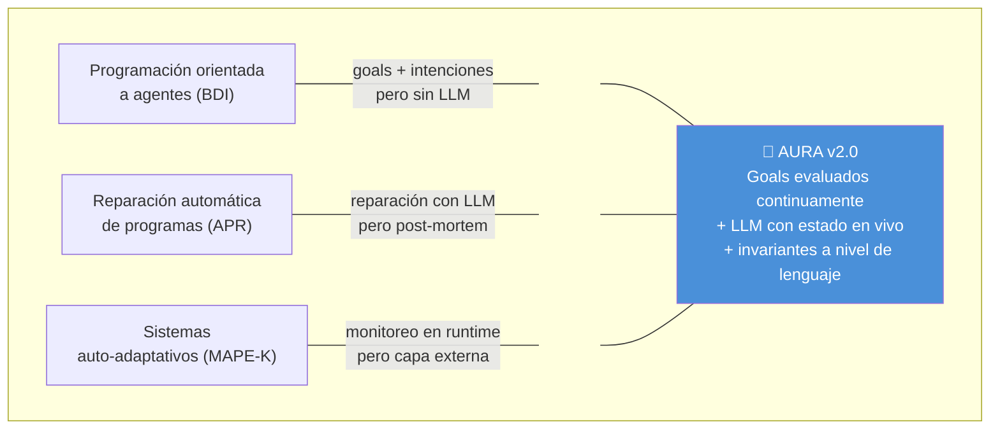

1. **Ningún lenguaje actual** proporciona construcciones integradas para expresar la intención del desarrollador (`goal`), expectativas de runtime (`expect`), monitoreo de variables (`observe`), puntos seguros de rollback (checkpoints), y solicitudes explícitas de razonamiento (`reason`) como sintaxis de primera clase.

2. **Ningún sistema actual** da a un LLM acceso al estado de ejecución en vivo (valores de variables, camino de ejecución, resultados de evaluación de goals) durante la ejecución del programa, permitiendo decisiones a mitad de ejecución (inyección de valores, parcheo de código, backtracking basado en checkpoints).

3. **Ningún sistema actual** impone invariantes de seguridad sobre las adaptaciones generadas por LLM a nivel del lenguaje---donde los invariantes se declaran en la sintaxis del programa, se validan por el parser, y se aplican antes de que cualquier fix propuesto por el LLM sea aplicado.

### 5.3 Afirmación formal de novedad

> AURA implementa un modelo operacional donde ejecutar un programa es buscar una trayectoria válida en un espacio de estados restringido por goals e invariantes declarados por el desarrollador, donde (1) un oráculo cognitivo (LLM con acceso al estado de ejecución reificado) selecciona trayectorias cuando la ejecución determinista no puede continuar, (2) las intervenciones del oráculo están estructuralmente tipadas en un álgebra de cinco modos (Continue, Override, Fix, Backtrack, Halt), (3) el backtracking con ajustes convierte al programa en un grafo navegable de estados---no una secuencia---, y (4) las restricciones declarativas (goals, invariantes) acotan formalmente el espacio de intervención del oráculo, distinguiendo a AURA de un sistema con "heurística IA externa" y posicionándolo como un modelo operacional no determinista con oráculo.

### 5.4 Lo que no es novedoso

La honestidad académica requiere identificar sobre qué construye AURA en lugar de inventar:

- La arquitectura BDI (Rao & Georgeff 1991, 1995; Bratman 1987)
- Ciclos auto-adaptativos MAPE-K (Kephart & Chess 2003)
- Mecanismos de checkpoint/rollback (Shavit & Touitou 1995)
- Backtracking cronológico (Prolog; Colmerauer & Roussel 1993)
- Reparación de código basada en LLM (Xia & Zhang 2023; Le Goues et al. 2012)
- Hot code reloading (Armstrong 2003)
- Sistemas de módulos basados en capacidades (cf. modelo de capacidades de SARL)
- Sistemas de condiciones/restarts (Common Lisp)
- Verificación en runtime (Leucker & Schallhart 2009)
- Semántica operacional (Plotkin 1981)
- Computación con oráculos (Turing 1939)

La contribución de AURA no es ninguna de estas piezas individualmente. Es el modelo que emerge de su síntesis: una máquina abstracta donde la continuidad del programa es negociada entre la semántica determinista del lenguaje y un oráculo generativo, dentro de un espacio restringido por intenciones declaradas.

---

## 6. Ejemplo desarrollado: Auto-reparación en acción

El siguiente programa AURA demuestra la ejecución cognitiva con auto-reparación real. A diferencia de un ejemplo trivial donde todo funciona, este programa tiene un **bug intencional** que el runtime cognitivo detecta y repara.

### 6.0 El escenario: Monitor de sensores IoT

Un sistema lee sensores de temperatura, detecta anomalías térmicas, y genera alertas. El código usa `umbral_temp` para definir el umbral de anomalía---pero esa variable **nunca se define**. Sin runtime cognitivo, el programa crashea. Con él, el error se detecta, se delibera un fix, se aplica, y se reintenta.

```aura
+http +json

goal "monitorear todos los sensores"
goal "detectar anomalias termicas" check lecturas != nil

invariant len(lecturas) >= 0

# Simula lecturas de sensores IoT
obtener_lecturas() = [{sensor: "TH-01", temp: 22.5, humedad: 45},
                      {sensor: "TH-02", temp: 38.7, humedad: 30},
                      {sensor: "TH-03", temp: 21.0, humedad: 55}]

# Bug intencional: umbral_temp NO esta definido
es_anomalia(temp) = temp > umbral_temp

# Formatea una alerta para un sensor
formatear_alerta(s) = "ALERTA: sensor {s.sensor} reporta {s.temp}C"

# Punto de entrada principal
main = : lecturas = obtener_lecturas();
         observe lecturas;
         expect len(lecturas) > 0 "sin datos de sensores";
         s1 = first(lecturas);
         s2 = first(tail(lecturas));
         print("Sensor {s1.sensor}: {s1.temp}C");
         print("Sensor {s2.sensor}: {s2.temp}C");
         a2 = es_anomalia(s2.temp);
         expect a2 "se esperaba anomalia en {s2.sensor}";
         alerta = formatear_alerta(s2);
         print(alerta);
         accion = reason "sensor {s2.sensor} en {s2.temp}C, que accion tomar?";
         print("Analisis completo");
         s2.temp
```

### 6.1 Ejecución sin runtime cognitivo

```bash
$ aura run examples/cognitive_demo.aura
Sensor TH-01: 22.5C
Sensor TH-02: 38.7C
Runtime error: Variable no definida: umbral_temp
```

El programa imprime los dos primeros sensores, llama a `es_anomalia(38.7)`, que evalúa `temp > umbral_temp`. Como `umbral_temp` no está definida, crashea. Comportamiento estándar de cualquier lenguaje.

### 6.2 Ejecución con runtime cognitivo

```bash
$ aura run --cognitive --provider mock examples/cognitive_demo.aura
Cognitive mode: provider=mock
Sensor TH-01: 22.5C
Sensor TH-02: 38.7C
Sensor TH-01: 22.5C
Sensor TH-02: 38.7C
ALERTA: sensor TH-02 reporta 38.7C
Analisis completo
38.7
  [1 fix(es) applied, 1 retries]
```

### 6.3 Traza detallada del ciclo cognitivo

Lo que sucede internamente ilustra el modelo de selección de trayectoria (Sección 4):

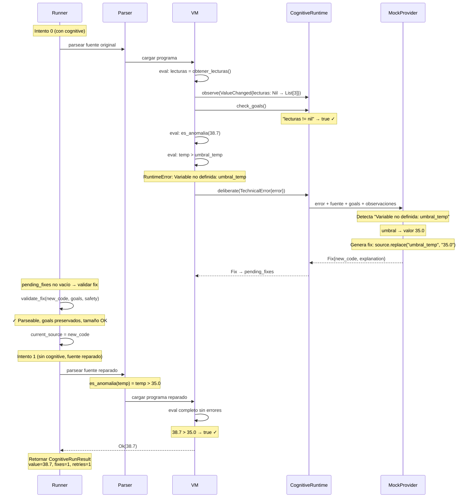

### 6.4 Lo que demuestra este ejemplo

Este ejemplo no es un escenario artificial---es la demostración concreta del modelo teórico de la Sección 4:

1. **El programa define un espacio de trayectorias, no un comportamiento fijo.** La trayectoria "evaluar `temp > umbral_temp` → crash" no es la única posible. El runtime cognitivo encuentra una trayectoria alternativa: reemplazar `umbral_temp` con `35.0` y reintentar.

2. **El error es un punto de bifurcación, no un crash.** En la Sección 4.4, definimos que un error activa una transición no determinista (Definición 13, regla STEP-FIX). Aquí el `RuntimeError` activa `deliberate(TechnicalError)`, que produce un `Fix`---una trayectoria alternativa.

3. **Las restricciones acotan la intervención.** El fix propuesto pasa por `validate_fix()`: debe parsear como AURA válido, preservar los dos goals, y no exceder 50 líneas. No es una intervención arbitraria---es una selección dentro del espacio restringido.

4. **El oráculo es semánticamente informado.** El MockProvider no elige `35.0` al azar: reconoce que `umbral` es un nombre de variable que implica un valor de umbral numérico. Un provider real (Claude, Ollama) haría un razonamiento aún más rico.

### 6.5 Contrafactual: escenario de backtracking

Imaginemos un goal más preciso con backtracking. Si `obtener_lecturas()` retornara un sensor con datos corruptos:

```aura
goal "todos los sensores deben tener lecturas válidas" check for(s in lecturas) : s.temp > 0
```

Cuando la verificación del goal falla:

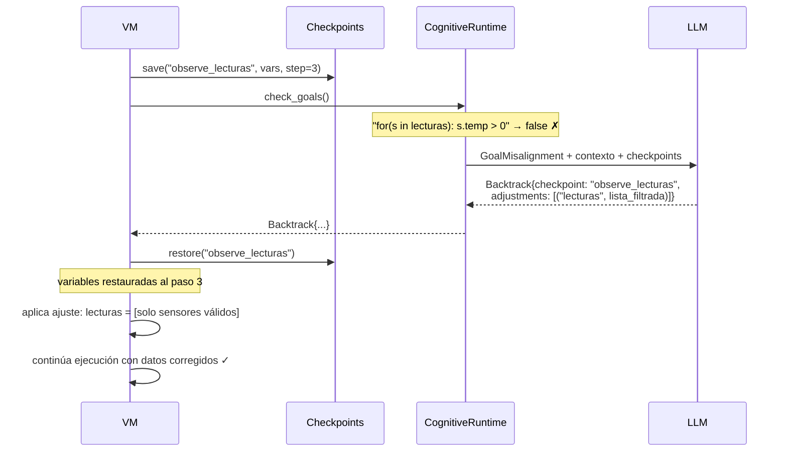

Esto ilustra la utilidad del backtracking con ajustes: el programa no crashea, no reinicia desde cero, no aplica una estrategia predefinida. El oráculo interpreta el goal, examina los datos, y propone una corrección dirigida---navegando el grafo de estados (Sección 4.11) hacia una trayectoria válida.

---

## 7. Evaluación empírica

Esta sección presenta mediciones del prototipo de AURA implementado en Rust, con el objetivo de responder tres preguntas concretas: (1) ¿cuál es el overhead del runtime cognitivo cuando no hay errores?, (2) ¿cuál es el costo de una reparación exitosa?, y (3) ¿cuál es el impacto en recursos del sistema?

Todas las mediciones se realizaron sobre el binario compilado en modo release (`cargo build --release`), ejecutando cada configuración 20 veces y reportando el promedio. El hardware es una máquina Linux x86_64 estándar. El provider cognitivo utilizado es `mock`---un provider determinista sin acceso a red que genera fixes basados en patrones del nombre de la variable, eliminando la variabilidad de latencia de red y de modelos externos.

### 7.1 Overhead cognitivo sin errores

Para medir el costo del runtime cognitivo cuando el programa no requiere intervención, se ejecutaron dos programas sin bugs con y sin el flag `--cognitive`:

| Programa | Normal (μs) | Cognitivo (μs) | Overhead |
|----------|-------------|-----------------|----------|
| `simple.aura` (asignación y retorno) | 1,630 | 2,532 | +55% |
| `math.aura` (aritmética y comparaciones) | 1,494 | 2,483 | +66% |

El overhead proviene de la inicialización del `CognitiveRuntime`, la creación del `CheckpointManager`, y la evaluación de goals e invariantes en cada paso relevante. Para programas que no activan ningún trigger cognitivo, el overhead es constante (aproximadamente 900 μs) e independiente del tamaño del programa---lo cual es consistente con el diseño de inicialización única del runtime.

Cuando el modo cognitivo no está activado, el `NullCognitiveRuntime` tiene cero overhead: todas sus operaciones son no-ops que retornan inmediatamente. Esto confirma que las capacidades cognitivas son puramente aditivas.

### 7.2 Costo de reparación cognitiva

Se midieron tres programas con bugs intencionales que el runtime cognitivo detecta y repara:

| Programa | Error | Fix aplicado | Crash (μs) | Reparación (μs) | Overhead |
|----------|-------|-------------|------------|------------------|----------|
| `cognitive_demo.aura` | `umbral_temp` indefinido | `umbral_temp` → `35.0` | 1,475 | 2,603 | +76% |
| `cognitive_func.aura` | `min_puntaje` indefinido | `min_puntaje` → `0` | 1,311 | 2,658 | +103% |
| `cognitive_config.aura` | `timeout_ms` indefinido | `timeout_ms` → `5000` | 1,473 | 2,541 | +73% |

La columna "Crash" mide el tiempo hasta que el programa falla sin modo cognitivo. La columna "Reparación" mide el ciclo completo: ejecución inicial → error → deliberación → generación de fix → validación → re-parseo → segunda ejecución exitosa.

El overhead de reparación (73-103%) incluye dos ejecuciones completas del programa más el ciclo de deliberación. Que el costo total de una reparación exitosa sea menor que 2x el tiempo de crash indica que la deliberación y validación del fix son operaciones baratas en comparación con la ejecución del programa.

### 7.3 Impacto en recursos

**Memoria.** El consumo de memoria residente (RSS) es:

| Modo | RSS (KB) | Delta |
|------|----------|-------|
| Normal | 5,068 | --- |
| Cognitivo | 5,564 | +496 KB |

El incremento de ~500 KB corresponde al `CognitiveRuntime`, el buffer de observaciones, el `CheckpointManager`, y el historial de `ReasoningEpisode`. Para contextos donde el consumo de memoria es crítico, el modo no cognitivo no incurre en esta asignación.

**Tamaño del binario.** El binario compilado en modo release ocupa 11 MB, incluyendo el runtime cognitivo, los tres providers (mock, Claude API, Ollama), y todas las capacidades del lenguaje (+http, +json, +db, +env).

### 7.4 Suite de tests

La implementación cuenta con 267 tests unitarios y de integración:

| Componente | Tests | Cobertura |
|------------|-------|-----------|
| Lexer | 41 | Todos los tokens, keywords, literales |
| Parser | 78 | AST completo, incluyendo nodos cognitivos |
| VM (core) | 89 | Evaluación, scoping, funciones, records |
| VM (cognitivo) | 36 | Deliberación, fixes, checkpoints, backtrack |
| Agente/bridge | 13 | MockProvider, validación de fixes |
| Capabilities | 10 | HTTP, JSON, DB, env |

La suite completa ejecuta en aproximadamente 1 segundo. Los 36 tests cognitivos cubren los cinco tipos de `CognitiveDecision` (Continue, Override, Fix, Backtrack, Halt), la validación de fixes (preservación de goals, tamaño máximo, parseabilidad), y los límites de `CognitiveSafetyConfig`.

### 7.5 Alcance y limitaciones de la evaluación

Esta evaluación tiene limitaciones que deben hacerse explícitas:

1. **Provider mock vs. provider real.** Los tiempos de reparación medidos usan el `MockProvider` determinista. Con un provider real (Claude API, Ollama), la latencia de deliberación dominaría el tiempo total (segundos en lugar de microsegundos). Los datos aquí miden el overhead del *framework* cognitivo, no el costo end-to-end con un LLM.

2. **Programas pequeños.** Los benchmarks usan programas de menos de 30 líneas. El overhead cognitivo constante (~900 μs) se volvería proporcionalmente menor en programas más grandes, pero la validación de fixes (`validate_fix`) podría escalar con el tamaño del código fuente.

3. **Un solo tipo de error.** Los tres ejemplos de reparación involucran el mismo patrón de error (variable indefinida). La generalización a otros tipos de error (type mismatches, errores lógicos, fallos de invariantes) requiere evaluación adicional.

4. **Ausencia de comparación directa.** No existe otro lenguaje con deliberación cognitiva integrada en la semántica de ejecución, lo cual impide una comparación directa. Los sistemas más cercanos (ChatRepair, MAPE-K) operan en niveles diferentes y no son directamente comparables.

---

## 8. Discusión

### 8.1 Enmarcamiento teórico: del sistema al modelo

La Sección 4 presentó el modelo formal de ejecución como selección de trayectoria restringida, estructurado alrededor de seis preguntas fundacionales (Sección 4.1). Aquí evaluamos qué logra esa formalización y qué queda pendiente.

**Lo que logra la formalización.** Las Definiciones 1-28 (Secciones 4.2-4.12) responden seis preguntas que cualquier modelo de computación debe abordar:

1. *¿Qué es un programa?* (Def. 1): una tripleta P = (C, G, I) de implementación, intenciones y restricciones.
2. *¿Qué es un estado?* (Def. 2): una 7-tupla que incluye heap, funciones, continuaciones, goals activos, invariantes, historia de observaciones y checkpoints.
3. *¿Qué es un paso?* (Defs. 5, 13): una transición determinista o una transición mediada por oráculo, con reglas de inferencia explícitas.
4. *¿Qué significa terminar?* (Defs. 16-17): alcanzar una configuración terminal donde el valor es consistente con los goals o el oráculo decidió detenerse.
5. *¿Qué significa ser correcto?* (Defs. 21-23, Teorema 3): una jerarquía de tres niveles---corrección estructural, intención satisfecha, intención preservada.
6. *¿Qué no puede expresar un modelo clásico?* (Teoremas 6-8): AURA generaliza estrictamente los modelos de Turing, planificación y control reactivo.

La denotación de un programa (Definición 20, Teorema 2) como conjunto de trayectorias válidas es el resultado central: eleva a AURA de *sistema interesante* a *modelo de computación*. AURA no compite con DSPy, LMQL, o LangChain (herramientas para *usar* LLMs). Compite con la pregunta de qué significa ejecutar un programa en presencia de incertidumbre.

**Lo que no logra (aún).** La formalización define *validez estructural* y *corrección semántica por satisfacción* (Definición 22), pero no *corrección semántica por preservación de intención* (Definición 23). La brecha entre intención satisfecha e intención preservada (Sección 4.7) permanece abierta como problema formal deliberado. Cerrarla requiere un lenguaje de especificación de intenciones más rico---conectando con la lógica de intenciones (Cohen & Levesque 1990), HyperLTL, o lógica deóntica.

**Mapeo a frameworks formales existentes:**

| Framework formal | Mapeo en AURA | Extensión de AURA |
|---|---|---|
| Efectos algebraicos (Plotkin & Pretnar 2009) | Primitivas cognitivas = efectos; `CognitiveRuntime` = handler | Handler generativo (LLM) vs. estático |
| MAPE-K (Kephart & Chess 2003) | `observe`=M, `Trigger`=A, LLM=P, `Decision`=E, `Episode`=K | Embebido en la VM, no capa externa |
| Condiciones/restarts (Common Lisp) | Errors + expects = condiciones; `CognitiveDecision` = restarts | Restarts generados dinámicamente, no predefinidos |
| Semántica de Prolog | Backtrack = backtracking cronológico | Con ajustes a variables + oráculo para elegir alternativas |
| Planificación HTN (Nau et al. 2003) | Programa = plan; deliberación = re-planificación | Re-planificación informada por estado de ejecución completo |
| Model checking | Espacio de estados + propiedades (goals/invariants) | Exploración guiada por oráculo, no exhaustiva |

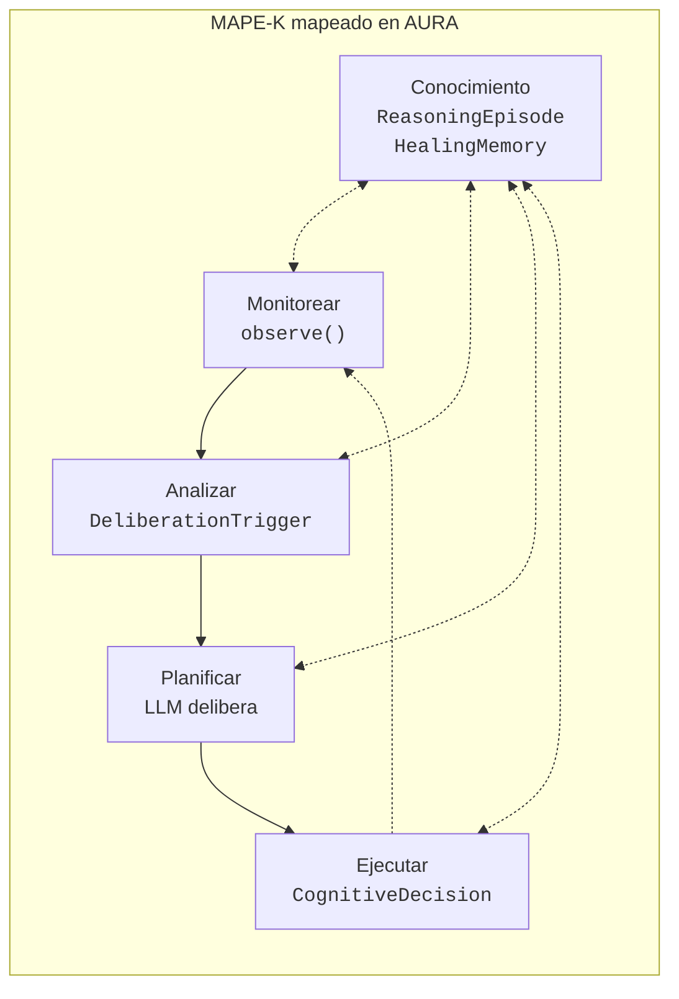

### 8.2 El runtime como arquitectura cognitiva

Al mapearse a la teoría de arquitecturas cognitivas, el runtime de AURA implementa los componentes esenciales identificados por Newell (1990) y arquitecturas subsiguientes:

- **Percepción**: detección de eventos vía `observe()`
- **Memoria de trabajo**: buffer de observaciones + contexto de ejecución
- **Memoria a largo plazo**: `HealingMemory` con persistencia de `ReasoningEpisode`
- **Deliberación**: invocación del LLM con contexto estructurado
- **Selección de acción**: enum `CognitiveDecision`
- **Aprendizaje**: el historial de episodios informa deliberaciones subsiguientes
- **Metacognición**: límites de `CognitiveSafetyConfig` sobre el comportamiento de razonamiento

Esto sugiere que AURA es, hasta donde sabemos, **el primer runtime de lenguaje de programación que es en sí mismo una arquitectura cognitiva**---en lugar de un lenguaje usado para implementar una.

### 8.3 Limitaciones

**Intención preservada vs. intención satisfecha (el problema central).** Como se discutió en la Sección 4.7 (Definiciones 22-23), AURA hoy solo garantiza *intención satisfecha*: que los goals evalúen a `true` después de una intervención. Pero no garantiza *intención preservada*: que la intervención sea coherente con lo que el desarrollador quiso decir. Un goal "mantener usuarios activos" podría satisfacerse degeneradamente eliminando usuarios inactivos, cuando el desarrollador quería notificarles. Este es el problema conceptual más importante que enfrenta el modelo, y resolverlo probablemente requiere un lenguaje de especificación de intenciones más rico que expresiones booleanas---conectando con la semántica de intenciones de Cohen & Levesque (1990) o verificación de propiedades temporales (LTL/CTL).

**Coherencia semántica de intervenciones.** Relacionado con lo anterior: hoy el sistema valida que una intervención sea *segura* (invariants OK, goals preservados, parseable), pero no que sea *semánticamente coherente*. El LLM puede producir una intervención que satisface todas las restricciones formales pero es absurda en contexto. La distinción entre "decisión semánticamente válida" y "heurística conveniente" requiere un modelo formal de validez de intervención que hoy no existe.

**Latencia.** La deliberación con LLM añade segundos de latencia por invocación. AURA mitiga esto a través del `NullCognitiveRuntime` (cero overhead cuando las características cognitivas están inactivas) y observaciones agrupadas, pero las aplicaciones en tiempo real pueden necesitar límites de latencia más estrictos.

**Determinismo.** Las respuestas del LLM son no determinísticas. Dos ejecuciones del mismo programa pueden seguir trayectorias diferentes en el espacio de estados (Sección 4.6, Teorema 2). AURA registra la traza de `ReasoningEpisode` para análisis de reproducibilidad, pero las garantías formales de convergencia requieren trabajo futuro.

**Corrección de fixes generados por LLM.** La función `validate_fix()` verifica sintaxis, preservación de goals, y tamaño---pero no corrección semántica. Un fix que parsea correctamente y preserva goals aún puede introducir errores lógicos. La verificación formal de parches generados por LLM sigue siendo un problema de investigación abierto.

**Costo.** Cada deliberación incurre en costos de API del LLM. Los límites `max_deliberations` y `max_deliberations_without_progress` acotan esto, pero las estrategias de deliberación conscientes del costo son trabajo futuro.

### 8.4 Direcciones futuras

- **Modelo formal de validez de intervención**: definir formalmente cuándo una intervención del oráculo es *semánticamente válida* y no solo *segura*. Conectar con la lógica de intenciones (Cohen & Levesque 1990) y verificación temporal.
- **Semántica operacional completa**: extender las reglas representativas de la Sección 4.3 a una semántica operacional de pasos pequeños exhaustiva que cubra todas las formas sintácticas de AURA.
- **Convergencia de trayectorias**: demostrar formalmente que, bajo ciertas condiciones sobre el oráculo y las restricciones, la búsqueda de trayectoria siempre termina (o acotar la probabilidad de no-terminación).
- **Runtime cognitivo multi-agente**: múltiples oráculos con diferentes especializaciones, formalizados como un sistema de handlers compuestos.
- **Adaptación verificada**: usar métodos formales para demostrar que las adaptaciones dentro del espacio acotado por invariantes preservan propiedades especificadas (model checking restringido).
- **Deliberación consciente del costo**: estrategias que balanceen el costo de llamadas al oráculo contra el beneficio esperado (formalizable como problema de decisión parcialmente observable).
- **Cognición colaborativa**: modos humano-en-el-ciclo donde el runtime presenta las trayectorias candidatas en lugar de seleccionar autónomamente.

---

## 9. Conclusión

Este trabajo se estructuró alrededor de seis preguntas fundacionales (Sección 4.1) que cualquier modelo de computación debe responder. Las respuestas formales---28 definiciones, 8 teoremas, 9 proposiciones, 4 desiderata, y 1 conjetura (Secciones 4.2-4.14)---convergen en una tesis:

> Un programa AURA no define una función de entradas a salidas, sino un espacio de historias válidas restringido por semántica declarativa, donde la ejecución es la selección progresiva de una trayectoria consistente bajo incertidumbre.

Los resultados centrales son:

1. **La denotación de un programa es un conjunto de trayectorias** (Definición 20, Teorema 2). Cuando el oráculo está activo, el programa admite múltiples ejecuciones válidas; el oráculo selecciona entre ellas.

2. **La corrección tiene tres niveles** (Definiciones 21-23, Teorema 3): corrección estructural (la ejecución respetó las reglas), intención satisfecha (los goals evalúan a true), e intención preservada (las intervenciones son coherentes con la semántica intencional). Los conversos son falsos---cada nivel es estrictamente más fuerte.

3. **Toda intervención preserva la especificación** (Teorema 4): goals e invariantes se mantienen invariantes bajo toda transición →_o, incluyendo Fix que reescribe el código.

4. **Las primitivas son consecuencias necesarias** (Teorema 5): eliminar cualquiera degrada el modelo a uno existente. Son el vocabulario mínimo para que la ejecución-como-selección-de-trayectoria sea un modelo distinto.

5. **AURA generaliza estrictamente tres modelos clásicos** (Teoremas 6-8): Turing (sin oráculo), planificación (sin ejecución sustantiva), y control reactivo (sin historia ni intenciones).

**AURA no es un lenguaje con features de agentes. Es una máquina abstracta donde la continuidad del programa es negociada** entre semántica determinista, oráculo generativo, y restricciones declarativas. Las primitivas del lenguaje (`goal`, `observe`, `expect`, `reason`, `invariant`) no son features que decidimos agregar---son las consecuencias mínimas necesarias del modelo (Sección 4.10): sin cualquiera de ellas, el modelo degenera a algo que ya existe.

La implementación en Rust (267 tests, modo cognitivo funcional con auto-reparación demostrada) prueba que el modelo es realizable. La evaluación empírica (Sección 7) muestra que el overhead cognitivo sin errores es constante (~900 μs), que una reparación exitosa cuesta menos de 2x el tiempo de crash, y que el `NullCognitiveRuntime` asegura cero overhead para programas no cognitivos.

Los problemas abiertos son significativos y productivos: la brecha entre intención satisfecha e intención preservada (Definición 23, Sección 4.7), los tipos cognitivos y la conjetura de programas open-world (Sección 4.13), y la complejidad computacional cognitiva (Sección 4.14). Estos son preguntas sobre modelos de computación, no sobre arquitectura de software---lo cual confirma que AURA opera en el espacio teórico correcto.

Si un programa ya no es una función sino una trayectoria en un espacio restringido, y si el oráculo que guía esa trayectoria es un modelo de lenguaje grande que entiende la semántica del código que ejecuta---entonces la frontera entre "programar" y "especificar intenciones para que una máquina las navegue" se desdibuja de maneras que la teoría de lenguajes de programación aún no ha explorado. AURA hace esa exploración concreta, formal, y tratable.

---

## Referencias

### Lenguajes de programación orientados a agentes

[1] Shoham, Y. (1993). "Agent-Oriented Programming." *Artificial Intelligence*, 60(1):51-92.

[2] Rao, A.S. (1996). "AgentSpeak(L): BDI Agents Speak Out in a Logical Computable Language." *MAAMAW'96*, LNCS 1038, Springer, 42-55.

[3] Bordini, R.H., Hubner, J.F., & Wooldridge, M. (2007). *Programming Multi-Agent Systems in AgentSpeak using Jason*. Wiley.

[4] Hindriks, K.V. (2009). "Programming Rational Agents in GOAL." In *Multi-Agent Programming*, Springer, 119-157.

[5] Dastani, M. (2008). "2APL: A Practical Agent Programming Language." *Autonomous Agents and Multi-Agent Systems*, 16(3):214-248.

[6] Rodriguez, S., Gaud, N., & Galland, S. (2014). "SARL: A General-Purpose Agent-Oriented Programming Language." *WI-IAT 2014*, IEEE/WIC/ACM.

[7] Pokahr, A., Braubach, L., & Lamersdorf, W. (2005). "Jadex: A BDI Reasoning Engine." In *Multi-Agent Programming*, Springer, 149-174.

### Teoría BDI

[8] Bratman, M.E. (1987). *Intention, Plans, and Practical Reason*. Harvard University Press.

[9] Rao, A.S. & Georgeff, M.P. (1991). "Modeling Rational Agents within a BDI-Architecture." *KR'91*, Morgan Kaufmann, 473-484.

[10] Rao, A.S. & Georgeff, M.P. (1995). "BDI Agents: From Theory to Practice." *ICMAS'95*, AAAI Press, 312-319.

[11] Sardina, S. & Padgham, L. (2011). "A BDI Agent Programming Language with Failure Handling, Declarative Goals, and Planning." *Autonomous Agents and Multi-Agent Systems*, 23(1):18-70.

[12] Cohen, P.R. & Levesque, H.J. (1990). "Intention is Choice with Commitment." *Artificial Intelligence*, 42(2-3):213-261.

### Reparación automática de programas

[13] Le Goues, C., Nguyen, T.V., Forrest, S., & Weimer, W. (2012). "GenProg: A Generic Method for Automatic Software Repair." *IEEE TSE*, 38(1):54-72.

[14] Nguyen, H.D.T., Qi, D., Roychoudhury, A., & Chandra, S. (2013). "SemFix: Program Repair via Semantic Analysis." *ICSE 2013*, 772-781.

[15] Mechtaev, S., Yi, J., & Roychoudhury, A. (2016). "Angelix: Scalable Multiline Program Patch Synthesis via Symbolic Analysis." *ICSE 2016*, 1071-1082.

[16] Long, F. & Rinard, M. (2016). "Automatic Patch Generation by Learning Correct Code." *POPL 2016*, 298-312.

[17] Xia, C.S. & Zhang, L. (2022). "Less Training, More Repairing Please: Revisiting Automated Program Repair via Zero-Shot Learning." *ESEC/FSE 2022*, 959-971.

[18] Xia, C.S. & Zhang, L. (2023). "Keep the Conversation Going: Fixing 162 out of 337 bugs for $0.42 each using ChatGPT." *ISSTA 2024*. arXiv:2304.00385.

[19] Monperrus, M. (2018). "Automatic Software Repair: A Bibliography." *ACM Computing Surveys*, 51(1):1-24.

### Sistemas auto-adaptativos

[20] Kephart, J.O. & Chess, D.M. (2003). "The Vision of Autonomic Computing." *IEEE Computer*, 36(1):41-50.

[21] Garlan, D., Cheng, S.-W., Huang, A.-C., Schmerl, B., & Steenkiste, P. (2004). "Rainbow: Architecture-Based Self-Adaptation with Reusable Infrastructure." *IEEE Computer*, 37(10):46-54.

[22] Weyns, D., Malek, S., & Andersson, J. (2012). "FORMS: Unifying Reference Model for Formal Specification of Distributed Self-Adaptive Systems." *ACM TAAS*, 7(1).

[23] Weyns, D. (2020). *An Introduction to Self-Adaptive Systems: A Contemporary Software Engineering Perspective*. Wiley/IEEE Press.

### Arquitecturas cognitivas

[24] Laird, J.E., Newell, A., & Rosenbloom, P.S. (1987). "SOAR: An Architecture for General Intelligence." *Artificial Intelligence*, 33(1):1-64.

[25] Newell, A. (1990). *Unified Theories of Cognition*. Harvard University Press.

[26] Anderson, J.R. & Lebiere, C. (1998). *The Atomic Components of Thought*. Lawrence Erlbaum Associates.

[27] Anderson, J.R. et al. (2004). "An Integrated Theory of the Mind." *Psychological Review*, 111(4):1036-1060.

[28] Sun, R. (2016). *Anatomy of the Mind: Exploring Psychological Mechanisms and Processes with the Clarion Cognitive Architecture*. Oxford University Press.

[29] Franklin, S. et al. (2014). "LIDA: A Systems-level Architecture for Cognition, Emotion, and Learning." *IEEE Trans. on Autonomous Mental Development*, 6(1):19-41.

### Reflexión, efectos y meta-programación

[30] Smith, B.C. (1984). "Reflection and Semantics in Lisp." *POPL '84*, ACM, 23-35.

[31] Kiczales, G., des Rivieres, J., & Bobrow, D.G. (1991). *The Art of the Metaobject Protocol*. MIT Press.

[32] Kiczales, G. et al. (1997). "Aspect-Oriented Programming." *ECOOP '97*, LNCS 1241, Springer, 220-242.

[33] Plotkin, G.D. & Pretnar, M. (2009). "Handlers of Algebraic Effects." *ESOP 2009*, LNCS 5502, Springer, 80-94.

[34] Bauer, A. & Pretnar, M. (2015). "Programming with Algebraic Effects and Handlers." *Journal of Logical and Algebraic Methods in Programming*, 84(1):108-123.

### Checkpoint, rollback y tolerancia a fallos

[35] Shavit, N. & Touitou, D. (1995). "Software Transactional Memory." *PODC '95*, ACM, 204-213.

[36] Harris, T., Marlow, S., Peyton Jones, S., & Herlihy, M. (2005). "Composable Memory Transactions." *PPoPP '05*, ACM, 48-60.

[37] Armstrong, J. (2003). *Making Reliable Distributed Systems in the Presence of Software Errors*. PhD Thesis, Royal Institute of Technology, Stockholm.

[38] Rinard, M. et al. (2004). "Enhancing Server Availability and Security Through Failure-Oblivious Computing." *OSDI 2004*, USENIX, 303-316.

[39] Perkins, J.H. et al. (2009). "Automatically Patching Errors in Deployed Software." *SOSP 2009*, ACM, 87-102.

### Programación integrada con LLM

[40] Beurer-Kellner, L., Fischer, M., & Vechev, M. (2023). "Prompting Is Programming: A Query Language for Large Language Models." *PLDI 2023*, ACM, 1507-1532.

[41] Khattab, O. et al. (2023). "DSPy: Compiling Declarative Language Model Calls into Self-Improving Pipelines." arXiv:2310.03714. *ICLR 2024*.

[42] Zheng, L. et al. (2024). "SGLang: Efficient Execution of Structured Language Model Programs." arXiv:2312.07104.

[43] Yao, S. et al. (2023). "ReAct: Synergizing Reasoning and Acting in Language Models." *ICLR 2023*.

[44] Shinn, N. et al. (2023). "Reflexion: Language Agents with Verbal Reinforcement Learning." *NeurIPS 2023*.

### Programación orientada a objetivos y planificación

[45] Fikes, R.E. & Nilsson, N.J. (1971). "STRIPS: A New Approach to the Application of Theorem Proving to Problem Solving." *Artificial Intelligence*, 2(3-4):189-208.

[46] Nilsson, N.J. (1994). "Teleo-Reactive Programs for Agent Control." *JAIR*, 1:139-158.

[47] Nau, D. et al. (2003). "SHOP2: An HTN Planning System." *JAIR*, 20:379-404.

### Verificación en runtime y diseño por contrato

[48] Meyer, B. (1992). "Applying 'Design by Contract'." *IEEE Computer*, 25(10):40-51.

[49] Leucker, M. & Schallhart, C. (2009). "A Brief Account of Runtime Verification." *Journal of Logic and Algebraic Programming*, 78(5):293-303.

[50] Ernst, M.D. et al. (2007). "The Daikon System for Dynamic Detection of Likely Invariants." *Science of Computer Programming*, 69(1-3):35-45.

### Surveys y trabajo fundacional

[51] Wooldridge, M. & Jennings, N.R. (1995). "Intelligent Agents: Theory and Practice." *Knowledge Engineering Review*, 10(2):115-152.

[52] Wang, L. et al. (2024). "A Survey on Large Language Model Based Autonomous Agents." *Frontiers of Computer Science*.

[53] Schmidhuber, J. (2003). "Goedel Machines: Self-Referential Universal Problem Solvers Making Provably Optimal Self-Improvements." Technical Report IDSIA-19-03.

[54] Hicks, M. & Nettles, S. (2005). "Dynamic Software Updating." *ACM TOPLAS*, 27(6):1049-1096.

[55] Gat, E. (1998). "On Three-Layer Architectures." In *Artificial Intelligence and Mobile Robots*, MIT Press, 195-210.

### Programación lógica y backtracking

[56] Colmerauer, A. & Roussel, P. (1993). "The Birth of Prolog." *History of Programming Languages II*, ACM, 331-367.

[57] Lloyd, J.W. (1987). *Foundations of Logic Programming* (2nd ed.). Springer-Verlag.

[58] Sterling, L. & Shapiro, E. (1994). *The Art of Prolog* (2nd ed.). MIT Press.

### Reversible computing y exploración de estados

[59] Landauer, R. (1961). "Irreversibility and Heat Generation in the Computing Process." *IBM Journal of Research and Development*, 5(3):183-191.

[60] Bennett, C.H. (1973). "Logical Reversibility of Computation." *IBM Journal of Research and Development*, 17(6):525-532.

[61] Clarke, E.M., Grumberg, O., & Peled, D.A. (1999). *Model Checking*. MIT Press.

### Oráculos y computabilidad

[62] Turing, A.M. (1939). "Systems of Logic Based on Ordinals." *Proceedings of the London Mathematical Society*, s2-45(1):161-228.

[63] Rogers, H. (1967). *Theory of Recursive Functions and Effective Computability*. McGraw-Hill.

### Semántica operacional

[64] Plotkin, G.D. (1981). "A Structural Approach to Operational Semantics." Technical Report DAIMI FN-19, Aarhus University.

[65] Wright, A.K. & Felleisen, M. (1994). "A Syntactic Approach to Type Soundness." *Information and Computation*, 115(1):38-94.

---

*AURA está implementado en Rust con 244+ tests, incluyendo auto-reparación cognitiva funcional. Código fuente disponible en el repositorio del proyecto.*
