# AURA: Incorporación de deliberación cognitiva en la semántica de lenguajes de programación

## Un reporte técnico sobre Agent-Unified Runtime Architecture

---

**Resumen.** Presentamos AURA (Agent-Unified Runtime Architecture), un lenguaje de programación cuya máquina virtual redefine qué significa ejecutar un programa: en AURA, un programa no es una función que mapea entradas a salidas, sino la especificación de un *espacio de trayectorias de ejecución válidas*, restringido por goals e invariantes declarados por el desarrollador, donde un agente cognitivo (respaldado por un LLM) actúa como oráculo que selecciona trayectorias viables cuando la ejecución determinista no puede continuar. A diferencia de los enfoques existentes donde los LLMs operan como herramientas externas de generación de código (GitHub Copilot, ChatRepair), como orquestadores de agentes (LangChain, DSPy), o donde la auto-reparación opera a nivel de sistemas (MAPE-K, Rainbow), AURA incorpora la deliberación cognitiva directamente en su semántica operacional: la VM puede suspender la evaluación en puntos arbitrarios, reificar el contexto completo de ejecución (variables, goals, invariantes, historial de observaciones, checkpoints), despachar a un LLM para deliberación, y resumir con una de cinco intervenciones estructuralmente tipadas---continuar, inyección de valor, parcheo de código, backtracking basado en checkpoints con ajustes, o detención. El backtracking con ajustes es la intervención central: convierte al programa en un *grafo navegable de estados* donde la ejecución puede retroceder y explorar trayectorias alternativas, acercando AURA a la semántica de búsqueda de Prolog, los handlers de efectos algebraicos, y el sistema de condiciones/restarts de Common Lisp---pero con un oráculo generativo en lugar de handlers estáticos. Hasta donde sabemos, AURA es el primer lenguaje de programación donde (1) la deliberación cognitiva es parte de la semántica operacional, no una capa externa, (2) la ejecución se modela como selección de trayectoria en un espacio restringido por intenciones declaradas, y (3) un LLM participa como componente del runtime que selecciona entre continuaciones semánticamente válidas, no como herramienta heurística arbitraria.

---

## 1. Introducción

### 1.1 La brecha paradigmática

Tres comunidades de investigación han desarrollado independientemente soluciones al problema de construir software que se adapte a condiciones inesperadas:

**Programación orientada a agentes** (Shoham 1993; Rao 1996; Bordini et al. 2007) introdujo actitudes mentales---creencias, deseos, intenciones---como primitivas de programación. Lenguajes como AgentSpeak/Jason, GOAL y 2APL implementan la arquitectura BDI (Belief-Desire-Intention) con razonamiento explícito sobre objetivos y manejo de fallos en planes. Sin embargo, estos lenguajes son anteriores a la era de los LLM: su "razonamiento" es búsqueda en biblioteca de planes, no deliberación abierta.

**Reparación automática de programas** (Le Goues et al. 2012; Xia & Zhang 2023; Long & Rinard 2016) desarrolló técnicas para corregir errores automáticamente, desde reparación basada en búsqueda (GenProg) hasta reparación conversacional con LLM (ChatRepair). Estos sistemas logran resultados impresionantes en benchmarks, pero todos operan *post-mortem*: el programa primero debe fallar, producir un fallo de test o mensaje de error, y luego una herramienta externa propone un parche. Ninguna herramienta APR tiene acceso al estado de ejecución en vivo.

**Sistemas auto-adaptativos** (Kephart & Chess 2003; Garlan et al. 2004; Weyns et al. 2012) formalizaron el ciclo MAPE-K (Monitorear-Analizar-Planificar-Ejecutar sobre Conocimiento compartido) para computación autónoma. Sistemas como Rainbow detectan violaciones de restricciones arquitectónicas y aplican estrategias de reparación predefinidas. Estos operan a nivel de infraestructura, no a nivel de lenguaje de programación.

A pesar de décadas de progreso en cada comunidad, persiste una brecha fundamental: **ningún lenguaje de programación existente integra deliberación cognitiva---la capacidad de pausar la ejecución, razonar sobre el estado actual contra intenciones declaradas, y elegir entre intervenciones estructuralmente diversas---en su semántica de ejecución.**

### 1.2 La síntesis

AURA cierra esta brecha sintetizando ideas de las tres tradiciones en un solo diseño de lenguaje:

| Origen | Concepto | Realización en AURA |
|--------|---------|------------------|
| Arquitecturas BDI | Goals como actitudes mentales de primera clase | `goal "descripción" check expr` --- goals con expresiones de verificación evaluadas en runtime |
| Verificación en runtime | Monitoreo continuo de propiedades | `observe variable` --- declara puntos de monitoreo en runtime |
| Diseño por contrato | Precondiciones e invariantes | `invariant expr` --- restricciones que acotan todas las adaptaciones |
| Ciclo MAPE-K | Ciclo Monitorear-Analizar-Planificar-Ejecutar | `observe` -> `deliberate()` -> `CognitiveDecision` -> aplicar |
| Checkpoint/rollback | Gestión transaccional de estado | `CheckpointManager` --- snapshots nombrados con restauración y ajustes |
| Frameworks de agentes LLM | Razonamiento potenciado por LLM | `reason "pregunta"` --- deliberación explícita con inyección de valores |

El resultado es un lenguaje donde el modelo de ejecución cambia fundamentalmente:

**Modelo v1 — ejecución tradicional:**

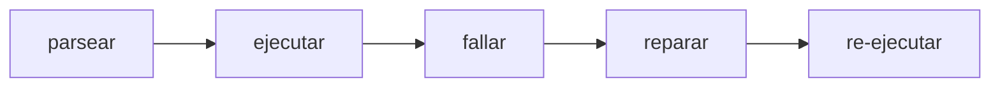

**Modelo v2 — ejecución cognitiva:**

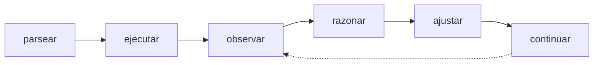

### 1.3 El salto conceptual

Sin embargo, describir AURA como "un lenguaje con primitivas de agentes" sería reduccionista. Lo que AURA realmente implementa es algo más profundo:

> **AURA no es un lenguaje que permite deliberación. AURA es una máquina abstracta donde la continuidad del programa es negociada.**

En un lenguaje convencional, un programa define *el* comportamiento: dada una entrada, la semántica del lenguaje determina una única traza de ejecución (o falla). En AURA, un programa define el *espacio permitido* de comportamientos. Los goals y los invariantes restringen ese espacio. La ejecución es entonces **búsqueda guiada en un espacio de trayectorias válidas**, donde el agente cognitivo actúa como oráculo de selección.

Esto cambia radicalmente el estatus del programa:

| Aspecto | Lenguaje convencional | AURA |
|---------|----------------------|------|
| El programa define | El comportamiento | El espacio de comportamientos permitidos |
| La ejecución es | Evaluación determinista | Búsqueda de trayectoria válida |
| Un error es | Un crash | Un punto de bifurcación |
| El estado es | Una secuencia | Un grafo navegable |
| La continuación es | Determinada por la semántica | Negociada con un oráculo |

Este reencuadre tiene consecuencias teóricas importantes. Conecta a AURA no con los agent frameworks (LangChain, DSPy), sino con:

- **Efectos algebraicos** (Plotkin & Pretnar 2009): la deliberación es un efecto cedido a un handler, pero el handler es generativo (LLM) en lugar de estático.
- **Condiciones/restarts de Common Lisp**: el programa señala una condición; el oráculo elige un restart---pero los restarts no están predefinidos sino generados dinámicamente.
- **Arquitecturas cognitivas tipo Soar** (Laird et al. 1987): un impasse activa sub-goalificación automática. En AURA, un error o expect fallido activa deliberación cognitiva.
- **Búsqueda con backtracking de Prolog**: la ejecución explora alternativas cuando un camino falla, pero las alternativas son propuestas por un oráculo en lugar de enumeradas estáticamente.

Este posicionamiento teórico se desarrolla formalmente en la Sección 4.

### 1.4 Contribuciones

Este reporte hace las siguientes afirmaciones, cada una respaldada por evidencia de implementación y posicionada contra la literatura relevada:

1. **Ejecución como selección de trayectoria restringida** (Sección 4). Proponemos un modelo operacional donde ejecutar un programa no es evaluar una función, sino buscar una trayectoria válida en un espacio de estados restringido por goals e invariantes. El LLM actúa como oráculo de selección, no como herramienta heurística. Esta formalización eleva a AURA de "sistema interesante" a "modelo de programación", conectándolo con semánticas operacionales no deterministas, planificación, y model checking.

2. **Deliberación cognitiva como semántica del lenguaje** (Sección 3.2). Ningún lenguaje existente define la deliberación como una operación semántica que puede modificar el estado de ejecución, reescribir código, o hacer backtrack con ajustes. El trait `CognitiveRuntime` (`observe`, `deliberate`, `check_goals`, `is_active`) es invocado por la VM durante la evaluación de expresiones, no como una capa de monitoreo externa.

3. **Backtracking con ajustes como primitiva semántica** (Sección 3.3). La intervención `Backtrack{checkpoint, adjustments}` convierte al programa en un grafo navegable de estados donde la ejecución puede retroceder y explorar trayectorias alternativas. Esto no es una feature---es la semántica. Combina backtracking cronológico (Prolog), memoria transaccional (STM), y re-planificación BDI, pero con un oráculo generativo que propone ajustes.

4. **Goals como expresiones de runtime evaluadas continuamente** (Sección 3.1). Ningún lenguaje BDI existente trata los goals como expresiones en el lenguaje anfitrión evaluadas durante la ejecución. El `GoalDef.check: Option<Expr>` de AURA permite monitoreo continuo de goals a granularidad arbitraria, distinto de los átomos simbólicos de AgentSpeak, las fórmulas lógicas de GOAL, y los maintain goals basados en callbacks de Jadex.

5. **Álgebra de intervención de cinco modos** (Sección 3.3). El enum `CognitiveDecision` define cinco intervenciones estructuralmente tipadas (`Continue`, `Override(Value)`, `Fix{new_code, explanation}`, `Backtrack{checkpoint, adjustments}`, `Halt(error)`), proporcionando un espacio de intervención más rico que cualquier sistema de auto-reparación existente.

6. **Adaptación acotada por invariantes** (Sección 3.4). Los invariantes y goals declarados por el desarrollador restringen todas las modificaciones generadas por el LLM. La función `validate_fix()` verifica que los fixes sean parseables, respeten límites de tamaño, preserven todos los goals declarados, y no introduzcan goals nuevos.

7. **Abstracción cognitiva de cero overhead** (Sección 3.5). Cuando `is_active()` retorna `false` (el `NullCognitiveRuntime`), todas las verificaciones cognitivas son no-ops. Los programas sin características cognitivas se ejecutan con rendimiento idéntico al de un runtime no cognitivo.

---

## 2. Trabajo relacionado

### 2.1 Lenguajes de programación orientados a agentes

**AgentSpeak(L)** (Rao 1996) introdujo el modelo de programación BDI dominante: los agentes tienen creencias (hechos tipo Prolog), eventos disparadores activan planes de una biblioteca de planes, y las intenciones son pilas de planes parcialmente ejecutados. **Jason** (Bordini et al. 2007) es la implementación más completa, añadiendo actos de habla, entornos y abstracciones organizacionales. Los goals en AgentSpeak son átomos simbólicos (`!achieve_goal`) que disparan selección de planes; el fallo causa abandono de intención o re-planificación dentro de la biblioteca de planes.

**GOAL** (Hindriks 2009) usa goals declarativos expresados como fórmulas lógicas. La base de goals de un agente se actualiza mediante un ciclo de deliberación que evalúa goals contra creencias. GOAL es el trabajo previo más cercano al modelo de goals activos de AURA, pero sus goals son fórmulas lógicas en un lenguaje de consulta de creencias separado, no expresiones en el lenguaje anfitrión.

**2APL** (Dastani 2008) introduce *reglas de razonamiento práctico* (PR-rules) que revisan planes cuando las condiciones cambian. Cuando un plan falla, las PR-rules hacen matching con el contexto de fallo y generan planes revisados. Este es el mecanismo de re-planificación más sofisticado en la literatura AOPL, pero opera sobre mapeos regla-plan predefinidos, no deliberación abierta con LLM.

**Jadex** (Pokahr et al. 2005) añade *maintain goals* al modelo BDI: condiciones que deben permanecer verdaderas, con re-activación automática de planes cuando se violan. Esto es estructuralmente similar al `goal ... check expr` de AURA, pero las condiciones maintain de Jadex son predicados Java registrados como callbacks, no expresiones en el lenguaje del agente mismo.

**SARL** (Rodriguez et al. 2014) introduce un modelo de capacidad/habilidad donde los agentes declaran capacidades requeridas y vinculan implementaciones en runtime. Esto es arquitectónicamente similar al sistema de capacidades de AURA (`+http`, `+json`, `+db`).

**La brecha.** Ningún lenguaje BDI existente trata los goals como expresiones evaluadas continuamente en el sistema de expresiones del lenguaje anfitrión. La Tabla 1 resume la distinción:

*Tabla 1: Representación de goals a través de lenguajes orientados a agentes*

| Lenguaje | Representación del goal | Momento de evaluación | Respuesta ante fallo |
|----------|-------------------|-------------------|-----------------|
| AgentSpeak | Átomo simbólico (`!g`) | Al dispararse | Abandonar intención |
| GOAL | Fórmula lógica | Por ciclo de deliberación | Re-seleccionar plan |
| Jadex | Predicado Java (callback) | Al callback | Re-activar plan |
| 2APL | Fórmula lógica | Por ciclo, PR-rules | Revisión basada en reglas |
| **AURA** | **Expresión del lenguaje anfitrión** | **Continua, por paso** | **Deliberación cognitiva + backtrack** |

### 2.2 Reparación automática de programas

**GenProg** (Le Goues et al. 2012) fue pionero en la reparación automatizada de programas basada en búsqueda usando programación genética para evolucionar parches. **SemFix** (Nguyen et al. 2013) y **Angelix** (Mechtaev et al. 2016) introdujeron reparación a nivel semántico usando ejecución simbólica y resolución de restricciones. **Prophet** (Long & Rinard 2016) aprendió modelos de corrección de código a partir de parches humanos para rankear candidatos.

La era de los LLM transformó el campo. **ChatRepair** (Xia & Zhang 2023) usa interacción conversacional con LLM para corregir 162/337 bugs de Defects4J a ~$0.42 por bug. **RepairLLaMA** (Silva et al. 2023) hace fine-tuning de LLMs open-source con adaptadores LoRA para reparación. **AlphaRepair** (Xia & Zhang 2022) demostró que modelos de código pre-entrenados pueden realizar reparación zero-shot tratando código con errores como un problema de modelo de lenguaje enmascarado.

**La limitación post-mortem.** Todas las herramientas APR---clásicas y basadas en LLM---comparten una arquitectura fundamental:

```
[Programa falla] → [Extraer código + error] → [Enviar a herramienta] → [Obtener parche] → [Aplicar] → [Re-ejecutar]
```

Ninguna tiene acceso al estado de ejecución en vivo. Ninguna puede inyectar valores a mitad de ejecución. Ninguna puede hacer backtrack a un checkpoint con ajustes. La herramienta de reparación nunca ve qué variables tenían qué valores en el momento del fallo, qué goals pretendía el desarrollador (más allá de aserciones de test), o el camino de ejecución que llevó al error.

### 2.3 Sistemas auto-adaptativos

**Computación autónoma** (Kephart & Chess 2003) propuso la arquitectura de referencia MAPE-K: Monitorear (recolectar datos vía sensores), Analizar (determinar si se necesita adaptación), Planificar (seleccionar estrategia), Ejecutar (aplicar vía efectores), sobre Conocimiento compartido. **Rainbow** (Garlan et al. 2004) implementa MAPE-K a nivel arquitectónico, monitoreando sistemas en ejecución contra restricciones y aplicando estrategias de reparación predefinidas.

**FORMS** (Weyns et al. 2012) proporciona un modelo de referencia formal para sistemas auto-adaptativos con semántica rigurosa para el sistema gestionado, entorno, goals de adaptación, y ciclo de retroalimentación.

**La limitación de capa externa.** Todas las implementaciones MAPE-K añaden monitoreo y adaptación como una capa arquitectónica externa. El sistema gestionado es una caja negra observada a través de sondas. Las estrategias de adaptación son configuraciones predefinidas, no modificaciones de código generadas en runtime. La lógica de adaptación está separada de la lógica del programa.

### 2.4 Arquitecturas cognitivas

**Soar** (Laird et al. 1987; Newell 1990) implementa un sistema de producción con sub-goalificación universal: cuando ninguna producción se dispara, un *impasse* activa la creación automática de sub-goals. El mecanismo de *chunking* de Soar aprende nuevas producciones a partir de la resolución de sub-goals, creando un ciclo de aprendizaje. **ACT-R** (Anderson & Lebiere 1998; Anderson et al. 2004) modela la cognición como la interacción de buffers modulares (visual, motor, memoria declarativa, buffer de goals) mediados por reglas de producción. **CLARION** (Sun 2016) modela explícitamente la interacción entre conocimiento implícito (subsimbólico) y explícito (simbólico). **LIDA** (Franklin et al. 2014) implementa la Teoría del Espacio de Trabajo Global con un mecanismo de difusión similar a la consciencia.

**La relevancia.** El runtime cognitivo de AURA implementa un ciclo que mapea directamente a componentes de arquitecturas cognitivas:

| Componente cognitivo | Implementación en AURA |
|---|---|
| Percepción | `observe()` --- detección de eventos durante la ejecución |
| Memoria de trabajo | Buffer de observaciones + contexto de ejecución actual |
| Deliberación | `deliberate()` --- invocación del LLM con contexto empaquetado |
| Decisión | Enum `CognitiveDecision` --- cinco tipos de intervención |
| Acción | Hot reload, inyección de valor, restauración de checkpoint |
| Aprendizaje | Traza de `ReasoningEpisode` + persistencia en `HealingMemory` |
| Metacognición | `CognitiveSafetyConfig` --- límites de seguridad sobre el comportamiento de razonamiento |

Esto convierte al runtime de AURA en una arquitectura cognitiva en sí misma, en lugar de un lenguaje usado para *implementar* una arquitectura cognitiva---una distinción sin precedentes en la literatura.

### 2.5 Arquitecturas reflectivas y de meta-nivel

**3-Lisp de Smith** (Smith 1984) introdujo la reflexión computacional: un programa que puede inspeccionar y modificar su propia ejecución. **CLOS MOP** (Kiczales et al. 1991) proporcionó un protocolo de meta-objetos que permite a los programas personalizar su propio sistema de clases. **Programación orientada a aspectos** (Kiczales et al. 1997) introdujo puntos de unión donde preocupaciones transversales pueden interceptar la ejecución.

**Efectos algebraicos** (Plotkin & Pretnar 2009; Bauer & Pretnar 2015) proporcionan el modelo formal más cercano: las computaciones pueden "ceder" efectos a handlers que los inspeccionan y reanudan. El puente cognitivo de AURA puede formalizarse como un handler de efectos algebraicos donde el efecto es "necesito asistencia cognitiva" y el handler es el LLM. La diferencia clave: los handlers de efectos algebraicos se definen estáticamente; el "handler" de AURA genera respuestas novedosas dinámicamente.

**El sistema de condiciones/restarts de Common Lisp** es el precedente clásico más cercano a la intervención a mitad de ejecución de AURA. Cuando un error señala una condición, los handlers pueden elegir entre restarts predefinidos (ej., `use-value`, `store-value`, `abort`). AURA generaliza esto: en lugar de restarts definidos por el programador, el LLM genera intervenciones novedosas informadas por el contexto de runtime, goals e invariantes.

### 2.6 Sistemas de programación integrados con LLM

**LMQL** (Beurer-Kellner et al. 2023) es la comparación más relevante como lenguaje de programación real (publicado en PLDI) que extiende Python con generación restringida de LLM. LMQL compila a máscaras a nivel de token para decodificación restringida. Sin embargo, se enfoca en restricciones en tiempo de generación, no en razonamiento de agentes---no tiene goals, observación, auto-reparación, ni runtime cognitivo.

**DSPy** (Khattab et al. 2023) introduce especificaciones declarativas de programas LLM con optimización automática de prompts. **SGLang** (Zheng et al. 2024) optimiza la ejecución de programas LLM estructurados con RadixAttention. Ambos están embebidos en Python y se enfocan en la eficiencia de llamadas al LLM, no en adaptación en runtime.

**ReAct** (Yao et al. 2023) y **Reflexion** (Shinn et al. 2023) implementan ciclos observar-razonar-actuar en agentes LLM, pero como patrones de prompt, no como semántica del lenguaje.

*Tabla 2: Sistemas de programación integrados con LLM*

| Sistema | ¿Es un lenguaje? | ¿LLM como primitiva? | ¿Goals? | ¿Auto-reparación? | ¿Ciclo en runtime? |
|--------|---------------|-------------------|--------|---------------|---------------|
| LMQL | **Sí** | Sí (generación restringida) | No | No | No |
| DSPy | Parcial (DSL en Python) | Sí (signatures) | No | Optimización de prompt | No |
| SGLang | Parcial (DSL en Python) | Sí (primitivas) | No | No | No |
| LangChain | No (biblioteca) | No (llamada a función) | No | No | No |
| ReAct | No (patrón de prompt) | Sí (en-prompt) | No | No | Sí (ad hoc) |
| **AURA** | **Sí** | **Sí** (`reason`) | **Sí** (`goal check`) | **Sí** (a nivel de lenguaje) | **Sí** (integrado en la VM) |

---

## 3. Diseño e implementación

La siguiente figura muestra la arquitectura general del runtime cognitivo de AURA, desde el código fuente hasta la intervención del LLM:

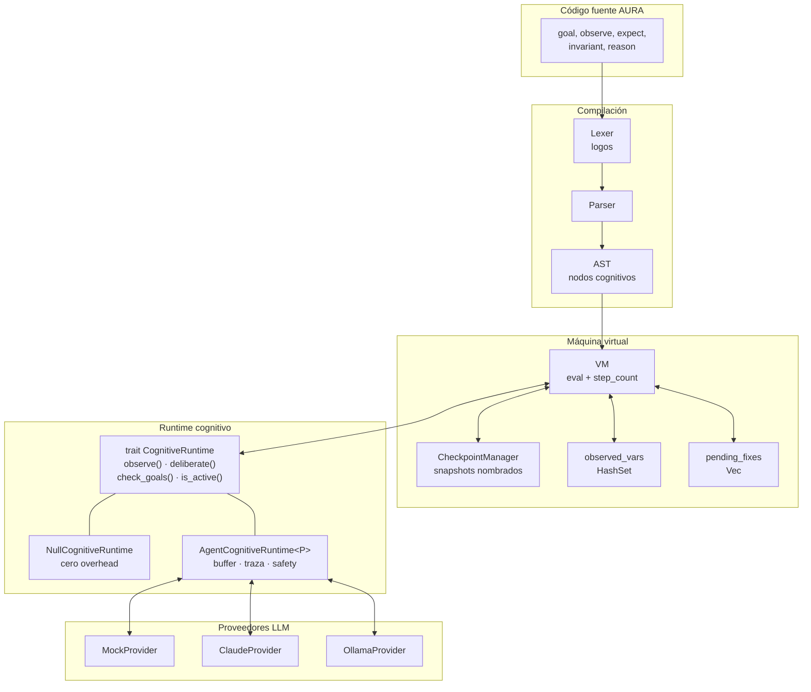

### 3.1 Primitivas cognitivas

AURA introduce seis construcciones que forman su vocabulario cognitivo. Estas se parsean en nodos AST---son parte de la gramática del lenguaje, no funciones de biblioteca.

#### 3.1.1 `goal`

```
goal "procesar datos de usuario correctamente"
goal "todos los usuarios deben tener nombres válidos" check usuarios != nil
```

Los goals son declaraciones de nivel superior (`Definition::Goal(GoalDef)`) con una expresión `check` opcional. La estructura `GoalDef`:

```rust
pub struct GoalDef {
    pub description: String,
    pub check: Option<Expr>,  // El elemento novedoso
    pub span: Span,
}
```

Cuando `check` está presente, el goal es *activo*: la VM evalúa la expresión check después de cambios en variables observadas, después de retornos de funciones, y en intervalos de pasos configurables. Si la verificación evalúa a falso, se eleva un `DeliberationTrigger::GoalMisalignment`, invocando el runtime cognitivo.

La palabra clave `check` se parsea como un *soft keyword* (`Ident("check")`), no como un token reservado---preservando compatibilidad hacia atrás con programas que usan "check" como identificador.

#### 3.1.2 `observe`

```
observe usuarios
observe respuesta.estado
observe datos where valido == true
```

`observe` declara un punto de monitoreo en runtime (`Expr::Observe`). Cuando una variable observada cambia de valor, la VM:
1. Crea un checkpoint implícito (vía `CheckpointManager`)
2. Notifica al runtime cognitivo vía `observe(ObservationEvent::ValueChanged{...})`
3. Dispara la evaluación de goals activos

Sin un runtime cognitivo, `observe` es un no-op que retorna nil.

#### 3.1.3 `expect`

```
expect len(usuarios) > 0 "debería haber usuarios"
```

`expect` es verificación de intención (`Expr::Expect`). A diferencia de las aserciones que crashean ante un fallo, los expects se registran como `ExpectationFailure` y, cuando un runtime cognitivo está activo, disparan `DeliberationTrigger::ExpectFailed`. El runtime puede entonces decidir continuar, sobreescribir el resultado, generar un fix, o hacer backtrack.

#### 3.1.4 `invariant`

```
invariant len(usuarios) > 0
```

Los invariantes (`Definition::Invariant(Expr)`) declaran restricciones que ninguna adaptación puede violar. Sirven como la frontera de seguridad del desarrollador: la función `validate_fix()` verifica que los fixes propuestos por el LLM no rompan invariantes antes de ser aplicados.

#### 3.1.5 `reason`

```
estrategia = reason "tenemos {len(usuarios)} usuarios, procesamos todos o filtramos?"
```

`reason` es un punto de deliberación explícito (`Expr::Reason`). La ejecución pausa, la pregunta y las observaciones recientes se envían al runtime cognitivo, y la decisión del LLM se convierte en el valor de la expresión. Esto permite *inyección de valores*: el LLM puede retornar un valor que se vincula a una variable y se usa en la computación subsiguiente.

Sin un runtime cognitivo, `reason` retorna nil.

#### 3.1.6 `@self_heal`

```
@self_heal(max_attempts: 5, mode: "semantic")
procesar_datos(datos) = { ... }
```

Anotación a nivel de función (`SelfHealConfig`) que marca funciones individuales para reparación automática. Configurable con `max_attempts` y `mode` (technical, semantic, auto).

### 3.2 El trait CognitiveRuntime

El trait `CognitiveRuntime` define la interfaz entre la VM y el agente cognitivo:

```rust
pub trait CognitiveRuntime: Send {
    fn observe(&mut self, event: ObservationEvent);
    fn deliberate(&mut self, trigger: DeliberationTrigger) -> CognitiveDecision;
    fn check_goals(&mut self) -> Vec<CognitiveDecision>;
    fn is_active(&self) -> bool;
    fn set_available_checkpoints(&mut self, checkpoints: Vec<String>) {}
}
```

**Eventos de observación** (`ObservationEvent`) incluyen `ValueChanged`, `ExpectEvaluated`, `FunctionReturned`, y `CheckpointCreated`. Estos proporcionan al LLM contexto de runtime rico que ninguna herramienta de reparación post-mortem puede acceder.

**Disparadores de deliberación** (`DeliberationTrigger`) clasifican qué provocó la deliberación: `ExpectFailed`, `ExplicitReason`, `TechnicalError`, o `GoalMisalignment`. Esta clasificación ayuda al LLM a entender la naturaleza del problema.

El `NullCognitiveRuntime` implementa todas las operaciones como no-ops con `is_active() = false`, proporcionando cero overhead para ejecución no cognitiva.

El siguiente diagrama muestra cómo la VM interactúa con el trait durante la evaluación de expresiones:

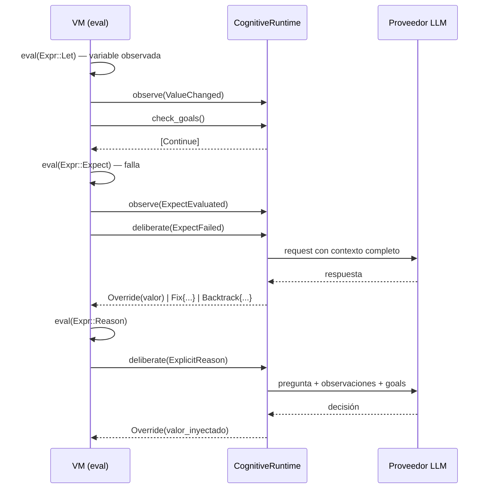

### 3.3 El álgebra de intervención de cinco modos

`CognitiveDecision` define cinco intervenciones estructuralmente tipadas:

```rust
pub enum CognitiveDecision {
    Continue,
    Override(Value),
    Fix { new_code: String, explanation: String },
    Backtrack { checkpoint: String, adjustments: Vec<(String, Value)> },
    Halt(RuntimeError),
}
```

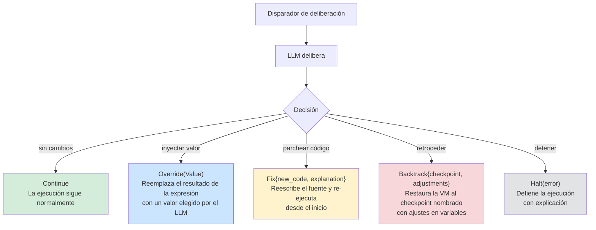

Comparación con modelos de intervención existentes:

| Intervención | Semántica | Precedente |
|---|---|---|
| `Continue` | Proceder normalmente | Común (todos los sistemas) |
| `Override(Value)` | Inyectar un valor de reemplazo en el flujo de ejecución | Restart `use-value` de Common Lisp, pero elegido por LLM |
| `Fix{new_code, explanation}` | Reescribir código fuente; re-ejecutar desde el inicio | Herramientas APR (GenProg, ChatRepair), pero con contexto de runtime |
| `Backtrack{checkpoint, adjustments}` | Restaurar la VM al checkpoint nombrado, aplicar ajustes a variables, continuar desde ese punto | **Sin precedente** en APR o frameworks LLM |
| `Halt(error)` | Detener ejecución con explicación | Común (todos los sistemas) |

#### Backtrack como primitiva semántica central

La intervención `Backtrack` no es una feature auxiliar---es la pieza que transforma la semántica de AURA. Con backtracking con ajustes, **el programa deja de ser una secuencia y se convierte en un grafo navegable en runtime:**

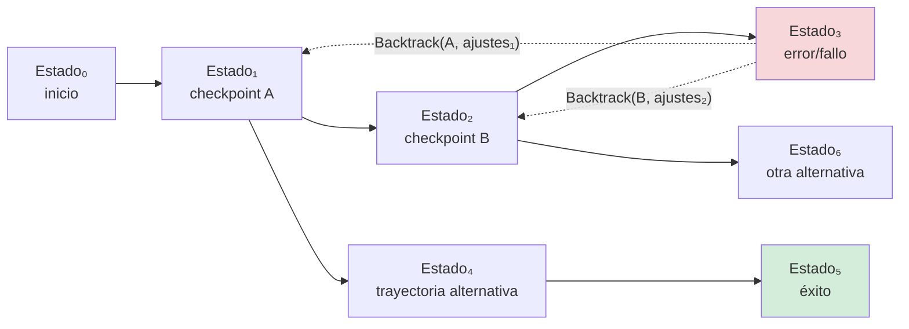

A diferencia de las herramientas APR que deben re-ejecutar desde cero, y a diferencia de la supervisión de Erlang que reinicia desde el estado inicial, AURA puede restaurar a cualquier checkpoint nombrado *con ajustes*---el LLM especifica qué variables modificar antes de reanudar. Esto permite re-ejecución parcial con correcciones informadas.

Lo que hace esto semánticamente radical es que la ejecución ya no avanza monótonamente. El programa puede:
- **Retroceder** a un estado anterior (como Prolog)
- **Ajustar variables** antes de reanudar (a diferencia de Prolog, que solo hace backtracking puro)
- **Elegir a qué checkpoint retroceder** (navegación en el grafo, no solo backtracking cronológico)

Esto es más cercano a *reversible computing* parcial y a planificación online que a los modelos de ejecución tradicionales. La implicación teórica se desarrolla en la Sección 4.

### 3.4 Seguridad: adaptación acotada por invariantes

La función `validate_fix()` impone restricciones de seguridad antes de que cualquier modificación propuesta por el LLM sea aplicada:

1. **Restricción de tamaño**: los fixes que exceden `max_fix_lines` (por defecto: 50) son rechazados, previniendo reescrituras completas del programa.
2. **Validez sintáctica**: cada fix propuesto debe tokenizarse y parsearse como AURA válido.
3. **Inmutabilidad de goals**: el fix debe preservar todos los goals declarados---sin adiciones, sin eliminaciones, sin modificaciones. Los goals son dominio exclusivo del desarrollador.
4. **Profundidad de backtrack**: `max_backtrack_depth` (por defecto: 5) previene ciclos infinitos de backtrack.
5. **Seguimiento de progreso**: `max_deliberations_without_progress` (por defecto: 3) detiene el razonamiento descontrolado.

```rust
pub struct CognitiveSafetyConfig {
    pub max_fix_lines: usize,
    pub max_backtrack_depth: usize,
    pub max_deliberations_without_progress: usize,
}
```

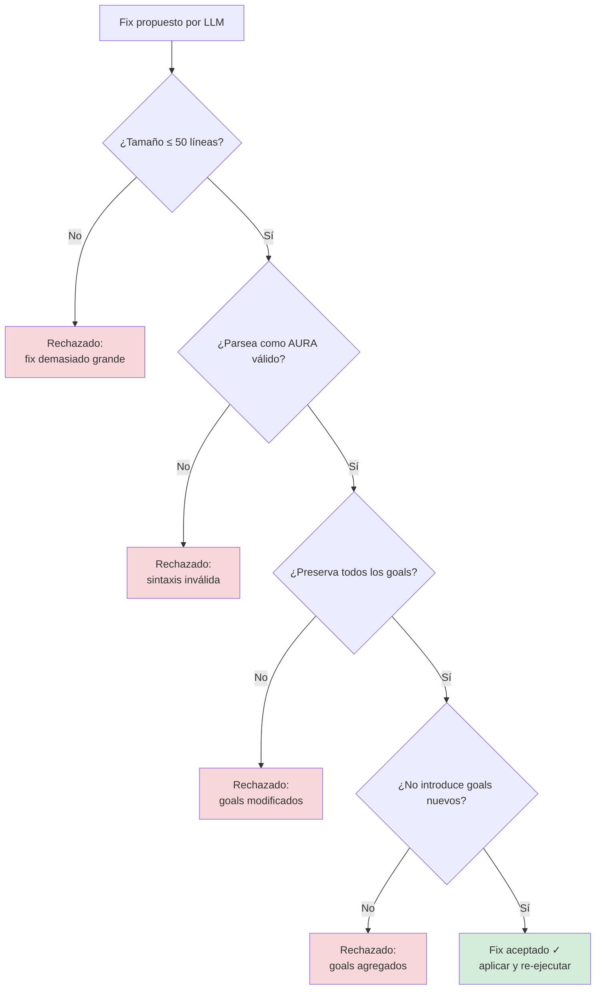

Esto establece un espacio de adaptación formalmente acotado: el LLM puede modificar el programa, pero solo dentro de las restricciones que el desarrollador ha declarado. Este es un patrón de diseño novedoso---**restricciones declaradas por el desarrollador sobre la modificación automatizada de programas**---que no tiene precedente directo en la literatura de APR o sistemas auto-adaptativos.

### 3.5 Sistema de checkpoints

El `CheckpointManager` mantiene snapshots nombrados del estado de la VM:

```rust
pub struct VMCheckpoint {
    pub name: String,
    pub variables: HashMap<String, Value>,
    pub step_count: u64,
    pub timestamp: Instant,
}
```

Los checkpoints se crean implícitamente (ante disparadores de `observe`, antes de llamadas a funciones) y pueden restaurarse con ajustes:

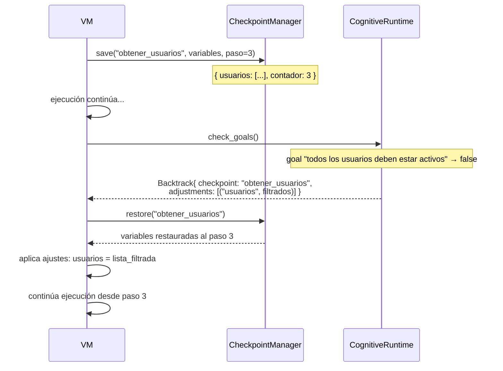

Esto combina ideas de memoria transaccional de software (Shavit & Touitou 1995; Harris et al. 2005), backtracking cronológico de Prolog, y manejo de fallos de planes BDI, pero la síntesis---backtracking con ajustes sugeridos por LLM en un ciclo de ejecución cognitiva---es nueva.

### 3.6 El AgentCognitiveRuntime

La implementación real conecta el trait `CognitiveRuntime` a un `AgentProvider` (soportando múltiples backends de LLM):

```rust
pub struct AgentCognitiveRuntime<P: AgentProvider> {
    provider: P,
    tokio_handle: Handle,        // puente async-sync
    goals: Vec<GoalDef>,
    invariants: Vec<String>,
    source_code: String,
    observation_buffer: Vec<ObservationEvent>,
    reasoning_trace: Vec<ReasoningEpisode>,
    available_checkpoints: Vec<String>,
    max_deliberations: usize,
    deliberation_count: usize,
    safety_config: CognitiveSafetyConfig,
    consecutive_backtracks: usize,
    deliberations_without_progress: usize,
}
```

Decisiones de diseño clave:

- **Puente async-sync**: la VM es síncrona; el `AgentProvider` es async. `tokio_handle.block_on()` tiende el puente, manteniendo simple la implementación de la VM.
- **Agrupación de observaciones**: los eventos se acumulan en `observation_buffer` y se drenan después de cada deliberación, proporcionando al LLM contexto acumulativo.
- **Memoria episódica**: `reasoning_trace: Vec<ReasoningEpisode>` registra cada episodio de deliberación, incluido en solicitudes subsiguientes para que el LLM pueda aprender de la historia reciente.
- **Fail-open**: si el provider falla (error de red, timeout), el runtime retorna `Continue` en lugar de crashear. La capa cognitiva nunca hace al programa *menos* confiable.

### 3.7 El runner de ejecución cognitiva

La función `run_cognitive()` orquesta el ciclo de reintentos:

```rust
pub fn run_cognitive(
    source: &str,
    cognitive: Box<dyn CognitiveRuntime>,
    max_retries: usize,
) -> Result<CognitiveRunResult, RuntimeError>
```

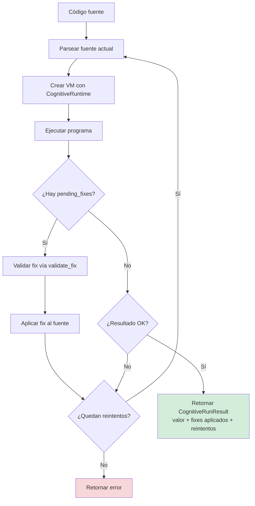

Para cada intento:
1. Parsear el código fuente actual
2. Crear la VM con runtime cognitivo (primer intento) o `NullCognitiveRuntime` (reintentos)
3. Cargar y ejecutar el programa
4. Si existen `pending_fixes`, validar cada fix vía `validate_fix()`, aplicar el válido, y reintentar
5. Si la ejecución tiene éxito sin fixes pendientes, retornar el resultado
6. Si se agotaron los reintentos, retornar el error

Crucialmente, las decisiones `Backtrack` se manejan *dentro* de una sola ejecución (son restauraciones de estado en línea), mientras que las decisiones `Fix` requieren re-parseo y re-ejecución. Esta adaptación de doble nivel---backtrack en línea para correcciones rápidas, re-ejecución completa para cambios estructurales---proporciona una flexibilidad sin igual en sistemas de estrategia única.

---

## 4. Modelo formal: Ejecución como selección de trayectoria restringida

Esta sección presenta el enmarcamiento teórico central de AURA. Argumentamos que la VM cognitiva de AURA implementa un modelo operacional fundamentalmente diferente al de los lenguajes convencionales, y que este modelo es formalmente describible---no como heurística asistida por IA, sino como semántica operacional no determinista con oráculo.

### 4.1 El programa como espacio de trayectorias

En un lenguaje convencional, un programa *P* con entrada *x* define una función:

```
eval(P, x) → v | ⊥
```

La semántica es determinista: dado el mismo programa y la misma entrada, la ejecución produce el mismo valor *v* o diverge/falla (*⊥*). No hay ambigüedad sobre qué significa "ejecutar P".

En AURA, un programa *P* define algo diferente: un **espacio de trayectorias de ejecución** *T(P)*. Cada trayectoria *τ ∈ T(P)* es una secuencia de estados de la VM:

```
τ = ⟨σ₀, σ₁, ..., σₙ⟩
```

donde cada estado *σᵢ* incluye el entorno de variables, la pila de llamadas, los checkpoints disponibles, y el buffer de observaciones. Las transiciones entre estados son de dos tipos:

- **Transiciones deterministas** (*σᵢ →ᵈ σᵢ₊₁*): las reglas de evaluación estándar del lenguaje (aritmética, llamadas a función, let-bindings, etc.)
- **Transiciones no deterministas** (*σᵢ →ⁿ σⱼ*): intervenciones del oráculo cognitivo que pueden:
  - Inyectar un valor (`Override`)
  - Modificar el código y reiniciar (`Fix`)
  - Retroceder a un estado anterior con ajustes (`Backtrack`)
  - Detener la ejecución (`Halt`)

Un programa AURA sin runtime cognitivo tiene solo transiciones deterministas---es un lenguaje convencional (v1 behavior). Con runtime cognitivo, el espacio de trayectorias se expande a todas las posibles intervenciones del oráculo.

### 4.2 Restricciones: goals e invariantes como superficie de constraint

No todas las trayectorias en *T(P)* son válidas. Los goals e invariantes declarados por el desarrollador definen una **superficie de restricción** *C* que acota el espacio:

```
T_válidas(P) = { τ ∈ T(P) | ∀ σᵢ ∈ τ : invariantes(σᵢ) ∧ goals_check(σᵢ) }
```

Los invariantes son restricciones duras: toda trayectoria válida debe satisfacerlos en cada estado. Los goals con `check` son restricciones evaluadas periódicamente: si fallan, el oráculo es invocado para corregir el rumbo.

Esto tiene una consecuencia crucial: **el desarrollador no programa el comportamiento, programa las restricciones sobre el espacio de comportamientos**. Los goals y los invariantes son la especificación; el código es un intento de solución que el oráculo puede ajustar.

### 4.3 El oráculo cognitivo

En la teoría de la computación, un **oráculo** es una caja negra que responde consultas durante la computación (Turing 1939). En AURA, el LLM funciona como oráculo de selección de trayectoria:

```
oracle(σᵢ, trigger, contexto) → decisión ∈ CognitiveDecision
```

El oráculo recibe:
- El estado actual *σᵢ* (variables, checkpoints, observaciones)
- El disparador (error técnico, expect fallido, goal desalineado, reason explícito)
- El contexto acumulado (historial de observaciones, traza de razonamiento, goals, invariantes)

Y retorna una decisión que selecciona la siguiente transición. Lo que hace al oráculo de AURA diferente de una herramienta heurística es que su intervención está **estructuralmente restringida**:

1. Solo puede elegir entre cinco tipos de intervención (el álgebra de `CognitiveDecision`)
2. Los fixes propuestos deben pasar `validate_fix()` (parseable, goals preservados, tamaño acotado)
3. Los backtracks solo pueden ir a checkpoints existentes
4. Los límites de seguridad (`CognitiveSafetyConfig`) acotan el número de deliberaciones

Esto eleva al LLM de "heurística externa" a **oráculo en un sistema formal**. No decide arbitrariamente---selecciona una trayectoria válida dentro de un espacio restringido.

Un revisor de PL podría decir:

> "Esto es un runtime con heurística externa."

Pero con este enmarcamiento, la respuesta es:

> "Es un modelo operacional no determinista con oráculo, donde las restricciones declarativas (goals, invariantes) acotan formalmente el espacio de intervención."

### 4.4 El grafo de estados navegable

La intervención `Backtrack{checkpoint, adjustments}` es la pieza que distingue a AURA de un simple "retry con IA". Con backtracking, el espacio de ejecución no es una secuencia lineal sino un **grafo dirigido acíclico** (DAG) de estados:

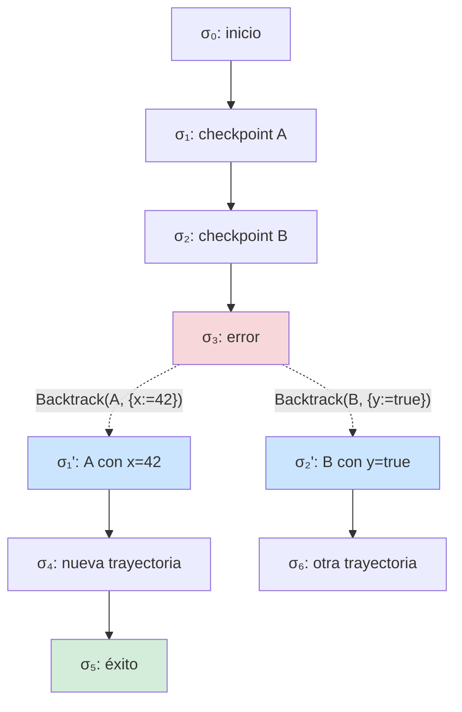

Cada backtrack crea un nuevo estado (*σ₁'* no es *σ₁*---tiene ajustes). La ejecución explora el grafo buscando una trayectoria que llegue a un estado final válido. Esto es formalmente análogo a:

| Modelo | Búsqueda | Alternativas | Ajustes |
|--------|----------|-------------|---------|
| Prolog | Backtracking cronológico | Cláusulas estáticas | No |
| Model checking | Exploración exhaustiva de estados | Transiciones del modelo | No |
| Planificación (STRIPS) | Búsqueda en espacio de planes | Acciones predefinidas | No |
| **AURA** | **Backtracking selectivo** | **Generadas por oráculo** | **Sí (ajustes a variables)** |

La novedad de AURA es que las alternativas no están predefinidas (como en Prolog) ni enumeradas exhaustivamente (como en model checking), sino **generadas dinámicamente** por un oráculo que entiende el contexto semántico del programa.

### 4.5 Corrección: intención preservada vs. intención satisfecha

Este modelo plantea una pregunta fundamental que no debe esquivarse:

> **¿Qué significa que un programa AURA sea correcto?**

Hoy, AURA garantiza **seguridad** (safety) vía invariantes: ninguna intervención del oráculo puede violar un invariant declarado. Y garantiza **preservación de goals**: ningún fix puede agregar o eliminar goals.

Pero seguridad no es corrección. Considérese:

```
goal "mantener usuarios activos en el sistema"
invariant len(usuarios) >= 0
```

Si el sistema detecta un problema con usuarios inactivos, el oráculo podría proponer:

- **Fix A**: filtrar la lista, manteniendo solo usuarios activos → *satisface* el goal
- **Fix B**: eliminar el campo `activo` de todos los usuarios → *satisface* el goal técnicamente
- **Fix C**: establecer `activo = true` para todos → *satisface* el goal degeneradamente

Los tres satisfacen el goal y respetan el invariant. Pero solo el Fix A **preserva la intención** del desarrollador.

Esto revela una distinción teórica fundamental:

- **Intención satisfecha**: el goal evalúa a `true` después de la intervención
- **Intención preservada**: la intervención es coherente con lo que el desarrollador *quiso decir* con el goal

AURA hoy opera en el nivel de *intención satisfecha*. Moverse a *intención preservada* requiere un modelo de especificación de intenciones más rico que las expresiones booleanas---posiblemente conectando con la semántica de intenciones de Cohen & Levesque (1990) o con verificación formal de propiedades temporales.

Este es un problema abierto deliberado: reconocerlo es más honesto y más productivo que pretender que los invariantes resuelven la corrección.

### 4.6 Relación con modelos formales existentes

El modelo de ejecución de AURA puede formalizarse en varios frameworks:

**Como semántica operacional no determinista con oráculo:**

```
            σᵢ, e ⇓ v
         ──────────────── [EVAL-DET]    (transición determinista)
            σᵢ →ᵈ σᵢ₊₁

            σᵢ, e ⇓ ⊥    oracle(σᵢ, ⊥) = Override(v')
         ──────────────────────────────────── [EVAL-ORACLE]
            σᵢ →ⁿ σᵢ₊₁[result := v']

            σᵢ, e ⇓ ⊥    oracle(σᵢ, ⊥) = Backtrack(cp, adj)
         ──────────────────────────────────── [EVAL-BACKTRACK]
            σᵢ →ⁿ restore(cp) ⊕ adj
```

**Como handler de efectos algebraicos:**

```
            effect CognitiveAssistance : Trigger → Decision

            handle (eval program) with
              | CognitiveAssistance trigger →
                  let decision = llm_deliberate(trigger, context) in
                  resume_with decision
```

La diferencia clave con los handlers de efectos algebraicos clásicos (Plotkin & Pretnar 2009) es que el handler es **generativo**: no está definido estáticamente como una función, sino que produce respuestas novedosas vía el LLM. Esto extiende el modelo de efectos algebraicos de handlers deterministas a handlers con oráculo.

**Como sistema de planificación online:**

La ejecución de AURA puede verse como un planificador que:
1. Ejecuta el plan (programa) paso a paso
2. Monitorea el estado contra goals/invariantes
3. Re-planifica cuando el plan falla (deliberación)
4. Puede volver atrás y ajustar (backtrack)

Esto conecta directamente con arquitecturas 3T (Gat 1998) y planificación HTN (Nau et al. 2003), pero donde el planificador es un LLM con acceso al estado de ejecución completo.

---

## 5. Posicionamiento frente al estado del arte

### 5.1 Comparación integral

*Tabla 3: AURA posicionado contra sistemas representativos de cada línea de investigación*

| Dimensión | GenProg | ChatRepair | LangChain | Rainbow | Jason | AURA v2.0 |
|---|---|---|---|---|---|---|
| **Naturaleza** | Herramienta APR | Herramienta de reparación LLM | Orquestación LLM | Framework auto-adaptativo | Lenguaje BDI | **Lenguaje cognitivo** |
| **Cuándo ocurre la reparación** | Post-mortem | Post-mortem | N/A | Runtime (externo) | Fallo de plan | **A mitad de ejecución (en la VM)** |
| **Acceso al estado de runtime** | Ninguno | Ninguno | Ninguno | Métricas arquitectónicas | Base de creencias | **Completo: variables, goals, checkpoints** |
| **Oráculo de reparación** | Suite de tests | Suite de tests + LLM | N/A | Estrategias predefinidas | Biblioteca de planes | **Goals + expects + invariantes + LLM** |
| **Inyección de valores** | No | No | No | No | Actualización de creencias | **Sí (`Override`)** |
| **Backtracking** | No | No | No | No | Pila de intenciones | **Sí (checkpoint + ajustes)** |
| **Parcheo de código** | Sí (fuente) | Sí (fuente) | N/A | Sí (config) | No | **Sí (fuente validado)** |
| **Restricciones de seguridad** | Solo suite de tests | Ninguna | N/A | Por construcción | Ninguna | **Invariantes + inmutabilidad de goals** |
| **Intención del desarrollador** | Casos de test | Casos de test | Código Python | Restricciones arq. | Goals BDI | **`goal`, `expect`, `invariant`** |
| **Integración LLM** | Ninguna | API externa | API externa | Ninguna | Ninguna | **Trait de runtime de primera clase** |

### 5.2 La brecha tripartita

AURA cierra una brecha en la intersección de tres preocupaciones previamente separadas:

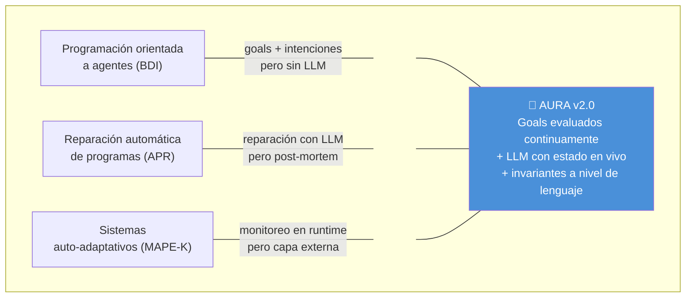

1. **Ningún lenguaje actual** proporciona construcciones integradas para expresar la intención del desarrollador (`goal`), expectativas de runtime (`expect`), monitoreo de variables (`observe`), puntos seguros de rollback (checkpoints), y solicitudes explícitas de razonamiento (`reason`) como sintaxis de primera clase.

2. **Ningún sistema actual** da a un LLM acceso al estado de ejecución en vivo (valores de variables, camino de ejecución, resultados de evaluación de goals) durante la ejecución del programa, permitiendo decisiones a mitad de ejecución (inyección de valores, parcheo de código, backtracking basado en checkpoints).

3. **Ningún sistema actual** impone invariantes de seguridad sobre las adaptaciones generadas por LLM a nivel del lenguaje---donde los invariantes se declaran en la sintaxis del programa, se validan por el parser, y se aplican antes de que cualquier fix propuesto por el LLM sea aplicado.

### 5.3 Afirmación formal de novedad

> AURA implementa un modelo operacional donde ejecutar un programa es buscar una trayectoria válida en un espacio de estados restringido por goals e invariantes declarados por el desarrollador, donde (1) un oráculo cognitivo (LLM con acceso al estado de ejecución reificado) selecciona trayectorias cuando la ejecución determinista no puede continuar, (2) las intervenciones del oráculo están estructuralmente tipadas en un álgebra de cinco modos (Continue, Override, Fix, Backtrack, Halt), (3) el backtracking con ajustes convierte al programa en un grafo navegable de estados---no una secuencia---, y (4) las restricciones declarativas (goals, invariantes) acotan formalmente el espacio de intervención del oráculo, distinguiendo a AURA de un sistema con "heurística IA externa" y posicionándolo como un modelo operacional no determinista con oráculo.

### 5.4 Lo que no es novedoso

La honestidad académica requiere identificar sobre qué construye AURA en lugar de inventar:

- La arquitectura BDI (Rao & Georgeff 1991, 1995; Bratman 1987)
- Ciclos auto-adaptativos MAPE-K (Kephart & Chess 2003)
- Mecanismos de checkpoint/rollback (Shavit & Touitou 1995)
- Backtracking cronológico (Prolog; Colmerauer & Roussel 1993)
- Reparación de código basada en LLM (Xia & Zhang 2023; Le Goues et al. 2012)
- Hot code reloading (Armstrong 2003)
- Sistemas de módulos basados en capacidades (cf. modelo de capacidades de SARL)
- Sistemas de condiciones/restarts (Common Lisp)
- Verificación en runtime (Leucker & Schallhart 2009)
- Semántica operacional (Plotkin 1981)
- Computación con oráculos (Turing 1939)

La contribución de AURA no es ninguna de estas piezas individualmente. Es el modelo que emerge de su síntesis: una máquina abstracta donde la continuidad del programa es negociada entre la semántica determinista del lenguaje y un oráculo generativo, dentro de un espacio restringido por intenciones declaradas.

---

## 6. Ejemplo desarrollado: Auto-reparación en acción

El siguiente programa AURA demuestra la ejecución cognitiva con auto-reparación real. A diferencia de un ejemplo trivial donde todo funciona, este programa tiene un **bug intencional** que el runtime cognitivo detecta y repara.

### 6.0 El escenario: Monitor de sensores IoT

Un sistema lee sensores de temperatura, detecta anomalías térmicas, y genera alertas. El código usa `umbral_temp` para definir el umbral de anomalía---pero esa variable **nunca se define**. Sin runtime cognitivo, el programa crashea. Con él, el error se detecta, se delibera un fix, se aplica, y se reintenta.

```aura
+http +json

goal "monitorear todos los sensores"
goal "detectar anomalias termicas" check lecturas != nil

invariant len(lecturas) >= 0

# Simula lecturas de sensores IoT
obtener_lecturas() = [{sensor: "TH-01", temp: 22.5, humedad: 45},
                      {sensor: "TH-02", temp: 38.7, humedad: 30},
                      {sensor: "TH-03", temp: 21.0, humedad: 55}]

# Bug intencional: umbral_temp NO esta definido
es_anomalia(temp) = temp > umbral_temp

# Formatea una alerta para un sensor
formatear_alerta(s) = "ALERTA: sensor {s.sensor} reporta {s.temp}C"

# Punto de entrada principal
main = : lecturas = obtener_lecturas();
         observe lecturas;
         expect len(lecturas) > 0 "sin datos de sensores";
         s1 = first(lecturas);
         s2 = first(tail(lecturas));
         print("Sensor {s1.sensor}: {s1.temp}C");
         print("Sensor {s2.sensor}: {s2.temp}C");
         a2 = es_anomalia(s2.temp);
         expect a2 "se esperaba anomalia en {s2.sensor}";
         alerta = formatear_alerta(s2);
         print(alerta);
         accion = reason "sensor {s2.sensor} en {s2.temp}C, que accion tomar?";
         print("Analisis completo");
         s2.temp
```

### 6.1 Ejecución sin runtime cognitivo

```bash
$ aura run examples/cognitive_demo.aura
Sensor TH-01: 22.5C
Sensor TH-02: 38.7C
Runtime error: Variable no definida: umbral_temp
```

El programa imprime los dos primeros sensores, llama a `es_anomalia(38.7)`, que evalúa `temp > umbral_temp`. Como `umbral_temp` no está definida, crashea. Comportamiento estándar de cualquier lenguaje.

### 6.2 Ejecución con runtime cognitivo

```bash
$ aura run --cognitive --provider mock examples/cognitive_demo.aura
Cognitive mode: provider=mock
Sensor TH-01: 22.5C
Sensor TH-02: 38.7C
Sensor TH-01: 22.5C
Sensor TH-02: 38.7C
ALERTA: sensor TH-02 reporta 38.7C
Analisis completo
38.7
  [1 fix(es) applied, 1 retries]
```

### 6.3 Traza detallada del ciclo cognitivo

Lo que sucede internamente ilustra el modelo de selección de trayectoria (Sección 4):

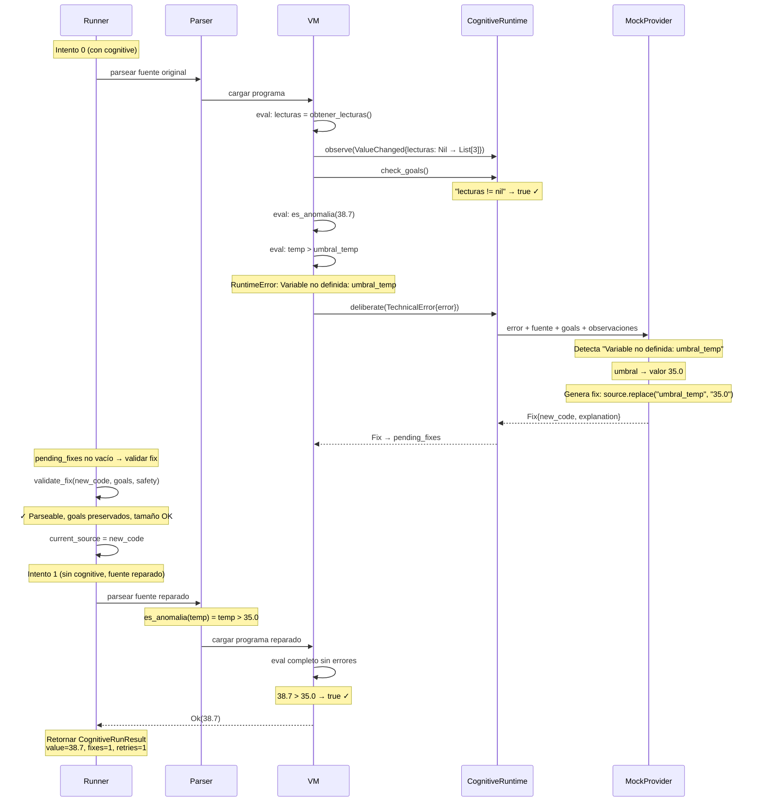

### 6.4 Lo que demuestra este ejemplo

Este ejemplo no es un escenario artificial---es la demostración concreta del modelo teórico de la Sección 4:

1. **El programa define un espacio de trayectorias, no un comportamiento fijo.** La trayectoria "evaluar `temp > umbral_temp` → crash" no es la única posible. El runtime cognitivo encuentra una trayectoria alternativa: reemplazar `umbral_temp` con `35.0` y reintentar.

2. **El error es un punto de bifurcación, no un crash.** En la Sección 4.1, definimos que un error activa una transición no determinista (*σᵢ →ⁿ σⱼ*). Aquí el `RuntimeError` activa `deliberate(TechnicalError)`, que produce un `Fix`---una trayectoria alternativa.

3. **Las restricciones acotan la intervención.** El fix propuesto pasa por `validate_fix()`: debe parsear como AURA válido, preservar los dos goals, y no exceder 50 líneas. No es una intervención arbitraria---es una selección dentro del espacio restringido.

4. **El oráculo es semánticamente informado.** El MockProvider no elige `35.0` al azar: reconoce que `umbral` es un nombre de variable que implica un valor de umbral numérico. Un provider real (Claude, Ollama) haría un razonamiento aún más rico.

### 6.5 Contrafactual: escenario de backtracking

Imaginemos un goal más preciso con backtracking. Si `obtener_lecturas()` retornara un sensor con datos corruptos:

```aura
goal "todos los sensores deben tener lecturas válidas" check for(s in lecturas) : s.temp > 0
```

Cuando la verificación del goal falla:

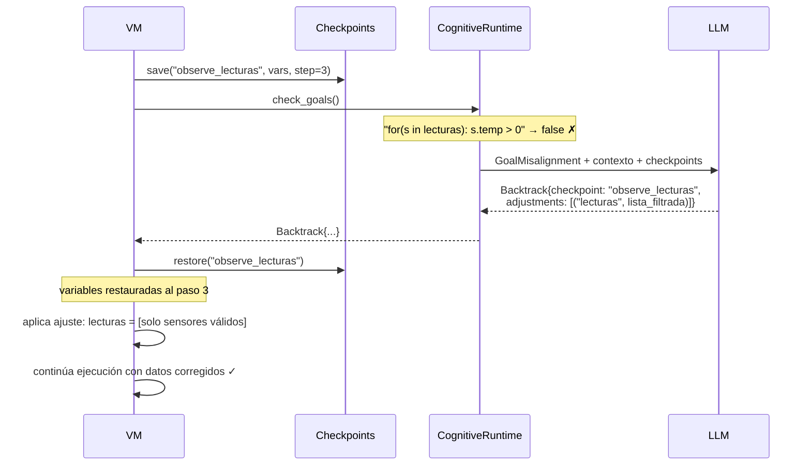

Este es el poder del backtracking con ajustes: el programa no crashea, no reinicia desde cero, no aplica una estrategia predefinida frágil. El oráculo entiende el goal, examina los datos, y propone una corrección dirigida---navegando el grafo de estados (Sección 4.4) hacia una trayectoria válida.

---

## 7. Discusión

### 7.1 Enmarcamiento teórico: del sistema al modelo

La Sección 4 presentó el modelo formal de ejecución como selección de trayectoria restringida. Aquí situamos ese modelo en el contexto más amplio de la teoría de lenguajes de programación.

**El salto clave.** AURA pasó de ser un *sistema interesante* a un *modelo de programación* cuando reconocimos que:

- El programa no define el comportamiento → define el espacio de comportamientos permitidos
- La ejecución no es evaluación → es búsqueda de trayectoria válida
- El LLM no es una herramienta heurística → es un oráculo en un sistema formal
- Backtrack no es una feature → es la semántica

Este reencuadre tiene una consecuencia práctica: AURA no compite con DSPy, LMQL, o LangChain (que son herramientas para *usar* LLMs). AURA compete con modelos de computación---con la pregunta de qué significa ejecutar un programa en presencia de incertidumbre.

**Mapeo a frameworks formales existentes:**

| Framework formal | Mapeo en AURA | Extensión de AURA |
|---|---|---|
| Efectos algebraicos (Plotkin & Pretnar 2009) | Primitivas cognitivas = efectos; `CognitiveRuntime` = handler | Handler generativo (LLM) vs. estático |
| MAPE-K (Kephart & Chess 2003) | `observe`=M, `Trigger`=A, LLM=P, `Decision`=E, `Episode`=K | Embebido en la VM, no capa externa |
| Condiciones/restarts (Common Lisp) | Errors + expects = condiciones; `CognitiveDecision` = restarts | Restarts generados dinámicamente, no predefinidos |
| Semántica de Prolog | Backtrack = backtracking cronológico | Con ajustes a variables + oráculo para elegir alternativas |
| Planificación HTN (Nau et al. 2003) | Programa = plan; deliberación = re-planificación | Re-planificación informada por estado de ejecución completo |
| Model checking | Espacio de estados + propiedades (goals/invariants) | Exploración guiada por oráculo, no exhaustiva |

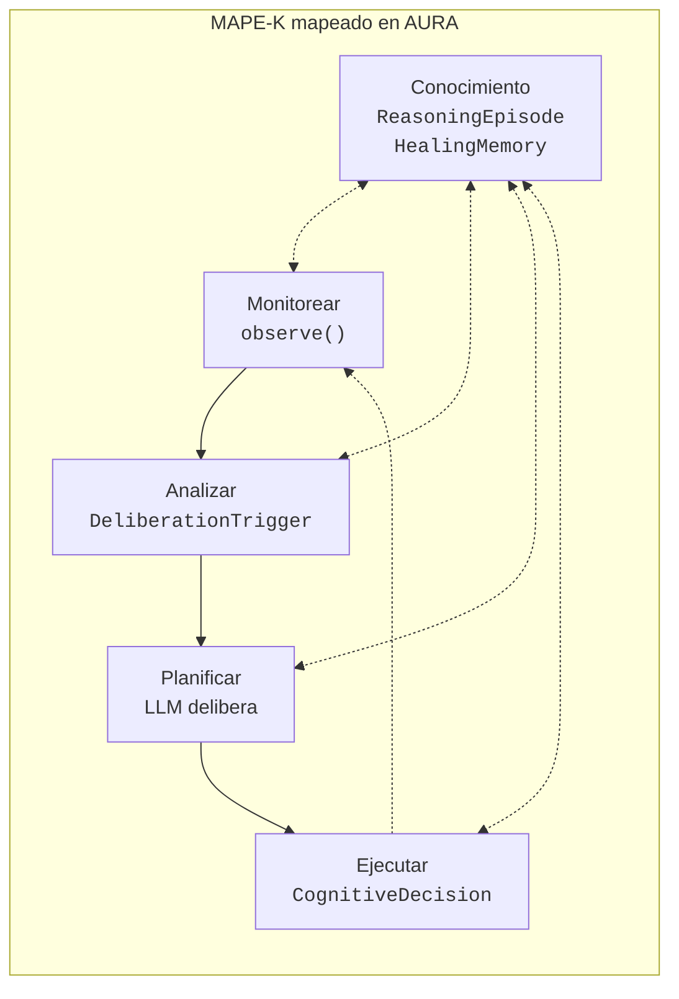

### 7.2 El runtime como arquitectura cognitiva

Al mapearse a la teoría de arquitecturas cognitivas, el runtime de AURA implementa los componentes esenciales identificados por Newell (1990) y arquitecturas subsiguientes:

- **Percepción**: detección de eventos vía `observe()`
- **Memoria de trabajo**: buffer de observaciones + contexto de ejecución
- **Memoria a largo plazo**: `HealingMemory` con persistencia de `ReasoningEpisode`
- **Deliberación**: invocación del LLM con contexto estructurado
- **Selección de acción**: enum `CognitiveDecision`
- **Aprendizaje**: el historial de episodios informa deliberaciones subsiguientes
- **Metacognición**: límites de `CognitiveSafetyConfig` sobre el comportamiento de razonamiento

Esto convierte a AURA, hasta donde sabemos, en **el primer runtime de lenguaje de programación que es en sí mismo una arquitectura cognitiva**---en lugar de un lenguaje usado para implementar una.

### 7.3 Limitaciones

**Intención preservada vs. intención satisfecha (el problema central).** Como se discutió en la Sección 4.5, AURA hoy solo garantiza *intención satisfecha*: que los goals evalúen a `true` después de una intervención. Pero no garantiza *intención preservada*: que la intervención sea coherente con lo que el desarrollador quiso decir. Un goal "mantener usuarios activos" podría satisfacerse degeneradamente eliminando usuarios inactivos, cuando el desarrollador quería notificarles. Este es el problema conceptual más importante que enfrenta el modelo, y resolverlo probablemente requiere un lenguaje de especificación de intenciones más rico que expresiones booleanas---conectando con la semántica de intenciones de Cohen & Levesque (1990) o verificación de propiedades temporales (LTL/CTL).

**Coherencia semántica de intervenciones.** Relacionado con lo anterior: hoy el sistema valida que una intervención sea *segura* (invariants OK, goals preservados, parseable), pero no que sea *semánticamente coherente*. El LLM puede producir una intervención que satisface todas las restricciones formales pero es absurda en contexto. La distinción entre "decisión semánticamente válida" y "heurística conveniente" requiere un modelo formal de validez de intervención que hoy no existe.

**Latencia.** La deliberación con LLM añade segundos de latencia por invocación. AURA mitiga esto a través del `NullCognitiveRuntime` (cero overhead cuando las características cognitivas están inactivas) y observaciones agrupadas, pero las aplicaciones en tiempo real pueden necesitar límites de latencia más estrictos.

**Determinismo.** Las respuestas del LLM son no determinísticas. Dos ejecuciones del mismo programa pueden seguir trayectorias diferentes en el espacio de estados (Sección 4.4). AURA registra la traza de `ReasoningEpisode` para análisis de reproducibilidad, pero las garantías formales de convergencia requieren trabajo futuro.

**Corrección de fixes generados por LLM.** La función `validate_fix()` verifica sintaxis, preservación de goals, y tamaño---pero no corrección semántica. Un fix que parsea correctamente y preserva goals aún puede introducir errores lógicos. La verificación formal de parches generados por LLM sigue siendo un problema de investigación abierto.

**Costo.** Cada deliberación incurre en costos de API del LLM. Los límites `max_deliberations` y `max_deliberations_without_progress` acotan esto, pero las estrategias de deliberación conscientes del costo son trabajo futuro.

### 7.4 Direcciones futuras

- **Modelo formal de validez de intervención**: definir formalmente cuándo una intervención del oráculo es *semánticamente válida* y no solo *segura*. Conectar con la lógica de intenciones (Cohen & Levesque 1990) y verificación temporal.
- **Semántica operacional completa**: formalizar las reglas de evaluación de AURA con oráculo como una semántica operacional de pasos pequeños con transiciones deterministas y no deterministas (Sección 4.6).
- **Convergencia de trayectorias**: demostrar formalmente que, bajo ciertas condiciones sobre el oráculo y las restricciones, la búsqueda de trayectoria siempre termina (o acotar la probabilidad de no-terminación).
- **Runtime cognitivo multi-agente**: múltiples oráculos con diferentes especializaciones, formalizados como un sistema de handlers compuestos.
- **Adaptación verificada**: usar métodos formales para demostrar que las adaptaciones dentro del espacio acotado por invariantes preservan propiedades especificadas (model checking restringido).
- **Deliberación consciente del costo**: estrategias que balanceen el costo de llamadas al oráculo contra el beneficio esperado (formalizable como problema de decisión parcialmente observable).
- **Cognición colaborativa**: modos humano-en-el-ciclo donde el runtime presenta las trayectorias candidatas en lugar de seleccionar autónomamente.

---

## 8. Conclusión

AURA demuestra que es posible construir un lenguaje de programación donde ejecutar un programa no significa evaluar una función, sino buscar una trayectoria válida en un espacio de estados restringido por intenciones declaradas, con un oráculo cognitivo que guía la búsqueda cuando la ejecución determinista no puede continuar.

Este es el resultado central del trabajo: **AURA no es un lenguaje con features de agentes. Es una máquina abstracta donde la continuidad del programa es negociada.** El programa define el espacio de comportamientos permitidos (goals, invariantes). La ejecución es búsqueda en ese espacio. El LLM es el oráculo que selecciona trayectorias. El backtracking con ajustes convierte al programa en un grafo navegable de estados.

Este reencuadre---de "primitivas sintácticas" a "modelo de ejecución"---es lo que distingue a AURA de los agent frameworks, las herramientas de auto-reparación, y los DSLs para LLMs. AURA no compite con LangChain o DSPy. Compite con la pregunta de qué significa ejecutar un programa en presencia de incertidumbre.

La implementación en Rust (244+ tests, modo cognitivo funcional con auto-reparación demostrada) prueba que el modelo es realizable. El `NullCognitiveRuntime` asegura cero overhead para programas no cognitivos, haciendo que las capacidades cognitivas sean puramente aditivas.

Los problemas abiertos son significativos: la distinción entre intención satisfecha e intención preservada (Sección 4.5), la coherencia semántica de las intervenciones del oráculo (Sección 7.3), y la formalización completa de la semántica operacional con oráculo (Sección 4.6). Estos problemas son más productivos que los que tendríamos si AURA fuera "solo" un agent framework---son preguntas sobre modelos de computación, no sobre arquitectura de software.

Si un programa ya no es una función sino una trayectoria en un espacio restringido, y si el oráculo que guía esa trayectoria es un modelo de lenguaje grande que entiende la semántica del código que ejecuta---entonces la frontera entre "programar" y "especificar intenciones para que una máquina las navegue" se desdibuja de maneras que la teoría de lenguajes de programación aún no ha explorado. AURA hace esa exploración concreta y tratable.

---

## Referencias

### Lenguajes de programación orientados a agentes

[1] Shoham, Y. (1993). "Agent-Oriented Programming." *Artificial Intelligence*, 60(1):51-92.

[2] Rao, A.S. (1996). "AgentSpeak(L): BDI Agents Speak Out in a Logical Computable Language." *MAAMAW'96*, LNCS 1038, Springer, 42-55.

[3] Bordini, R.H., Hubner, J.F., & Wooldridge, M. (2007). *Programming Multi-Agent Systems in AgentSpeak using Jason*. Wiley.

[4] Hindriks, K.V. (2009). "Programming Rational Agents in GOAL." In *Multi-Agent Programming*, Springer, 119-157.

[5] Dastani, M. (2008). "2APL: A Practical Agent Programming Language." *Autonomous Agents and Multi-Agent Systems*, 16(3):214-248.

[6] Rodriguez, S., Gaud, N., & Galland, S. (2014). "SARL: A General-Purpose Agent-Oriented Programming Language." *WI-IAT 2014*, IEEE/WIC/ACM.

[7] Pokahr, A., Braubach, L., & Lamersdorf, W. (2005). "Jadex: A BDI Reasoning Engine." In *Multi-Agent Programming*, Springer, 149-174.

### Teoría BDI

[8] Bratman, M.E. (1987). *Intention, Plans, and Practical Reason*. Harvard University Press.

[9] Rao, A.S. & Georgeff, M.P. (1991). "Modeling Rational Agents within a BDI-Architecture." *KR'91*, Morgan Kaufmann, 473-484.

[10] Rao, A.S. & Georgeff, M.P. (1995). "BDI Agents: From Theory to Practice." *ICMAS'95*, AAAI Press, 312-319.

[11] Sardina, S. & Padgham, L. (2011). "A BDI Agent Programming Language with Failure Handling, Declarative Goals, and Planning." *Autonomous Agents and Multi-Agent Systems*, 23(1):18-70.

[12] Cohen, P.R. & Levesque, H.J. (1990). "Intention is Choice with Commitment." *Artificial Intelligence*, 42(2-3):213-261.

### Reparación automática de programas

[13] Le Goues, C., Nguyen, T.V., Forrest, S., & Weimer, W. (2012). "GenProg: A Generic Method for Automatic Software Repair." *IEEE TSE*, 38(1):54-72.

[14] Nguyen, H.D.T., Qi, D., Roychoudhury, A., & Chandra, S. (2013). "SemFix: Program Repair via Semantic Analysis." *ICSE 2013*, 772-781.

[15] Mechtaev, S., Yi, J., & Roychoudhury, A. (2016). "Angelix: Scalable Multiline Program Patch Synthesis via Symbolic Analysis." *ICSE 2016*, 1071-1082.

[16] Long, F. & Rinard, M. (2016). "Automatic Patch Generation by Learning Correct Code." *POPL 2016*, 298-312.

[17] Xia, C.S. & Zhang, L. (2022). "Less Training, More Repairing Please: Revisiting Automated Program Repair via Zero-Shot Learning." *ESEC/FSE 2022*, 959-971.

[18] Xia, C.S. & Zhang, L. (2023). "Keep the Conversation Going: Fixing 162 out of 337 bugs for $0.42 each using ChatGPT." *ISSTA 2024*. arXiv:2304.00385.

[19] Monperrus, M. (2018). "Automatic Software Repair: A Bibliography." *ACM Computing Surveys*, 51(1):1-24.

### Sistemas auto-adaptativos

[20] Kephart, J.O. & Chess, D.M. (2003). "The Vision of Autonomic Computing." *IEEE Computer*, 36(1):41-50.

[21] Garlan, D., Cheng, S.-W., Huang, A.-C., Schmerl, B., & Steenkiste, P. (2004). "Rainbow: Architecture-Based Self-Adaptation with Reusable Infrastructure." *IEEE Computer*, 37(10):46-54.

[22] Weyns, D., Malek, S., & Andersson, J. (2012). "FORMS: Unifying Reference Model for Formal Specification of Distributed Self-Adaptive Systems." *ACM TAAS*, 7(1).

[23] Weyns, D. (2020). *An Introduction to Self-Adaptive Systems: A Contemporary Software Engineering Perspective*. Wiley/IEEE Press.

### Arquitecturas cognitivas

[24] Laird, J.E., Newell, A., & Rosenbloom, P.S. (1987). "SOAR: An Architecture for General Intelligence." *Artificial Intelligence*, 33(1):1-64.

[25] Newell, A. (1990). *Unified Theories of Cognition*. Harvard University Press.

[26] Anderson, J.R. & Lebiere, C. (1998). *The Atomic Components of Thought*. Lawrence Erlbaum Associates.

[27] Anderson, J.R. et al. (2004). "An Integrated Theory of the Mind." *Psychological Review*, 111(4):1036-1060.

[28] Sun, R. (2016). *Anatomy of the Mind: Exploring Psychological Mechanisms and Processes with the Clarion Cognitive Architecture*. Oxford University Press.

[29] Franklin, S. et al. (2014). "LIDA: A Systems-level Architecture for Cognition, Emotion, and Learning." *IEEE Trans. on Autonomous Mental Development*, 6(1):19-41.

### Reflexión, efectos y meta-programación

[30] Smith, B.C. (1984). "Reflection and Semantics in Lisp." *POPL '84*, ACM, 23-35.

[31] Kiczales, G., des Rivieres, J., & Bobrow, D.G. (1991). *The Art of the Metaobject Protocol*. MIT Press.

[32] Kiczales, G. et al. (1997). "Aspect-Oriented Programming." *ECOOP '97*, LNCS 1241, Springer, 220-242.

[33] Plotkin, G.D. & Pretnar, M. (2009). "Handlers of Algebraic Effects." *ESOP 2009*, LNCS 5502, Springer, 80-94.

[34] Bauer, A. & Pretnar, M. (2015). "Programming with Algebraic Effects and Handlers." *Journal of Logical and Algebraic Methods in Programming*, 84(1):108-123.

### Checkpoint, rollback y tolerancia a fallos

[35] Shavit, N. & Touitou, D. (1995). "Software Transactional Memory." *PODC '95*, ACM, 204-213.

[36] Harris, T., Marlow, S., Peyton Jones, S., & Herlihy, M. (2005). "Composable Memory Transactions." *PPoPP '05*, ACM, 48-60.

[37] Armstrong, J. (2003). *Making Reliable Distributed Systems in the Presence of Software Errors*. PhD Thesis, Royal Institute of Technology, Stockholm.

[38] Rinard, M. et al. (2004). "Enhancing Server Availability and Security Through Failure-Oblivious Computing." *OSDI 2004*, USENIX, 303-316.

[39] Perkins, J.H. et al. (2009). "Automatically Patching Errors in Deployed Software." *SOSP 2009*, ACM, 87-102.

### Programación integrada con LLM

[40] Beurer-Kellner, L., Fischer, M., & Vechev, M. (2023). "Prompting Is Programming: A Query Language for Large Language Models." *PLDI 2023*, ACM, 1507-1532.

[41] Khattab, O. et al. (2023). "DSPy: Compiling Declarative Language Model Calls into Self-Improving Pipelines." arXiv:2310.03714. *ICLR 2024*.

[42] Zheng, L. et al. (2024). "SGLang: Efficient Execution of Structured Language Model Programs." arXiv:2312.07104.

[43] Yao, S. et al. (2023). "ReAct: Synergizing Reasoning and Acting in Language Models." *ICLR 2023*.

[44] Shinn, N. et al. (2023). "Reflexion: Language Agents with Verbal Reinforcement Learning." *NeurIPS 2023*.

### Programación orientada a objetivos y planificación

[45] Fikes, R.E. & Nilsson, N.J. (1971). "STRIPS: A New Approach to the Application of Theorem Proving to Problem Solving." *Artificial Intelligence*, 2(3-4):189-208.

[46] Nilsson, N.J. (1994). "Teleo-Reactive Programs for Agent Control." *JAIR*, 1:139-158.

[47] Nau, D. et al. (2003). "SHOP2: An HTN Planning System." *JAIR*, 20:379-404.

### Verificación en runtime y diseño por contrato

[48] Meyer, B. (1992). "Applying 'Design by Contract'." *IEEE Computer*, 25(10):40-51.

[49] Leucker, M. & Schallhart, C. (2009). "A Brief Account of Runtime Verification." *Journal of Logic and Algebraic Programming*, 78(5):293-303.

[50] Ernst, M.D. et al. (2007). "The Daikon System for Dynamic Detection of Likely Invariants." *Science of Computer Programming*, 69(1-3):35-45.

### Surveys y trabajo fundacional

[51] Wooldridge, M. & Jennings, N.R. (1995). "Intelligent Agents: Theory and Practice." *Knowledge Engineering Review*, 10(2):115-152.

[52] Wang, L. et al. (2024). "A Survey on Large Language Model Based Autonomous Agents." *Frontiers of Computer Science*.

[53] Schmidhuber, J. (2003). "Goedel Machines: Self-Referential Universal Problem Solvers Making Provably Optimal Self-Improvements." Technical Report IDSIA-19-03.

[54] Hicks, M. & Nettles, S. (2005). "Dynamic Software Updating." *ACM TOPLAS*, 27(6):1049-1096.

[55] Gat, E. (1998). "On Three-Layer Architectures." In *Artificial Intelligence and Mobile Robots*, MIT Press, 195-210.

### Programación lógica y backtracking

[56] Colmerauer, A. & Roussel, P. (1993). "The Birth of Prolog." *History of Programming Languages II*, ACM, 331-367.

[57] Lloyd, J.W. (1987). *Foundations of Logic Programming* (2nd ed.). Springer-Verlag.

[58] Sterling, L. & Shapiro, E. (1994). *The Art of Prolog* (2nd ed.). MIT Press.

### Reversible computing y exploración de estados

[59] Landauer, R. (1961). "Irreversibility and Heat Generation in the Computing Process." *IBM Journal of Research and Development*, 5(3):183-191.

[60] Bennett, C.H. (1973). "Logical Reversibility of Computation." *IBM Journal of Research and Development*, 17(6):525-532.

[61] Clarke, E.M., Grumberg, O., & Peled, D.A. (1999). *Model Checking*. MIT Press.

### Oráculos y computabilidad

[62] Turing, A.M. (1939). "Systems of Logic Based on Ordinals." *Proceedings of the London Mathematical Society*, s2-45(1):161-228.

[63] Rogers, H. (1967). *Theory of Recursive Functions and Effective Computability*. McGraw-Hill.

### Semántica operacional

[64] Plotkin, G.D. (1981). "A Structural Approach to Operational Semantics." Technical Report DAIMI FN-19, Aarhus University.

[65] Wright, A.K. & Felleisen, M. (1994). "A Syntactic Approach to Type Soundness." *Information and Computation*, 115(1):38-94.

---

*AURA está implementado en Rust con 244+ tests, incluyendo auto-reparación cognitiva funcional. Código fuente disponible en el repositorio del proyecto.*
